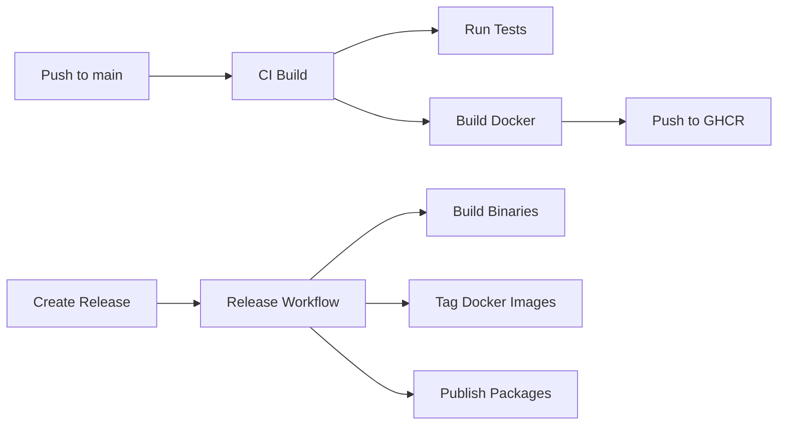

# Release Workflow Guide

## Overview

Fluxbase uses a **manual release workflow** where:

- ✅ **CI builds** run automatically on every push
- ✅ **Docker images** are built and pushed to GHCR automatically on main pushes
- ✅ **Releases** are created manually when you're ready
- ✅ **Publishing** (binaries, Docker tags, NPM, Helm) happens automatically when you create a release

## Creating a Release

### Option 1: GitHub Web Interface (Easiest)

1. Go to https://github.com/wayli-app/fluxbase/releases/new
2. Click "Choose a tag" and type your version (e.g., `v0.1.0`)
3. Enter a title (e.g., "Release 0.1.0")
4. Write release notes (auto-generated or custom)
5. Click "Publish release"

### Option 2: Git Command Line

```bash
# Create and push a tag
git tag v0.1.0
git push origin v0.1.0

# The Release workflow will trigger automatically
```

### Option 3: GitHub CLI

```bash
# Create release with notes
gh release create v0.1.0 \
  --title "Release 0.1.0" \
  --notes "## What's New

- Feature A
- Feature B
- Bug fixes"

# Or use auto-generated notes
gh release create v0.1.0 --generate-notes
```

## What Happens When You Release

When you create a release (or push a version tag), GitHub Actions automatically:

1. **Builds binaries** for multiple platforms:
   - Linux (amd64, arm64)

2. **Publishes Docker images** with version tags:
   - `ghcr.io/wayli-app/fluxbase:0.1.0`
   - `ghcr.io/wayli-app/fluxbase:0.1`
   - `ghcr.io/wayli-app/fluxbase:0`
   - `ghcr.io/wayli-app/fluxbase:latest`
   - (Also Docker Hub if configured)

3. **Updates Go module** at `github.com/wayli-app/fluxbase@v0.1.0`

4. **Publishes NPM packages** (if `NPM_TOKEN` secret is set)

5. **Publishes Helm charts** to GHCR

## Version Numbering

Use [Semantic Versioning](https://semver.org/):

- `v1.0.0` - Major version (breaking changes)
- `v0.1.0` - Minor version (new features, backward compatible)
- `v0.0.1` - Patch version (bug fixes)

## CI/CD Workflow



## Continuous Testing vs Releases

### Every Push to Main:
- ✅ Linting
- ✅ Unit tests
- ✅ Integration tests
- ✅ Docker build
- ✅ Push to GHCR (with `main-<sha>` tag)

### On Release:
- ✅ All of the above
- ✅ Build cross-platform binaries
- ✅ Tag Docker images with version
- ✅ Publish to registries
- ✅ Update package indexes

## Examples

### Create a Beta Release

```bash
gh release create v0.1.0-beta.1 \
  --title "Beta Release 0.1.0-beta.1" \
  --prerelease \
  --notes "Testing new features"
```

### Create a Patch Release

```bash
gh release create v0.1.1 \
  --title "Patch Release 0.1.1" \
  --notes "Bug fixes:
- Fixed issue #123
- Resolved crash on startup"
```

### View Release Status

```bash
# List recent releases
gh release list

# View specific release
gh release view v0.1.0

# Check workflow status
gh run list --workflow=release.yml
```

## Troubleshooting

### Release workflow didn't trigger
- Ensure the tag starts with `v` (e.g., `v0.1.0`, not `0.1.0`)
- Check the Actions tab for errors

### Docker images not tagged correctly
- Verify the version format matches semver
- Check GHCR permissions in repository settings

### Binaries not uploaded
- Ensure you created a GitHub release, not just a tag
- Check that `GITHUB_TOKEN` has write permissions

## Configuration

### Optional: Docker Hub Publishing

To also publish to Docker Hub:

```bash
# Add secrets to repository
gh secret set DOCKERHUB_USERNAME -b "your-username"
gh secret set DOCKERHUB_TOKEN -b "your-token"

# Optional: Set organization name
gh variable set DOCKERHUB_ORG -b "your-org"
```

### Optional: NPM Publishing

To publish TypeScript SDK:

```bash
gh secret set NPM_TOKEN -b "your-npm-token"
```

## Best Practices

1. **Test before releasing** - All tests should pass on main
2. **Use semantic versioning** - Follow semver conventions
3. **Write release notes** - Document what changed
4. **Tag stable releases** - Don't delete release tags
5. **Use pre-releases** - Mark beta/RC releases appropriately

## Related Documentation

- [CI Pipeline](.github/workflows/ci.yml) - Runs on every push
- [Release Pipeline](.github/workflows/release.yml) - Runs on release creation
- [Pipeline Fixes](.github/PIPELINE_FIXES.md) - Troubleshooting guide
