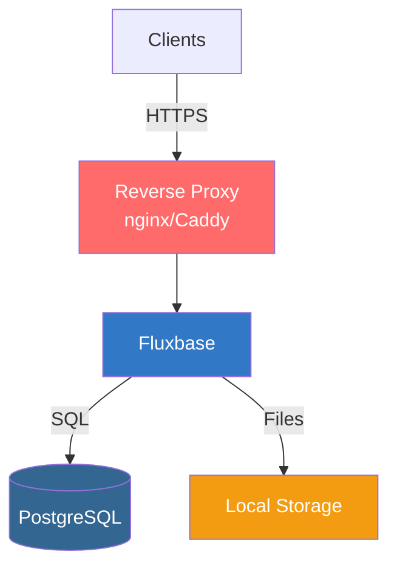
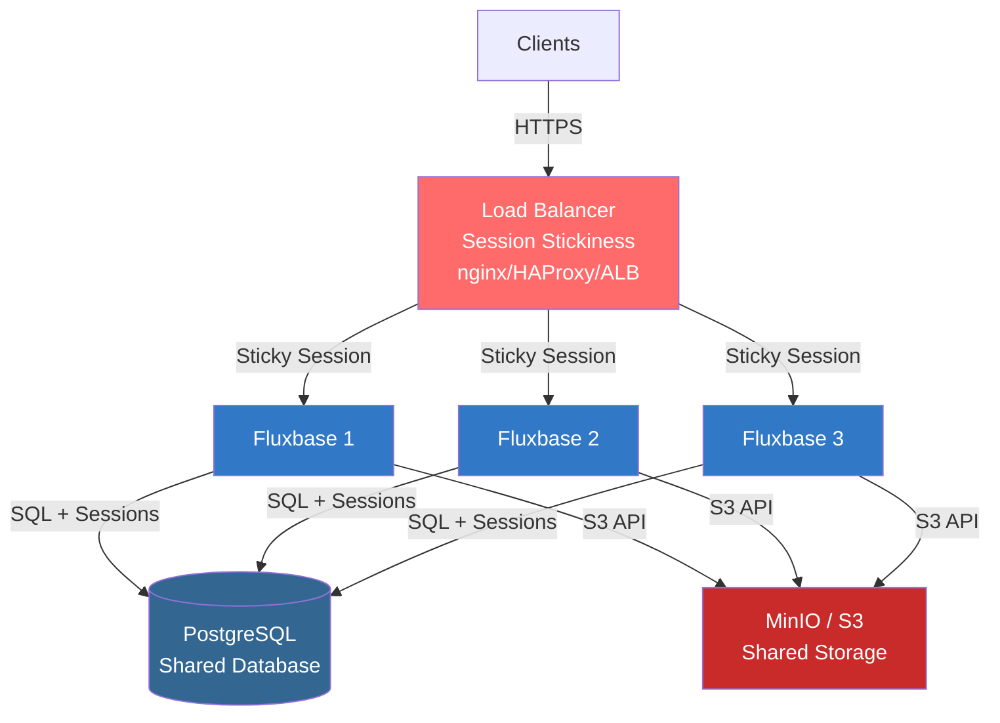
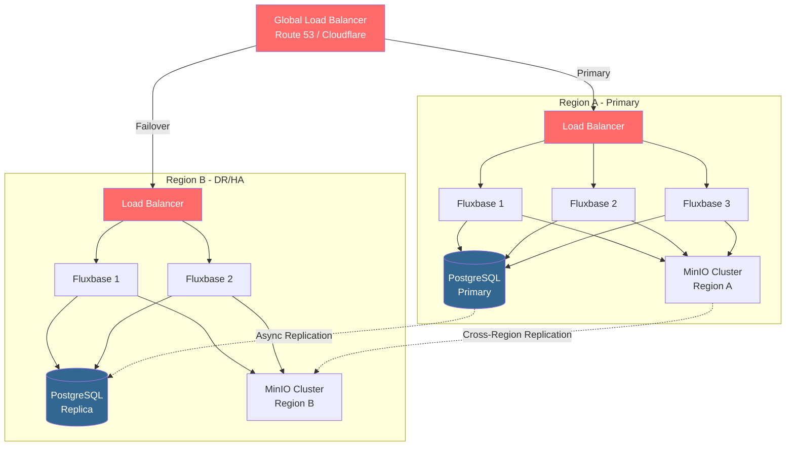

# Deployment Overview

Fluxbase offers multiple deployment options to suit different production scenarios. Choose the deployment method that best fits your infrastructure and scaling needs.

## Deployment Options

| Option | Best For | Complexity | Scalability | Cost |
|--------|----------|------------|-------------|------|
| **Docker Compose** | Small projects, development | Low | Limited | Low |
| **Single Docker Container** | Simple production | Low | Limited | Low |
| **Kubernetes (Helm)** | Enterprise, high-availability | Medium | High | Medium-High |
| **Cloud Platforms** | Managed infrastructure | Low-Medium | High | Medium-High |

## Quick Decision Guide

### Choose Docker Compose if:
- You're running a small application (< 10,000 users)
- You have a single server or VPS
- You want simple deployment and management
- High availability isn't critical

### Choose Kubernetes if:
- You need high availability and zero-downtime deployments
- You expect high traffic or rapid scaling
- You have multiple services to orchestrate
- You want automated rollouts and rollbacks

### Choose Cloud Platforms if:
- You prefer managed infrastructure
- You want automatic scaling and updates
- You don't want to manage servers
- Budget allows for managed services

## Architecture Overview

### Single-Instance Setup (Development/Small Projects)

For simple deployments with a single Fluxbase instance:



**Characteristics:**
- Simple setup, minimal configuration
- Local file storage (single server)
- Suitable for < 10,000 users
- Not horizontally scalable

### Multi-Instance Setup (Production/High-Traffic)

For horizontally scalable deployments with multiple Fluxbase instances:



**Requirements for Horizontal Scaling:**
- External PostgreSQL (not embedded) - stores data + sessions
- S3-compatible storage (MinIO/AWS S3) - stores files
- Load balancer with session stickiness (for WebSocket/realtime)
- See [Scaling Guide](scaling#horizontal-scaling-requirements) for detailed configuration

**Note**: Sessions are stored in PostgreSQL (shared across all instances). Rate limiting and CSRF are per-instance.

### High-Availability Multi-Region Setup

For enterprise deployments requiring disaster recovery and multi-region availability:



**Features:**
- Active-passive or active-active configuration
- Automatic failover on region failure
- Cross-region data replication
- < 1 hour RTO, < 5 minutes RPO
- Suitable for 100K+ users or mission-critical applications

## System Requirements

### Minimum Requirements (Development/Small Projects)

- **CPU**: 2 cores
- **RAM**: 4 GB
- **Storage**: 20 GB SSD
- **Network**: 100 Mbps
- **OS**: Linux (Ubuntu 20.04+, Debian 11+, RHEL 8+)

### Recommended Requirements (Production)

- **CPU**: 4-8 cores
- **RAM**: 8-16 GB
- **Storage**: 100+ GB SSD (depending on data)
- **Network**: 1 Gbps
- **OS**: Linux (Ubuntu 22.04 LTS recommended)

### High-Traffic Requirements (Enterprise)

- **Fluxbase Pods**: 3-10+ instances
  - CPU: 2-4 cores per pod
  - RAM: 4-8 GB per pod
- **PostgreSQL**:
  - CPU: 8-16 cores
  - RAM: 32-64 GB
  - Storage: 500+ GB SSD with high IOPS
- **Load Balancer**: Managed service (ALB, GCP LB) or dedicated hardware
- **Redis** (optional): 2-4 GB RAM for caching

## Components

### Core Components

1. **Fluxbase Application**
   - Single Go binary
   - Embedded Admin UI
   - Stateless (can scale horizontally with external PostgreSQL and S3/MinIO)
   - Port: 8080 (HTTP)

2. **PostgreSQL Database**
   - Primary data store
   - Required for all deployments
   - Recommended version: 14+
   - Port: 5432

### Optional Components

3. **Redis** (Recommended for production)
   - Session storage
   - Caching layer
   - Rate limiting state
   - Port: 6379

4. **Object Storage** (For file uploads)
   - Local filesystem (development)
   - S3-compatible storage (production)
   - MinIO (self-hosted alternative)

5. **Deno Runtime** (For Edge Functions)
   - Required only if using Edge Functions
   - Installed automatically in Docker images
   - Version: 2.5.4+

## Security Checklist

Before deploying to production, ensure:

- [ ] Changed default JWT secret (`FLUXBASE_AUTH_JWT_SECRET`)
- [ ] Changed default database password
- [ ] Enabled HTTPS/TLS for all connections
- [ ] Configured firewall rules (only expose 80/443)
- [ ] Set up database connection pooling
- [ ] Enabled database SSL (`FLUXBASE_DATABASE_SSL_MODE=require`)
- [ ] Configured CORS properly (not `*` in production)
- [ ] Set up regular database backups
- [ ] Enabled rate limiting
- [ ] Configured proper logging and monitoring
- [ ] Set `FLUXBASE_DEBUG=false`
- [ ] Set `FLUXBASE_ENVIRONMENT=production`
- [ ] Implemented secrets management (not environment variables in code)
- [ ] Set up health checks and alerts
- [ ] Configured Row Level Security (RLS) policies

## Performance Considerations

### Database Connection Pooling

```bash
# Recommended settings for production
FLUXBASE_DATABASE_MAX_CONNECTIONS=25
FLUXBASE_DATABASE_MIN_CONNECTIONS=5
FLUXBASE_DATABASE_MAX_CONN_LIFETIME=1h
FLUXBASE_DATABASE_MAX_CONN_IDLE_TIME=30m
```

**Formula**: `max_connections = (number_of_pods × max_connections_per_pod) + buffer`

Example: 5 pods × 25 connections + 25 buffer = 150 total PostgreSQL connections

### Caching Strategy

1. **Application-level caching**: Redis for session storage
2. **Database query caching**: PostgreSQL shared_buffers
3. **CDN**: For static assets and Admin UI
4. **Client-side caching**: HTTP cache headers

### Scaling Guidelines

| Users | Fluxbase Pods | PostgreSQL | Redis | Database Size |
|-------|---------------|------------|-------|---------------|
| < 1K | 1-2 | Shared hosting | Optional | < 1 GB |
| 1K-10K | 2-3 | Dedicated 2 core | Recommended | 1-10 GB |
| 10K-100K | 3-5 | Dedicated 4-8 core | Required | 10-100 GB |
| 100K-1M | 5-10 | Dedicated 8-16 core | Required | 100GB-1TB |
| 1M+ | 10+ | Clustered | Required | 1TB+ |

## Monitoring and Observability

### Essential Metrics

1. **Application Metrics**
   - Request rate (requests/second)
   - Response time (p50, p95, p99)
   - Error rate (4xx, 5xx responses)
   - Active connections

2. **Database Metrics**
   - Connection pool usage
   - Query latency
   - Slow queries (> 100ms)
   - Replication lag (if using replicas)

3. **System Metrics**
   - CPU usage
   - Memory usage
   - Disk I/O
   - Network throughput

### Recommended Tools

- **Monitoring**: Prometheus + Grafana
- **Logging**: ELK Stack (Elasticsearch, Logstash, Kibana) or Loki
- **Tracing**: Jaeger or Zipkin (built-in support)
- **Uptime**: UptimeRobot, Pingdom, or StatusCake
- **Alerts**: PagerDuty, OpsGenie, or Alertmanager

## Backup Strategy

### Database Backups

1. **Automated Daily Backups**
   ```bash
   # PostgreSQL backup script
   pg_dump -h localhost -U postgres -d fluxbase -F c -f backup_$(date +%Y%m%d).dump
   ```

2. **Point-in-Time Recovery (PITR)**
   - Enable WAL archiving in PostgreSQL
   - Store WAL files in S3 or similar
   - Allows recovery to any point in time

3. **Retention Policy**
   - Daily backups: Keep 7 days
   - Weekly backups: Keep 4 weeks
   - Monthly backups: Keep 12 months

### File Storage Backups

- Use S3 versioning for object storage
- Replicate across regions for disaster recovery
- Test restore procedures monthly

## Disaster Recovery

### Recovery Time Objective (RTO)

Target: < 1 hour for critical failures

1. **Database failure**: Promote replica to primary (< 5 minutes)
2. **Application failure**: Deploy from backup (< 15 minutes)
3. **Complete region failure**: Failover to DR region (< 1 hour)

### Recovery Point Objective (RPO)

Target: < 5 minutes of data loss

- Continuous WAL archiving (near-zero data loss)
- Database replication (synchronous or asynchronous)
- Regular backup verification

## Cost Optimization

### Reduce Infrastructure Costs

1. **Right-size resources**: Monitor and adjust based on actual usage
2. **Use spot instances**: For non-critical workloads (dev/staging)
3. **Auto-scaling**: Scale down during off-peak hours
4. **Reserved instances**: For predictable workloads (production)
5. **Database optimization**: Proper indexing reduces compute needs

### Reduce Data Transfer Costs

1. **CDN for static assets**: Reduce origin bandwidth
2. **Compression**: Enable gzip/brotli compression
3. **Regional deployment**: Deploy close to users
4. **Efficient queries**: Reduce database round-trips

## Next Steps

Choose your deployment method:

- [Docker Deployment](docker) - Simple single-server deployment
- [Kubernetes Deployment](kubernetes) - Production-grade Kubernetes with Helm
- [Production Checklist](production-checklist) - Pre-deployment checklist
- [Scaling Guide](scaling) - Scaling and performance optimization

## Support

- **Documentation**: https://docs.fluxbase.io
- **GitHub Issues**: https://github.com/your-org/fluxbase/issues
- **Community**: Discord or Forum
- **Enterprise Support**: Available for production deployments
