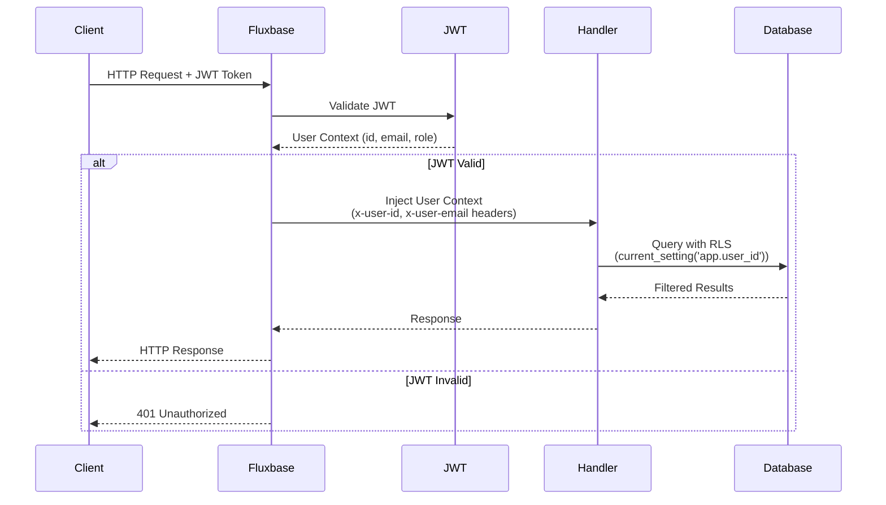

# Authentication

Fluxbase provides JWT-based authentication with support for email/password, magic links, OAuth, anonymous auth, and two-factor authentication.

## Features

- Email/password authentication
- Magic links (passwordless)
- OAuth providers (Google, GitHub, Microsoft, etc.)
- Anonymous authentication
- Two-factor authentication (TOTP)
- Session management
- Password reset flows

## Configuration

Configure authentication in your config file or via environment variables:

```yaml
auth:
  jwt_secret: "your-secret-key"
  jwt_expiry: 15m
  refresh_expiry: 168h # 7 days
  password_min_length: 8
  bcrypt_cost: 12
  enable_signup: true
  enable_magic_link: false
```

### Password Requirements

Default requirements:

- Minimum 8 characters
- Maximum 72 characters (bcrypt limit)

Optional requirements (configurable):

- Uppercase letters
- Lowercase letters
- Digits
- Special characters

## Installation

```bash
npm install @fluxbase/sdk
```

## Quick Start

```typescript
import { FluxbaseClient } from "@fluxbase/sdk";

const client = new FluxbaseClient({
  url: "http://localhost:8080",
});

// Sign up
const { user, session } = await client.auth.signUp({
  email: "user@example.com",
  password: "SecurePassword123",
});

// Sign in
const { user, session } = await client.auth.signIn({
  email: "user@example.com",
  password: "SecurePassword123",
});

// Get current user
const user = await client.auth.getCurrentUser();

// Sign out
await client.auth.signOut();
```

## Core Authentication Methods

| Method                   | Purpose                  | Parameters                       |
| ------------------------ | ------------------------ | -------------------------------- |
| `signUp()`               | Create new account       | `email`, `password`, `metadata?` |
| `signIn()`               | Sign in with credentials | `email`, `password`              |
| `signOut()`              | End current session      | None                             |
| `getCurrentUser()`       | Get authenticated user   | None                             |
| `getSession()`           | Get session details      | None                             |
| `resetPassword()`        | Request password reset   | `email`                          |
| `confirmPasswordReset()` | Confirm password reset   | `token`, `password`              |

**Example:**

```typescript
// Sign up
const { user, session } = await client.auth.signUp({
  email: "user@example.com",
  password: "SecurePassword123",
});

// Sign in
const { user, session } = await client.auth.signIn({
  email: "user@example.com",
  password: "SecurePassword123",
});

// Get current user
const user = await client.auth.getCurrentUser();

// Sign out
await client.auth.signOut();
```

## Password Reset

```typescript
// Request reset (sends email with token)
await client.auth.resetPassword({ email: "user@example.com" });

// Confirm reset (after user receives token)
await client.auth.confirmPasswordReset({
  token: "reset-token-from-email",
  password: "NewSecurePassword123",
});
```

## Magic Links

```typescript
await client.auth.sendMagicLink({ email: "user@example.com" });
// User clicks link in email, automatically signed in
```

## OAuth / Social Login

**Supported providers:** Google, GitHub, Microsoft, GitLab, Bitbucket, Facebook, Twitter/X, Discord, Slack

**Configuration:**

```yaml
oauth:
  google:
    client_id: "your-client-id"
    client_secret: "your-client-secret"
    redirect_url: "http://localhost:8080/api/v1/auth/callback/google"
```

**Usage:**

```typescript
const { url } = await client.auth.getOAuthUrl({
  provider: "google",
  redirectTo: "http://localhost:3000/dashboard",
});
window.location.href = url;
// User redirected back with session after authorization
```

## Anonymous Authentication

```typescript
// Sign in without account
const { user, session } = await client.auth.signInAnonymously();

// Convert to permanent account later
await client.auth.convertAnonymousUser({
  email: "user@example.com",
  password: "SecurePassword123",
});
```

## Two-Factor Authentication

```typescript
// Enable 2FA
const { secret, qr_code } = await client.auth.enable2FA();
await client.auth.verify2FA({ code: "123456" });

// Sign in with 2FA
const { requires_2fa } = await client.auth.signIn({ email, password });
if (requires_2fa) {
  await client.auth.verify2FACode({ code: "123456" });
}

// Disable 2FA
await client.auth.disable2FA({ code: "123456" });
```

## Session Management

```typescript
// List sessions
const sessions = await client.auth.listSessions();

// Revoke session
await client.auth.revokeSession(session_id);

// Revoke all other sessions (keep current)
await client.auth.revokeAllSessions({ except_current: true });
```

## Token Refresh

Tokens are automatically refreshed by the SDK. Manual refresh:

```typescript
const { session } = await client.auth.refreshSession();
```

## Auth State Changes

```typescript
const subscription = client.auth.onAuthStateChange((event, session) => {
  // Events: SIGNED_IN, SIGNED_OUT, TOKEN_REFRESHED, USER_UPDATED
  if (event === "SIGNED_IN") {
    console.log("User signed in:", session.user);
  }
});

subscription.unsubscribe();
```

## User Metadata

```typescript
// Update metadata
await client.auth.updateUser({
  metadata: { name: "John Doe", avatar_url: "https://..." },
});

// Update email
await client.auth.updateEmail({
  email: "newemail@example.com",
  password: "current",
});

// Update password
await client.auth.updatePassword({
  current_password: "OldPassword123",
  new_password: "NewPassword123",
});
```

## API Keys

```typescript
// Create API key for server-to-server auth
const { key, id } = await client.auth.createApiKey({
  name: "Production API",
  expires_in: 86400 * 365,
});

// Use API key
const client = new FluxbaseClient({
  url: "http://localhost:8080",
  apiKey: "your-api-key",
});

// Manage keys
const keys = await client.auth.listApiKeys();
await client.auth.revokeApiKey(key_id);
```

## Service Keys (Admin)

Service keys bypass Row-Level Security. Use only in backend services.

```typescript
const adminClient = new FluxbaseClient({
  url: "http://localhost:8080",
  serviceKey: process.env.FLUXBASE_SERVICE_KEY,
});

// Bypasses RLS
const allUsers = await adminClient.from("users").select("*");
```

**Security:** Store in secrets management, use environment variables, never expose in client code.

## REST API

For direct HTTP access without the SDK, see the [API Reference](/docs/api/sdk/classes/FluxbaseAuth).

## Reference

### JWT Token Structure

Access tokens contain:

```json
{
  "user_id": "uuid",
  "email": "user@example.com",
  "role": "authenticated",
  "session_id": "uuid",
  "token_type": "access",
  "iss": "fluxbase",
  "sub": "user-id",
  "iat": 1698307200,
  "exp": 1698308100
}
```

### User Roles

- `anonymous` - Guest users (limited access)
- `authenticated` - Logged-in users
- `service_role` - Admin/backend services (bypass RLS)

Configure role-based access with Row-Level Security policies.

### Authentication Flow

When a request includes a JWT token, Fluxbase validates it and injects user context for use by edge functions, RLS policies, and other services:



**Flow explanation:**

1. **Client sends request** with JWT token in `Authorization: Bearer <token>` header
2. **Fluxbase validates JWT** using the configured secret key
3. **User context extracted** from token payload (user_id, email, role)
4. **Context injected** into request:
   - Headers: `x-user-id`, `x-user-email` (available to edge functions)
   - PostgreSQL settings: `app.user_id`, `app.user_email` (available to RLS policies)
5. **Handler processes request** with user context available
6. **Database queries respect RLS** policies using `current_setting('app.user_id')`
7. **Response returned** to client

This flow ensures that user identity is consistently available throughout the request lifecycle, enabling secure data access control via Row-Level Security policies.

## Next Steps

- [Row-Level Security](/docs/guides/row-level-security) - Secure data with RLS policies
- [OAuth Providers](/docs/guides/oauth-providers) - Configure social login
- [Email Services](/docs/guides/email-services) - Set up email for password reset
