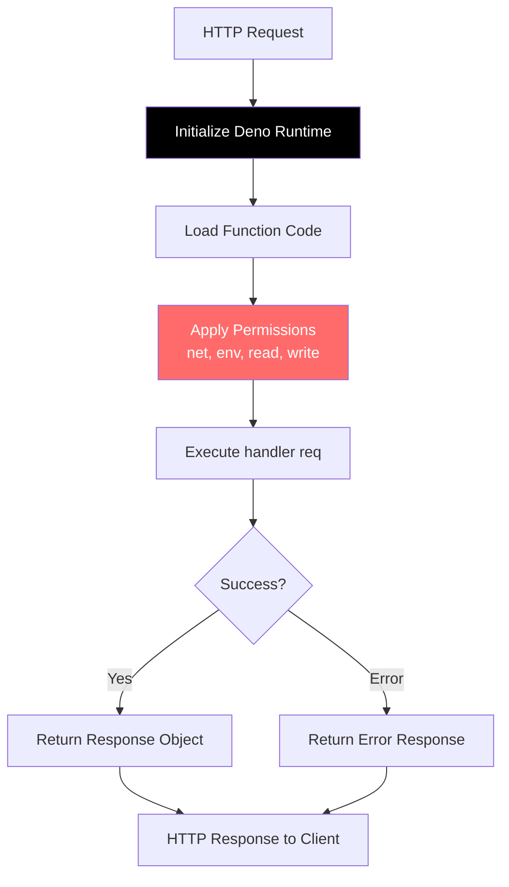

# Edge Functions

Edge Functions are serverless functions powered by Deno that execute JavaScript/TypeScript code in response to HTTP requests.

## Features

- Deno runtime for TypeScript/JavaScript
- HTTP triggered via REST API or SDK
- Secure sandbox with configurable permissions
- Direct database access
- Execution logging and versioning
- Configurable timeouts

## Use Cases

- Process webhooks from third-party services
- Transform and validate data
- Integrate with external APIs
- Run scheduled tasks
- Implement custom business logic
- Extend authentication flows

## Installation

```bash
npm install @fluxbase/sdk
```

## Quick Start

```typescript
import { FluxbaseClient } from '@fluxbase/sdk'

const client = new FluxbaseClient({
  url: 'http://localhost:8080',
  apiKey: process.env.FLUXBASE_API_KEY
})

// Create function
await client.functions.create({
  name: 'hello-world',
  description: 'My first edge function',
  code: `
    async function handler(req) {
      const data = JSON.parse(req.body || '{}')
      return {
        status: 200,
        headers: { "Content-Type": "application/json" },
        body: JSON.stringify({
          message: \`Hello \${data.name || 'World'}!\`
        })
      }
    }
  `,
  enabled: true
})

// Invoke function
const result = await client.functions.invoke('hello-world', {
  name: 'Alice'
})

console.log(result) // { message: "Hello Alice!" }

// List functions
const functions = await client.functions.list()

// Get function details
const details = await client.functions.get('hello-world')

// View execution history
const executions = await client.functions.getExecutions('hello-world', {
  limit: 10
})
```

## Writing Functions

### Function Signature

Every function must export an async `handler` function:

```typescript
async function handler(req) {
  // req contains: method, url, headers, body, params

  return {
    status: 200,
    headers: { "Content-Type": "application/json" },
    body: JSON.stringify({ result: 'success' })
  }
}
```

### Request Object

```typescript
interface Request {
  method: string // GET, POST, etc.
  url: string
  headers: Record<string, string>
  body: string // Raw body (use JSON.parse for JSON)
  params: Record<string, string> // Query parameters
}
```

### Response Object

```typescript
interface Response {
  status: number
  headers?: Record<string, string>
  body?: string
}
```

## Function Examples

### Simple Data Processing

```typescript
async function handler(req) {
  const { email } = JSON.parse(req.body || '{}')

  // Validate email
  if (!email || !email.includes('@')) {
    return {
      status: 400,
      body: JSON.stringify({ error: 'Invalid email' })
    }
  }

  return {
    status: 200,
    body: JSON.stringify({ valid: true })
  }
}
```

### Database Query

```typescript
async function handler(req) {
  // Database client is available via env
  const dbUrl = Deno.env.get('DATABASE_URL')

  // Use pg client or any PostgreSQL library
  const result = await fetch(`${dbUrl}/users`)

  return {
    status: 200,
    body: JSON.stringify(result)
  }
}
```

### External API Call

```typescript
async function handler(req) {
  const { query } = JSON.parse(req.body || '{}')

  // Call external API
  const response = await fetch(`https://api.example.com/search?q=${query}`)
  const data = await response.json()

  return {
    status: 200,
    headers: { "Content-Type": "application/json" },
    body: JSON.stringify(data)
  }
}
```

### Error Handling

```typescript
async function handler(req) {
  try {
    const data = JSON.parse(req.body || '{}')

    // Process data
    const result = await processData(data)

    return {
      status: 200,
      body: JSON.stringify({ result })
    }
  } catch (error) {
    return {
      status: 500,
      body: JSON.stringify({
        error: 'Processing failed',
        message: error.message
      })
    }
  }
}
```

## Authentication

Functions automatically receive the authenticated user context:

```typescript
async function handler(req) {
  // User info from JWT token (if authenticated)
  const userId = req.headers['x-user-id']
  const userEmail = req.headers['x-user-email']

  if (!userId) {
    return {
      status: 401,
      body: JSON.stringify({ error: 'Unauthorized' })
    }
  }

  return {
    status: 200,
    body: JSON.stringify({ userId, userEmail })
  }
}
```

**How it works:**
1. Fluxbase validates the JWT token in the `Authorization` header
2. User context (id, email, role) is extracted from the token
3. User info is injected into request headers (`x-user-id`, `x-user-email`)
4. Function handler receives the request with user context
5. Handler can use user info for authorization and data filtering

## Handler Execution Flow



**Execution steps:**
1. Initialize Deno runtime with configured permissions
2. Load the function code into the sandbox
3. Apply security permissions (net, env, read, write)
4. Execute the handler with the request object
5. Return the response to the client

## Deployment Methods

### 1. SDK Deployment

```typescript
await client.functions.create({
  name: 'my-function',
  code: `async function handler(req) { ... }`,
  enabled: true
})

// Update existing function
await client.functions.update('my-function', {
  code: `async function handler(req) { ... }`
})
```

### 2. File-Based Deployment

Mount a directory with function files:

```yaml
# docker-compose.yml
services:
  fluxbase:
    image: ghcr.io/wayli-app/fluxbase:latest
    volumes:
      - ./functions:/app/functions
    environment:
      FLUXBASE_FUNCTIONS_ENABLED: "true"
      FLUXBASE_FUNCTIONS_DIR: /app/functions
```

Create function file:

```bash
# functions/hello.ts
async function handler(req) {
  return {
    status: 200,
    body: JSON.stringify({ message: 'Hello!' })
  }
}
```

Reload functions:

```bash
curl -X POST http://localhost:8080/api/v1/admin/functions/reload \
  -H "Authorization: Bearer ADMIN_TOKEN"
```

### 3. Admin Dashboard

- Navigate to Functions section
- Click "New Function"
- Write code in browser editor
- Save (stores in database and syncs to filesystem)

## Best Practices

**Performance:**
- Keep functions lightweight
- Avoid long-running operations (use timeouts)
- Cache external API responses when possible
- Minimize database queries

**Security:**
- Validate all inputs
- Never expose secrets in function code
- Use environment variables for sensitive data
- Implement proper authentication checks
- Sanitize user-provided data

**Error Handling:**
- Always wrap code in try-catch blocks
- Return appropriate HTTP status codes
- Log errors for debugging
- Provide meaningful error messages

**Code Organization:**
- Keep functions focused on single tasks
- Extract shared logic into utility modules
- Use consistent naming conventions
- Document function purpose and parameters

## Configuration

Set function-level configuration:

```typescript
await client.functions.create({
  name: 'my-function',
  code: '...',
  timeout: 30, // seconds
  memory: 256, // MB
  env: {
    API_KEY: 'secret-key',
    API_URL: 'https://api.example.com'
  }
})
```

Access environment variables in function:

```typescript
async function handler(req) {
  const apiKey = Deno.env.get('API_KEY')
  // Use apiKey...
}
```

## Debugging

### View Logs

```typescript
const logs = await client.functions.getLogs('my-function', {
  limit: 50
})

logs.forEach(log => {
  console.log(`${log.timestamp}: ${log.message}`)
})
```

### Test Locally

Use Deno CLI to test functions:

```bash
deno run --allow-net --allow-env my-function.ts
```

### Execution History

```typescript
const executions = await client.functions.getExecutions('my-function')

executions.forEach(exec => {
  console.log('Status:', exec.status)
  console.log('Duration:', exec.duration_ms, 'ms')
  console.log('Error:', exec.error)
})
```

## Limitations

- Maximum execution time: 60 seconds (configurable)
- Maximum response size: 6MB
- No filesystem persistence (use database or external storage)
- Limited Deno permissions by default (configurable)

## Security Considerations

**Permissions:**
Functions run with restricted permissions. Enable only what's needed:

```typescript
await client.functions.create({
  name: 'my-function',
  code: '...',
  permissions: {
    net: true, // Allow network access
    env: true, // Allow environment variables
    read: false, // Deny filesystem read
    write: false // Deny filesystem write
  }
})
```

**Input Validation:**
Always validate and sanitize inputs:

```typescript
async function handler(req) {
  const data = JSON.parse(req.body || '{}')

  // Validate required fields
  if (!data.email || typeof data.email !== 'string') {
    return { status: 400, body: JSON.stringify({ error: 'Invalid email' }) }
  }

  // Sanitize inputs
  const email = data.email.trim().toLowerCase()

  // Continue processing...
}
```

## REST API

For direct HTTP access without the SDK, see the [SDK Documentation](/docs/api/sdk).

## Troubleshooting

**Function not executing:**
- Verify function is enabled: `enabled: true`
- Check function syntax (use Deno to validate TypeScript)
- Review execution logs for errors

**Timeout errors:**
- Increase timeout configuration
- Optimize slow operations
- Consider breaking into smaller functions

**Permission errors:**
- Enable required permissions in function config
- Check environment variable availability

**Memory errors:**
- Increase memory allocation
- Optimize data processing (stream large datasets)
- Reduce in-memory caching

## Migration from Supabase

Supabase Edge Functions use `serve()`, Fluxbase uses `handler()`:

```typescript
// Supabase
import { serve } from "https://deno.land/std@0.168.0/http/server.ts"

serve(async (req) => {
  const data = await req.json()
  return new Response(JSON.stringify(result), {
    headers: { "Content-Type": "application/json" }
  })
})

// Fluxbase equivalent
async function handler(req) {
  const data = JSON.parse(req.body || '{}')
  return {
    status: 200,
    headers: { "Content-Type": "application/json" },
    body: JSON.stringify(result)
  }
}
```

## Related Documentation

- [Authentication](/docs/guides/authentication) - Secure function access
- [Webhooks](/docs/guides/webhooks) - Trigger functions from events
- [SDK Documentation](/docs/api/sdk) - Complete SDK documentation
