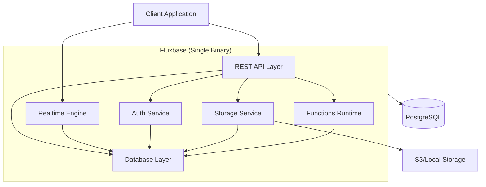

# Welcome to Fluxbase

:::caution Pre-Release Software
Fluxbase is currently in active development and **pre-release phase**. While we're working hard to stabilize the API and features, you may encounter breaking changes between versions. We recommend using Fluxbase for testing and development purposes, but exercise caution before deploying to production environments.
:::

Fluxbase is a lightweight, single-binary Backend-as-a-Service (BaaS) alternative to Supabase. It provides essential backend services including auto-generated REST APIs, authentication, realtime subscriptions, file storage, and edge functions - all in a single Go binary with PostgreSQL as the only dependency.

## Why Fluxbase?

### Single Binary Deployment

- **Simple**: Deploy one ~40MB binary or ~80MB container
- **Fast**: Starts in seconds, not minutes
- **Portable**: Runs anywhere Go runs

### Minimal Dependencies

- **PostgreSQL Only**: No Redis, no RabbitMQ, no additional services
- **Self-Contained**: Everything runs in one process
- **Easy Operations**: Less moving parts = less complexity

### High Performance

- **Efficient**: Written in Go for maximum performance
- **Scalable**: Handle 1000+ concurrent connections
- **Fast**: Sub-millisecond response times

### Developer Friendly

- **PostgREST Compatible**: Use existing Supabase knowledge
- **Auto-Generated APIs**: Database tables become REST endpoints automatically
- **TypeScript & Go SDKs**: First-class support for modern development

## Core Features

### REST API

Automatically generate CRUD endpoints from your PostgreSQL schema with PostgREST-compatible query syntax:

```bash
# Filter and select
GET /api/v1/tables/posts?published=eq.true&select=id,title,author(name)

# Order and paginate
GET /api/v1/tables/posts?order=created_at.desc&limit=10&offset=20

# Complex queries
GET /api/v1/tables/posts?or=(status.eq.draft,status.eq.published)&author_id=eq.1
```

### Authentication

Built-in authentication with JWT tokens:

- Email/password authentication
- Magic link authentication
- Session management
- Protected endpoints

### Realtime

WebSocket-based realtime subscriptions:

- PostgreSQL LISTEN/NOTIFY integration
- Channel-based subscriptions
- Presence tracking
- Broadcast capabilities

### Storage

File storage with access policies:

- Local filesystem or S3-compatible backends
- Bucket management
- Public/private access control
- Image transformations

### Edge Functions

JavaScript/TypeScript function execution:

- HTTP-triggered functions
- Scheduled functions (cron)
- Database webhook triggers
- Deno runtime

## Quick Comparison

| Feature            | Fluxbase          | Supabase                 | Firebase           |
| ------------------ | ----------------- | ------------------------ | ------------------ |
| **Deployment**     | Single binary (~40MB) | ~10 containers (~2GB) | Cloud only         |
| **Dependencies**   | PostgreSQL only   | PostgreSQL + 5+ services | Proprietary        |
| **Self-hosting**   | ✅ Easy           | ⚠️ Complex               | ❌ No              |
| **REST API**       | ✅ Auto-generated | ✅ PostgREST             | ✅ Auto-generated  |
| **Authentication** | ✅ Built-in       | ✅ GoTrue                | ✅ Built-in        |
| **Realtime**       | ✅ WebSocket      | ✅ WebSocket             | ✅ WebSocket       |
| **Storage**        | ✅ Local/S3       | ✅ S3                    | ✅ Cloud Storage   |
| **Functions**      | ✅ Deno           | ✅ Deno                  | ✅ Cloud Functions |
| **Background Jobs**| ✅ Built-in       | ✅ pg_cron (ext)         | ❌ No              |
| **Open Source**    | ✅ MIT            | ✅ Apache 2.0            | ❌ Proprietary     |

## Getting Started

### Prerequisites

- Go 1.22+ (for building from source)
- PostgreSQL 14+

### Quick Install

```bash
# Download the latest binary
curl -L https://github.com/wayli-app/fluxbase/releases/latest/download/fluxbase-linux-amd64 -o fluxbase
chmod +x fluxbase

# Or use Docker
docker run -p 8080:8080 ghcr.io/wayli-app/fluxbase:latest

# Or build from source
git clone https://github.com/wayli-app/fluxbase.git
cd fluxbase
make build
./fluxbase
```

### Your First API

1. Create a table in PostgreSQL:

```sql
CREATE TABLE posts (
    id UUID PRIMARY KEY DEFAULT gen_random_uuid(),
    title TEXT NOT NULL,
    content TEXT,
    published BOOLEAN DEFAULT false,
    created_at TIMESTAMPTZ DEFAULT NOW()
);
```

2. Access your auto-generated API:

```bash
# Create a post
curl -X POST http://localhost:8080/api/v1/tables/posts \
  -H "Content-Type: application/json" \
  -d '{"title": "Hello World", "content": "My first post!"}'

# Query posts
curl http://localhost:8080/api/v1/tables/posts?published=eq.true
```

That's it! Your API is ready.

## Architecture

Fluxbase is built as a monolithic Go application with a modular architecture:



## Next Steps

- [Installation Guide](getting-started/installation) - Set up Fluxbase in your environment
- [Quick Start Tutorial](getting-started/quick-start) - Build your first application
- [Configuration Reference](reference/configuration) - Customize Fluxbase for your needs
- [SDK Documentation](api/sdk) - TypeScript SDK API reference
- [SDK Guides](/docs/category/sdks) - Learn how to use the TypeScript SDK

## Community & Support

- **GitHub**: [github.com/wayli-app/fluxbase](https://github.com/wayli-app/fluxbase)
- **Discord**: [discord.gg/fluxbase](https://discord.gg/fluxbase)
- **Twitter**: [@fluxbase](https://twitter.com/fluxbase)

## License

Fluxbase is open source and released under the MIT License.
