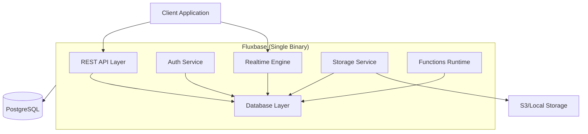

# Welcome to Fluxbase

Fluxbase is a lightweight, single-binary Backend-as-a-Service (BaaS) alternative to Supabase. It provides essential backend services including auto-generated REST APIs, authentication, realtime subscriptions, file storage, and edge functions - all in a single Go binary with PostgreSQL as the only dependency.

## Why Fluxbase?

### 🚀 Single Binary Deployment

- **Simple**: Deploy one binary file (~50MB)
- **Fast**: Starts in seconds, not minutes
- **Portable**: Runs anywhere Go runs

### 🔧 Minimal Dependencies

- **PostgreSQL Only**: No Redis, no RabbitMQ, no additional services
- **Self-Contained**: Everything runs in one process
- **Easy Operations**: Less moving parts = less complexity

### ⚡ High Performance

- **Efficient**: Written in Go for maximum performance
- **Scalable**: Handle 1000+ concurrent connections
- **Fast**: Sub-millisecond response times

### 🛠️ Developer Friendly

- **PostgREST Compatible**: Use existing Supabase knowledge
- **Auto-Generated APIs**: Database tables become REST endpoints automatically
- **TypeScript & Go SDKs**: First-class support for modern development

## Core Features

### 📊 REST API

Automatically generate CRUD endpoints from your PostgreSQL schema with PostgREST-compatible query syntax:

```bash
# Filter and select
GET /api/rest/posts?published=eq.true&select=id,title,author(name)

# Order and paginate
GET /api/rest/posts?order=created_at.desc&limit=10&offset=20

# Complex queries
GET /api/rest/posts?or=(status.eq.draft,status.eq.published)&author_id=eq.1
```

### 🔐 Authentication

Built-in authentication with JWT tokens:

- Email/password authentication
- Magic link authentication
- Session management
- Protected endpoints

### 📡 Realtime

WebSocket-based realtime subscriptions:

- PostgreSQL LISTEN/NOTIFY integration
- Channel-based subscriptions
- Presence tracking
- Broadcast capabilities

### 📦 Storage

File storage with access policies:

- Local filesystem or S3-compatible backends
- Bucket management
- Public/private access control
- Image transformations

### ⚡ Edge Functions

JavaScript/TypeScript function execution:

- HTTP-triggered functions
- Scheduled functions (cron)
- Database webhook triggers
- Embedded QuickJS runtime

## Quick Comparison

| Feature            | Fluxbase          | Supabase                 | Firebase           |
| ------------------ | ----------------- | ------------------------ | ------------------ |
| **Deployment**     | Single binary     | Multiple services        | Cloud only         |
| **Dependencies**   | PostgreSQL only   | PostgreSQL + 5+ services | Proprietary        |
| **Self-hosting**   | ✅ Easy           | ⚠️ Complex               | ❌ No              |
| **REST API**       | ✅ Auto-generated | ✅ PostgREST             | ✅ Auto-generated  |
| **Authentication** | ✅ Built-in       | ✅ GoTrue                | ✅ Built-in        |
| **Realtime**       | ✅ WebSocket      | ✅ WebSocket             | ✅ WebSocket       |
| **Storage**        | ✅ Local/S3       | ✅ S3                    | ✅ Cloud Storage   |
| **Functions**      | ✅ QuickJS        | ✅ Deno                  | ✅ Cloud Functions |
| **Open Source**    | ✅ MIT            | ✅ Apache 2.0            | ❌ Proprietary     |

## Getting Started

### Prerequisites

- Go 1.22+ (for building from source)
- PostgreSQL 14+

### Quick Install

```bash
# Download the latest binary
curl -L https://github.com/wayli-app/fluxbase/releases/latest/download/fluxbase-linux-amd64 -o fluxbase
chmod +x fluxbase

# Or use Docker
docker run -p 8080:8080 ghcr.io/wayli-app/fluxbase:latest

# Or build from source
git clone https://github.com/wayli-app/fluxbase.git
cd fluxbase
make build
./fluxbase
```

### Your First API

1. Create a table in PostgreSQL:

```sql
CREATE TABLE posts (
    id UUID PRIMARY KEY DEFAULT gen_random_uuid(),
    title TEXT NOT NULL,
    content TEXT,
    published BOOLEAN DEFAULT false,
    created_at TIMESTAMPTZ DEFAULT NOW()
);
```

2. Access your auto-generated API:

```bash
# Create a post
curl -X POST http://localhost:8080/api/rest/posts \
  -H "Content-Type: application/json" \
  -d '{"title": "Hello World", "content": "My first post!"}'

# Query posts
curl http://localhost:8080/api/rest/posts?published=eq.true
```

That's it! Your API is ready.

## Architecture

Fluxbase is built as a monolithic Go application with a modular architecture:



## Next Steps

- 📖 [Installation Guide](getting-started/installation) - Set up Fluxbase in your environment
- 🚀 [Quick Start Tutorial](getting-started/quick-start) - Build your first application
- 🔧 [Configuration Reference](reference/configuration) - Customize Fluxbase for your needs
- 📚 [API Documentation](api/rest) - Learn about all available endpoints
- 💻 [SDK Documentation](sdks/typescript) - Use our TypeScript or Go SDKs

## Community & Support

- **GitHub**: [github.com/wayli-app/fluxbase](https://github.com/wayli-app/fluxbase)
- **Discord**: [discord.gg/fluxbase](https://discord.gg/fluxbase)
- **Twitter**: [@fluxbase](https://twitter.com/fluxbase)

## License

Fluxbase is open source and released under the MIT License.
