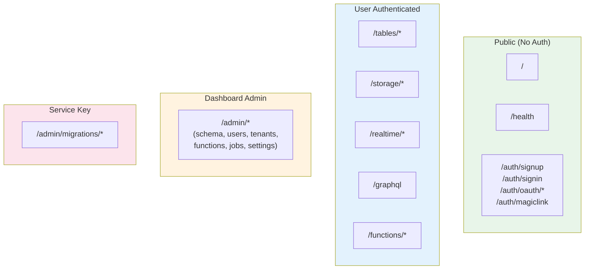

I believe in being transparent about how Fluxbase is built. This page explains my development philosophy, the role AI plays, and why this approach produces a better product.

## The Origin Story

Fluxbase was born from a real problem: building [Wayli](https://wayli.io), a self-hosted location tracking platform, I realized no one would use a product whose backend required Supabase-level infrastructure complexity. So I built what I actually needed—a Backend-as-a-Service that runs as a **single binary** with PostgreSQL as the only dependency.

Solo developer, ambitious scope, so I embraced AI assistance for velocity. The core principle: **AI writes code, humans own security.**

## How I Use AI

- **Human-led architecture** — System design, security patterns, and data models are human-designed
- **AI-assisted implementation** — AI writes boilerplate, handlers, tests, and documentation
- **Iterative refinement** — Multiple review cycles refine and validate all code
- **Security-first constraints** — Security patterns are non-negotiable requirements

## Security Through Simplicity

Fluxbase's architecture eliminates entire classes of vulnerabilities by making security explicit.

### API Registry

Every route is registered with explicit auth requirements:

```go
type Route struct {
    Auth         AuthRequirement  // none, optional, required, dashboard, service_key
    Scopes       []string
    TenantScoped bool
}
```

All API routes are registered through the centralized registry. Auth is declared, not bolted on—middleware is auto-injected. Gap audits are trivial: the built-in `AuditRoutes()` method lists all public endpoints, or check both `Auth: AuthNone` and `Public: true` in the route definitions.

### Declarative Schema

Schema files show current state, not migration history. Security reviews don't require git archaeology—RLS policies, GRANTs, and constraints are visible in one place.

### Row-Level Security

RLS enforces data access at the database level. Application bugs cannot bypass it.

### Additional Protections

AES-256-GCM encryption for secrets, rate limiting per endpoint, tenant-scoped connection pools, audit logging, and enforced parameterized queries.

### Multi-Agent Chatbot Pipeline

Chatbots run a multi-agent supervisor pipeline by default. This is disclosed for transparency:

- **Routing decision is logged**: when a user message arrives, a routing LLM (the supervisor) classifies intent and decides which specialist agent (SQL, KB, action, chat) handles it. The routing decision is emitted to the WebSocket client as an `agent_transition` event and is visible in server logs.
- **Per-agent prompts are public**: each specialist agent's system prompt is plain Go code in `internal/ai/agent_prompts.go`. You can read exactly what instructions each agent receives.
- **Verification is deterministic + LLM**: the verifier always runs a Unicode-script language-match check (stdlib only, no LLM call). On investigative turns it also runs a small LLM call to check that factual claims in the answer are grounded in tool results. The LLM check is opt-out via `@fluxbase:reasoning-mode react`.
- **One-retry cap**: verification never blocks an answer permanently. If the verifier reports issues, the answer ships anyway with the issues surfaced in the `done` event.
- **No silent data exfiltration**: agents only call tools configured for the chatbot (`execute_sql`, `search_vectors`, MCP tools). The supervisor itself has no tools. No agent can make outbound HTTP except through the chatbot's explicitly-allowed domains.

See [Multi-Agent Supervisor](/guides/ai-agents/) for the full architecture.

## API Surface



*(Selection of public endpoints shown — see [API Reference](/api/http/) for complete list)*

All routes without explicit `Auth: AuthNone` require authentication. Public routes are the exception, not the rule.

## What You're Getting

**What you can expect:** A functional, secure backend with security patterns enforced at the architecture level.

**What might happen:** Occasional edge cases or bugs, some features that need refinement on first release.

**How I handle it:** Transparent issue tracking on GitHub, rapid response to security vulnerabilities, active acceptance of community fixes.

**Why it's still safe:** Security isn't implemented feature-by-feature—it's baked in. RLS, parameterized queries, and scope validation are default patterns.

## Quality Gates

Every change passes `go fmt`, `golangci-lint`, TypeScript type-checking, and tests (25%+ coverage). Security patterns—parameterized queries, RLS on all user data, scope validation, no secrets in code—are enforced by pre-commit hooks and CI.

## My Commitment

1. **Transparency** — I'll always be upfront about how Fluxbase is built
2. **Security-first** — Security decisions are made by humans, not delegated to AI
3. **Simplicity** — I'll keep the codebase understandable and auditable
4. **Responsiveness** — Security issues get immediate attention
5. **Community** — I welcome contributions, security audits, and scrutiny

Released under AGPLv3. If you're evaluating Fluxbase, [read the code](https://github.com/nimbleflux/fluxbase)—the best verification is seeing for yourself.

---

## Learn More

- [Security Overview](/security/overview/) — Our security architecture in detail
- [Row-Level Security Guide](/guides/row-level-security/) — How RLS protects your data
- [API Reference](/api/http/) — HTTP API documentation
- [GitHub Repository](https://github.com/nimbleflux/fluxbase) — Source code
- [Discord Community](https://discord.gg/BXPRHkQzkA) — Join the conversation
