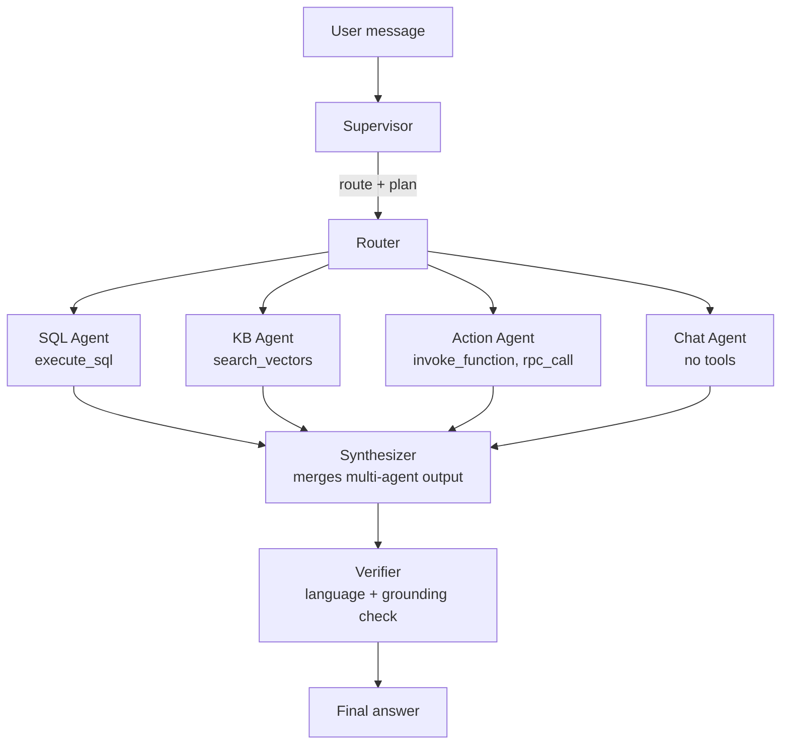

# Multi-Agent Supervisor Mode

By default, Fluxbase chatbots run in **supervisor mode** — a multi-agent pipeline that routes each user message through the right specialist, verifies the answer, and synthesizes multi-source responses into one coherent reply.

This is the recommended mode for production chatbots. It costs slightly more tokens than the legacy single-agent ReAct loop but produces better-structured answers, more reliable SQL investigations, and consistent language matching.

## Why a supervisor?

A single-agent loop (the legacy `react` mode) gives the model all tools and a long prompt, then lets it decide what to do. That works, but it has two well-known failure modes:

1. **Wrong tool selection.** The model answers from memory instead of running SQL, or uses the knowledge-base tool for a data question. A supervisor that *only sees SQL tools* on the SQL Agent cannot make this mistake.
2. **Language drift.** Tool results come back in English (column names, summaries). On long conversations the model's final answer sometimes drifts to English even when the user wrote in another language.

The supervisor pattern addresses both by **routing at the architecture level**: each specialist agent has a small focused prompt and a constrained tool set, the supervisor detects the user's language once and threads it through every downstream agent, and a verifier performs a deterministic Unicode-script check on the final answer before it ships.

## Architecture



Each box is a **node** in a graph executor. The supervisor runs first, decides which specialists to invoke, and stores its plan in graph state. The router fans out (sequentially in v1; parallelism is a planned optimization) and each specialist writes its output to shared state. When two or more specialists produced output, the synthesizer merges them. The verifier runs only when the supervisor flagged the turn as investigative.

## The seven agents

| Agent | Role | Tools | Default model tier |
|---|---|---|---|
| **Supervisor** | Reads the user's message, decides which specialists to invoke, detects language | None | Cheap |
| **SQL Agent** | Investigates factual data questions by running SQL queries | `execute_sql` | Strong |
| **KB Agent** | Answers conceptual questions from knowledge bases | `search_vectors` | Strong |
| **Action Agent** | Executes mutations, edge functions, and RPC procedures | `invoke_function`, `rpc_call`, etc. | Strong |
| **Chat Agent** | Handles greetings, chitchat, follow-ups | None | Cheap |
| **Synthesizer** | Merges multi-agent outputs into one coherent answer in the user's language | None | Medium |
| **Verifier** | Rule-based language check + optional LLM grounding check | None | Cheap |

Specialist prompts are small (~100 lines each) and focused. The SQL Agent's prompt *only* knows about SQL — it cannot see the KB or action tools. This makes wrong-tool selection structurally impossible.

## Per-agent model overrides

Different agents benefit from different models. The chat agent doesn't need GPT-4-class reasoning; the SQL agent does. Override per agent with the `@fluxbase:supervisor-models` annotation:

```typescript
/**
 * @fluxbase:supervisor-models {
 *   "supervisor": "gpt-4o-mini",
 *   "sql": "gpt-4-turbo",
 *   "chat": "gpt-4o-mini",
 *   "verifier": "gpt-4o-mini"
 * }
 */
export default `You are a helpful assistant.`;
```

Missing keys fall back to the chatbot's main `@fluxbase:model`. Use this to cut cost on chatbots with high chitchat ratio — the chat agent routes to the cheap model while SQL investigations still get the strong one.

## Verification

On investigative turns, the verifier runs two checks before the answer ships:

1. **Language match (always).** Compares the dominant Unicode script of the user's message against the response. If the user wrote in Cyrillic and the answer is Latin, the verifier flags it. This is a stdlib-only check — no LLM call.
2. **Grounding (LLM, investigative only).** When the language check passes and the turn ran tools, the verifier asks a small focused LLM call: "Are all factual claims in the answer supported by the tool results?" If not, the issues are reported in the turn's `done` event.

The verifier does **not** block the response permanently. It runs once, reports issues, and ships. Future iterations may add a one-retry path.

## Cost and latency

| Turn type | LLM calls | Notes |
|---|---|---|
| Chitchat ("hi", "thanks") | 2 (supervisor + chat) | Cheap model on chat |
| Single-agent investigative | 3-5 (supervisor + 1-3 SQL iterations + verifier) | SQL Agent runs an internal tool loop |
| Multi-agent investigative | 5-7 (supervisor + 2 specialists + synthesizer + verifier) | Synthesizer skipped on single-agent routes |

First-token latency is higher than legacy `react` mode because the supervisor runs before any specialist streams. The trade-off is fewer hallucinated answers and consistent language matching.

## Opting out

If supervisor mode doesn't fit a chatbot, pin the legacy ReAct loop:

```typescript
/**
 * @fluxbase:reasoning-mode react
 */
export default `You are a helpful assistant.`;
```

The ReAct loop remains fully supported. It runs faster and cheaper, at the cost of the supervisor's quality guarantees.

## See also

- [AI Chatbots](./ai-chatbots.md) — overview of chatbot setup and configuration
- [Page-aware chatbots](./ai-chatbots.md#page-aware-chatbots) — one chatbot, multiple page profiles
- [AI events reference](./ai-events.md) — WebSocket event types
- [Knowledge Bases](./knowledge-bases.md) — RAG setup
- [Vector Search](./vector-search.md) — embeddings
