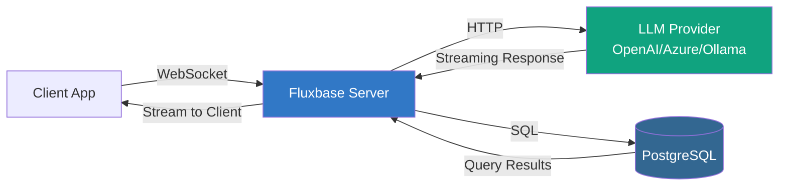

Fluxbase provides WebSocket-based AI chatbot integration, allowing you to build natural language interfaces to your database with streaming responses and custom behavior.

## Overview

AI chatbots in Fluxbase enable:

- **Natural Language Queries**: Users can ask questions in plain English instead of writing SQL
- **Streaming Responses**: Real-time streaming of AI responses via WebSocket
- **Custom Chatbots**: Create domain-specific assistants with TypeScript
- **Provider Management**: Support for OpenAI, Azure OpenAI, and Ollama
- **Built-in Security**: Rate limiting, token budgets, and row-level security
- **Conversation History**: Optional persistence of chat sessions
- **RAG Support**: Connect knowledge bases for context-aware responses

Common use cases include SQL assistants, customer support bots, data exploration tools, and domain-specific query interfaces.

## Architecture



The chatbot system:
1. Client connects to Fluxbase via WebSocket
2. User sends a message to the chatbot
3. Fluxbase sends the prompt to the LLM provider
4. LLM may call tools (like `execute_sql`) to query the database
5. Fluxbase streams the response back to the client
6. Query results are sent directly to the client for display

## Installation

```bash
npm install @fluxbase/sdk
```

## Basic Usage

### Connecting to a Chatbot

```typescript
import { createClient } from '@fluxbase/sdk'

const client = createClient('http://localhost:8080', 'your-anon-key')

// List available chatbots
const { data: chatbots, error } = await client.ai.listChatbots()
console.log('Available chatbots:', chatbots)

// Create a chat connection
const chat = client.ai.createChat({
  token: 'your-jwt-token',
  onContent: (delta, conversationId) => {
    // Stream content as it arrives
    process.stdout.write(delta)
  },
  onProgress: (step, message, conversationId) => {
    // Progress updates (e.g., "Querying database...")
    console.log(`[${step}] ${message}`)
  },
  onQueryResult: (query, summary, rowCount, data, conversationId) => {
    // SQL query results
    console.log(`Query: ${query}`)
    console.log(`Summary: ${summary}`)
    console.log(`Rows: ${rowCount}`)
    console.log('Data:', data)
  },
  onDone: (usage, conversationId) => {
    // Completion with token usage stats
    console.log(`\nTokens used: ${usage?.total_tokens}`)
  },
  onError: (error, code, conversationId) => {
    console.error(`Error: ${error} (${code})`)
  },
})

// Connect and start chatting
await chat.connect()
const conversationId = await chat.startChat('sql-assistant')
chat.sendMessage(conversationId, 'Show me the top 10 users by order count')
```

### Event Callbacks

The chat client provides several event callbacks:

| Callback | Description | Parameters |
|----------|-------------|------------|
| `onEvent` | All events (general handler) | `(event: AIChatEvent) => void` |
| `onContent` | Streaming content chunks | `(delta: string, conversationId: string) => void` |
| `onProgress` | Progress updates | `(step: string, message: string, conversationId: string) => void` |
| `onQueryResult` | SQL query results | `(query, summary, rowCount, data, conversationId) => void` |
| `onDone` | Message completion | `(usage: AIUsageStats \| undefined, conversationId) => void` |
| `onError` | Error events | `(error: string, code: string \| undefined, conversationId: string \| undefined) => void` |

### React Example

```typescript
import { useState, useEffect, useRef } from 'react'
import { createClient } from '@fluxbase/sdk'

function ChatInterface() {
  const [messages, setMessages] = useState<string[]>([])
  const [input, setInput] = useState('')
  const [conversationId, setConversationId] = useState<string | null>(null)
  const chatRef = useRef<any>(null)

  const client = createClient('http://localhost:8080', process.env.ANON_KEY!)

  useEffect(() => {
    const chat = client.ai.createChat({
      token: localStorage.getItem('access_token'),
      onContent: (delta) => {
        setMessages(prev => {
          const newMessages = [...prev]
          const lastIdx = newMessages.length - 1
          if (lastIdx >= 0 && newMessages[lastIdx].startsWith('AI: ')) {
            newMessages[lastIdx] += delta
          } else {
            newMessages.push('AI: ' + delta)
          }
          return newMessages
        })
      },
      onQueryResult: (query, summary, rowCount, data) => {
        console.log('Query executed:', { query, summary, rowCount, data })
      },
      onError: (error) => {
        setMessages(prev => [...prev, `Error: ${error}`])
      },
    })

    chatRef.current = chat

    chat.connect().then(() => {
      return chat.startChat('sql-assistant')
    }).then((convId) => {
      setConversationId(convId)
    })

    return () => chat.disconnect()
  }, [])

  const sendMessage = () => {
    if (!input.trim() || !conversationId) return

    setMessages(prev => [...prev, `You: ${input}`])
    chatRef.current.sendMessage(conversationId, input)
    setInput('')
  }

  return (
    <div>
      <div className="messages">
        {messages.map((msg, i) => (
          <div key={i}>{msg}</div>
        ))}
      </div>
      <input
        value={input}
        onChange={(e) => setInput(e.target.value)}
        onKeyPress={(e) => e.key === 'Enter' && sendMessage()}
        placeholder="Ask a question..."
      />
      <button onClick={sendMessage}>Send</button>
    </div>
  )
}
```

## Creating Custom Chatbots

Chatbots are defined in TypeScript files with metadata annotations and exported system prompts.

### File Structure

Create a chatbot file (e.g., `chatbots/my-assistant/index.ts`):

```typescript
/**
 * My Custom Assistant
 *
 * A helpful assistant for my specific domain.
 *
 * @fluxbase:description Custom assistant for domain-specific queries
 * @fluxbase:allowed-tables products,orders,customers
 * @fluxbase:allowed-operations SELECT
 * @fluxbase:allowed-schemas public
 * @fluxbase:max-tokens 4096
 * @fluxbase:temperature 0.7
 * @fluxbase:persist-conversations true
 * @fluxbase:conversation-ttl 24
 * @fluxbase:max-turns 50
 * @fluxbase:rate-limit 20
 * @fluxbase:daily-limit 500
 * @fluxbase:token-budget 100000
 * @fluxbase:allow-unauthenticated false
 * @fluxbase:public true
 */

export default `You are a helpful assistant that helps users query their data.

## Your Capabilities

1. You can execute SELECT queries against the database
2. You understand the database schema
3. You explain results clearly

## Guidelines

1. **Security First**: Only execute SELECT queries
2. **User Context**: Always filter by current user's ID when appropriate
3. **Pagination**: Use LIMIT clauses (max 100 rows)
4. **Explain First**: Describe what you're querying before executing
5. **Clear Answers**: Explain results in plain language

## Query Process

1. Understand the user's question
2. Examine the schema
3. Formulate a SQL query
4. Execute using execute_sql tool
5. Interpret and explain results

Current user ID: {{user_id}}
`

export const tools = [
  {
    name: "execute_sql",
    description: "Execute a read-only SQL query against the database",
    parameters: {
      type: "object",
      properties: {
        sql: {
          type: "string",
          description: "The SQL SELECT query to execute",
        },
        description: {
          type: "string",
          description: "Brief description of what this query retrieves",
        },
      },
      required: ["sql", "description"],
    },
  },
]
```

### Configuration Annotations

Available metadata annotations:

| Annotation | Description | Default |
|------------|-------------|---------|
| `@fluxbase:description` | Short description of the chatbot | Required |
| `@fluxbase:allowed-tables` | Comma-separated table names or `*` | `*` |
| `@fluxbase:allowed-operations` | Allowed SQL operations (SELECT, INSERT, etc.) | `SELECT` |
| `@fluxbase:allowed-schemas` | Allowed database schemas | `public` |
| `@fluxbase:max-tokens` | Maximum tokens per response | `4096` |
| `@fluxbase:temperature` | LLM temperature (0.0-2.0) | `0.7` |
| `@fluxbase:persist-conversations` | Save conversation history | `false` |
| `@fluxbase:conversation-ttl` | Conversation TTL in hours | `24` |
| `@fluxbase:max-turns` | Max messages in conversation | `50` |
| `@fluxbase:rate-limit` | Requests per minute | `10` |
| `@fluxbase:daily-limit` | Requests per day | `100` |
| `@fluxbase:token-budget` | Max tokens per day | `50000` |
| `@fluxbase:allow-unauthenticated` | Allow anonymous access | `false` |
| `@fluxbase:public` | Show in public chatbot list | `true` |
| `@fluxbase:http-allowed-domains` | Domains chatbot can fetch (comma-separated) | `""` (disabled) |
| `@fluxbase:knowledge-base` | Name of knowledge base for RAG (can specify multiple) | - |
| `@fluxbase:rag-max-chunks` | Maximum chunks to retrieve for RAG context | `5` |
| `@fluxbase:rag-similarity-threshold` | Minimum similarity score for RAG (0.0-1.0) | `0.7` |

### HTTP Tool

Chatbots can make HTTP requests to external APIs using the HTTP tool. This is useful for fetching external data, calling webhooks, or integrating with third-party services.

**Enable HTTP requests by specifying allowed domains:**

```typescript
/**
 * @fluxbase:http-allowed-domains api.example.com,data.weather.gov
 */
```

**Security restrictions:**

- Only GET requests are supported
- HTTPS is required for non-localhost domains
- Maximum response size: 1MB
- Request timeout: 10 seconds
- URLs containing credentials (basic auth) are blocked
- Only explicitly listed domains are allowed

**Example chatbot with HTTP tool:**

```typescript
/**
 * Weather Assistant
 *
 * @fluxbase:description Answers questions about weather using external API
 * @fluxbase:http-allowed-domains api.openweathermap.org
 * @fluxbase:allowed-tables locations
 */

export default `You can query weather data from the OpenWeatherMap API.

Use the http_get tool to fetch weather data:
- Endpoint: https://api.openweathermap.org/data/2.5/weather
- Parameters: lat, lon, appid (API key is provided automatically)

Current user ID: {{user_id}}
`
```

### RAG & Knowledge Bases

Chatbots can use Retrieval-Augmented Generation (RAG) to provide context-aware responses based on your custom documentation, FAQs, or other content stored in knowledge bases.

**Enable RAG by linking knowledge bases:**

```typescript
/**
 * Support Assistant
 *
 * @fluxbase:description Customer support with knowledge base
 * @fluxbase:knowledge-base product-docs
 * @fluxbase:knowledge-base faq
 * @fluxbase:rag-max-chunks 5
 * @fluxbase:rag-similarity-threshold 0.7
 */

export default `You are a helpful customer support assistant.

Use the provided context from the knowledge base to answer questions.
If you can't find relevant information in the context, say so honestly.

Current user ID: {{user_id}}
`
```

**How RAG works:**

1. When a user sends a message, the query is embedded using the same model as documents
2. Similar chunks are retrieved from linked knowledge bases via vector similarity search
3. Retrieved context is injected into the system prompt before the LLM call
4. The LLM generates an informed response using the provided context

**RAG configuration options:**

| Annotation | Description | Default |
|------------|-------------|---------|
| `@fluxbase:knowledge-base` | Knowledge base name (can specify multiple) | - |
| `@fluxbase:rag-max-chunks` | Maximum chunks to retrieve | `5` |
| `@fluxbase:rag-similarity-threshold` | Minimum similarity (0.0-1.0) | `0.7` |

For detailed documentation on creating knowledge bases, adding documents, and configuring RAG, see the [Knowledge Bases & RAG](/docs/guides/knowledge-bases) guide.

### System Prompt Best Practices

1. **Be Specific**: Clearly define the chatbot's purpose and capabilities
2. **Security Rules**: Emphasize security constraints (e.g., read-only operations)
3. **User Context**: Explain how to use `{{user_id}}` for user-specific queries
4. **Examples**: Include example queries users might ask
5. **Formatting**: Use clear sections with markdown headers

### Variable Substitution

Available template variables:

- `{{user_id}}`: Current authenticated user's ID
- `{{namespace}}`: Current namespace

## Admin Management

Administrators can manage chatbots and AI providers through the admin API.

### Listing Chatbots

```typescript
// List all chatbots (admin view)
const { data, error } = await client.admin.ai.listChatbots()

// Filter by namespace
const { data, error } = await client.admin.ai.listChatbots('production')
```

### Managing Chatbots

```typescript
// Get chatbot details
const { data, error } = await client.admin.ai.getChatbot('chatbot-id')

// Enable/disable a chatbot
const { data, error } = await client.admin.ai.toggleChatbot('chatbot-id', true)

// Delete a chatbot
const { data, error } = await client.admin.ai.deleteChatbot('chatbot-id')
```

### Syncing Chatbots

Sync chatbots from filesystem or API payload:

```typescript
// Sync from filesystem (loads from configured chatbots directory)
const { data, error } = await client.admin.ai.sync()

// Sync with provided chatbot code
const { data, error } = await client.admin.ai.sync({
  namespace: 'default',
  chatbots: [{
    name: 'my-assistant',
    code: chatbotCodeString,
  }],
  options: {
    delete_missing: false, // Don't remove chatbots not in this sync
    dry_run: false,        // Preview changes without applying
  }
})

if (data) {
  console.log(`Created: ${data.summary.created}`)
  console.log(`Updated: ${data.summary.updated}`)
  console.log(`Deleted: ${data.summary.deleted}`)
}
```

### Provider Management

Configure AI providers (OpenAI, Azure OpenAI, or Ollama):

```typescript
// List providers
const { data: providers } = await client.admin.ai.listProviders()

// Create a provider
const { data, error } = await client.admin.ai.createProvider({
  name: 'openai-main',
  display_name: 'OpenAI (Main)',
  provider_type: 'openai',
  is_default: true,
  config: {
    api_key: 'sk-...',
    model: 'gpt-4-turbo',
  }
})

// Set as default
await client.admin.ai.setDefaultProvider('provider-id')

// Delete provider
await client.admin.ai.deleteProvider('provider-id')
```

## Security & Best Practices

### Authentication

Chatbots require authentication by default. Configure with `@fluxbase:allow-unauthenticated` for public access.

```typescript
// Authenticated usage (recommended)
const chat = client.ai.createChat({
  token: userJWT, // User's JWT token
  // ... event handlers
})
```

### Row-Level Security

Chatbots respect PostgreSQL Row-Level Security (RLS) policies. Always use `{{user_id}}` in your system prompt to filter user-specific data:

```typescript
export default `
When querying user-specific tables, ALWAYS filter by:
WHERE user_id = '{{user_id}}'

Current user: {{user_id}}
`
```

### Rate Limiting

Protect your API with rate limits and token budgets:

```typescript
/**
 * @fluxbase:rate-limit 20        # 20 requests per minute
 * @fluxbase:daily-limit 500      # 500 requests per day
 * @fluxbase:token-budget 100000  # 100k tokens per day
 */
```

### Allowed Operations

Restrict database operations to prevent data modification:

```typescript
/**
 * @fluxbase:allowed-operations SELECT
 * @fluxbase:allowed-tables products,orders
 */
```

### Best Practices

1. **Start with SELECT Only**: Only allow SELECT queries unless you have a specific need
2. **Use RLS**: Implement Row-Level Security policies for all user data
3. **Set Token Budgets**: Prevent runaway costs with daily token limits
4. **Enable Conversation Persistence**: Store chat history for better context
5. **Monitor Usage**: Track token consumption and query patterns
6. **Validate Table Access**: Limit `allowed-tables` to only what's needed
7. **Set Reasonable Limits**: Configure appropriate rate limits for your use case

## Troubleshooting

### Connection Issues

**WebSocket fails to connect:**
- Verify the WebSocket URL is correct
- Check CORS settings if connecting from browser
- Ensure JWT token is valid and not expired
- Verify network allows WebSocket connections

### Rate Limit Errors

**"Rate limit exceeded" error:**
- User has exceeded `@fluxbase:rate-limit` (per minute)
- Wait or increase the limit in chatbot configuration

**"Daily limit exceeded" error:**
- User has exceeded `@fluxbase:daily-limit` (per day)
- Reset occurs at midnight UTC or increase the limit

**"Token budget exceeded" error:**
- Total tokens consumed exceeded `@fluxbase:token-budget`
- Monitor usage via admin API and increase if needed

### Provider Configuration

**"No AI provider configured" error:**
- Create at least one AI provider via admin API
- Set a default provider with `setDefaultProvider()`

**"Provider authentication failed" error:**
- Verify API key is correct
- Check provider is enabled
- Ensure API key has sufficient credits/quota

### Query Execution Errors

**"Table not allowed" error:**
- Table not in `@fluxbase:allowed-tables` list
- Update chatbot configuration to include the table

**"Operation not allowed" error:**
- Query uses operation not in `@fluxbase:allowed-operations`
- Typically means attempting INSERT/UPDATE/DELETE when only SELECT is allowed

**"Permission denied" error:**
- User lacks PostgreSQL permissions on the table
- Check Row-Level Security policies
- Verify user authentication

## Next Steps

- [Knowledge Bases & RAG](/docs/guides/knowledge-bases) - Create knowledge bases for RAG-powered chatbots
- [TypeScript SDK Reference](/docs/api/sdk) - Full SDK API documentation
- [Row-Level Security](/docs/guides/row-level-security) - Secure your data access
- [Authentication](/docs/guides/authentication) - User authentication setup
- [Rate Limiting](/docs/guides/rate-limiting) - Configure rate limits
- [Monitoring](/docs/guides/monitoring-observability) - Track chatbot usage
