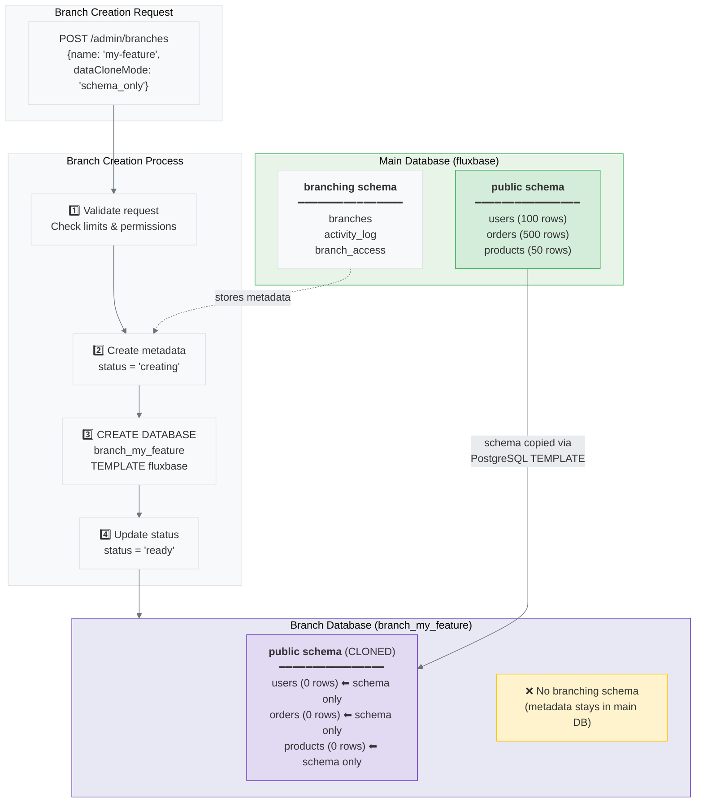
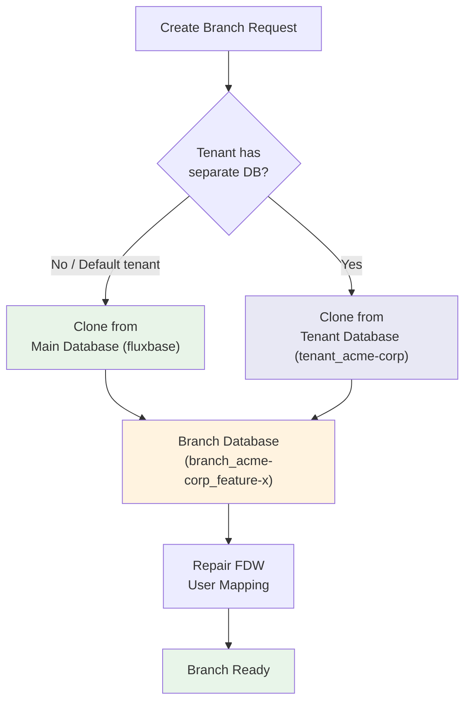

Database branching allows you to create isolated copies of your database for development, testing, or preview environments. Each branch is a separate PostgreSQL database that can be used independently.

## Overview

Use database branches to:

- Test migrations before applying to production
- Create isolated environments for PR previews
- Safely experiment with schema changes
- Run integration tests with real data structures

## Quick Start with CLI

The easiest way to work with branches is using the Fluxbase CLI. The server handles all the database operations - you just run commands.

### Common Workflow

```bash
# Create a branch for your feature
fluxbase branch create my-feature

# Work with the branch (it's automatically used by the CLI)
fluxbase branch get my-feature

# When done, delete the branch
fluxbase branch delete my-feature
```

### Essential Commands

```bash
# Create a branch (copies schema from main by default)
fluxbase branch create my-feature

# Create a branch with full data copy
fluxbase branch create my-feature --clone-data full_clone

# List all branches
fluxbase branch list

# Show branch details
fluxbase branch get my-feature

# Reset branch to parent state (useful for testing migrations)
fluxbase branch reset my-feature

# Delete a branch
fluxbase branch delete my-feature

# Set default branch for all CLI commands
fluxbase branch use my-feature

# Check which branch is currently active
fluxbase branch current

# Switch back to main branch
fluxbase branch use main
```

### Setting a Default Branch

Use `fluxbase branch use` to set a default branch for all CLI commands. This saves the branch to your profile and automatically includes the `X-Fluxbase-Branch` header in every request.

```bash
# Set CLI to use a specific branch
fluxbase branch use my-feature
# Output: Now using branch: my-feature
#         All CLI commands will now use this branch.

# All subsequent commands automatically use this branch
fluxbase data list users    # Uses my-feature branch
fluxbase function deploy    # Uses my-feature branch

# Check current branch
fluxbase branch current
# Output: Current branch: my-feature

# Switch back to main
fluxbase branch use main
```

This is useful when you're working on a feature branch for an extended period and don't want to specify the branch with every command.

### Creating Nested Branches

Create a branch from another branch:

```bash
# Create feature-b from feature-a (instead of main)
fluxbase branch create feature-b --from feature-a
```

This creates a chain: `main` → `feature-a` → `feature-b`

## Server Configuration

**This section is for server operators only.** Users of the CLI or API don't need to configure anything - the server handles branching automatically.

### Prerequisites

The PostgreSQL user must have `CREATE DATABASE` privilege. Grant it if needed:

```sql
-- Connect to postgres database as superuser
GRANT CREATE ON DATABASE postgres TO your_fluxbase_user;
```

### Minimal Configuration

Enable branching in your `fluxbase.yaml`:

```yaml
branching:
  enabled: true
```

That's it! The server will use its existing database credentials to create and manage branches.

### Optional Settings

```yaml
branching:
  enabled: true
  max_total_branches: 50 # Maximum total branches across all users
  max_branches_per_user: 5 # Maximum branches per user (default: 5)
  default_data_clone_mode: schema_only
  auto_delete_after: 24h
  database_prefix: branch_
```

| Option                    | Default       | Description                                                     |
| ------------------------- | ------------- | --------------------------------------------------------------- |
| `enabled`                 | `true`        | Enable database branching                                       |
| `max_total_branches`      | `50`          | Maximum total branches across all users                         |
| `default_data_clone_mode` | `schema_only` | Default cloning mode (schema_only, full_clone, seed_data)       |
| `auto_delete_after`       | `0`           | Auto-delete preview branches after this duration (0 = disabled) |
| `database_prefix`         | `branch_`     | Prefix for branch database names                                |

**Note:** When `auto_delete_after` is set (e.g., `24h`, `7d`), a background cleanup scheduler runs automatically to delete expired branches.

### Data Clone Modes

| Mode          | Description                                                          |
| ------------- | -------------------------------------------------------------------- |
| `schema_only` | Copy schema only, no data (fast)                                     |
| `full_clone`  | Copy schema and all data (slower, useful for testing with real data) |
| `seed_data`   | Copy schema with seed data from `seeds_path` (see [Workflows](/guides/branching/workflows/)) |

### How It Works

When you create a branch, the server:

1. Uses its database credentials to connect to the `postgres` database
2. Executes `CREATE DATABASE branch_my_feature` (or similar)
3. Copies the schema (and optionally data) from the parent branch
4. Tracks the branch metadata in the `branching.branches` table

The server never needs separate admin credentials — it uses the same PostgreSQL user it already has. For tenants with separate databases, the branch is cloned from the tenant's database instead of the main one (see [Branches and Multi-Tenancy](#branches-and-multi-tenancy)).

### Branch Creation Process

The following diagram shows how database branching works, including what happens to the `public` schema:



**Key points:**

- **Database-level isolation**: Each branch is a separate PostgreSQL database, not just a schema within the same database
- **Branching metadata stays in main**: The `branching` schema (which tracks all branches) only exists in the main database
- **Public schema is cloned**: Your application tables in the `public` schema are copied to the new database
- **Data depends on clone mode**: With `schema_only`, tables are created but empty. With `full_clone`, all data is copied too

## Using TypeScript SDK

```typescript
import { createClient } from "@nimbleflux/fluxbase-sdk";

const client = createClient("http://localhost:8080", "your-key");

// Create a branch
const { data: branch } = await client.branching.create("my-feature", {
  dataCloneMode: "schema_only",
  expiresIn: "7d",
});

// Wait for it to be ready
await client.branching.waitForReady("my-feature");

// Delete when done
await client.branching.delete("my-feature");
```

See the [Branching API](/guides/branching/api/) for complete documentation.

## Using the REST API

For advanced users and custom integrations:

```bash
# Create a branch
curl -X POST http://localhost:8080/api/v1/admin/branches \
  -H "Authorization: Bearer $TOKEN" \
  -H "Content-Type: application/json" \
  -d '{"name": "my-feature"}'

# Access branch data
curl http://localhost:8080/api/v1/tables/users \
  -H "Authorization: Bearer $TOKEN" \
  -H "X-Fluxbase-Branch: my-feature"
```

## Branch Types

| Type         | Description            | Auto-Delete               |
| ------------ | ---------------------- | ------------------------- |
| `main`       | Primary database       | Never                     |
| `preview`    | Temporary environments | After `auto_delete_after` |
| `persistent` | Long-lived branches    | Never                     |

## Connecting to Branches

### Via HTTP Header

Include the `X-Fluxbase-Branch` header in your requests:

```bash
curl http://localhost:8080/api/v1/tables/users \
  -H "X-Fluxbase-Branch: my-feature"
```

### Via Query Parameter

Append `?branch=` to the URL:

```bash
curl "http://localhost:8080/api/v1/tables/users?branch=my-feature"
```

### Direct Database Connection

Get the branch connection URL for direct PostgreSQL access:

```bash
fluxbase branch get my-feature --output json | jq -r .connection_url
```

## Branch Lifecycle

```
┌─────────────────────────────────────────────────────────────┐
│                        MAIN BRANCH                          │
│                    (Always exists)                          │
└───────────────────────────┬─────────────────────────────────┘
                            │
                            ▼
┌───────────────────────────────────────────────────────────────┐
│  Creating  →  Ready  →  Migrating  →  Ready  →  Deleting     │
│    (new)       (use)     (update)      (use)     (cleanup)   │
└───────────────────────────────────────────────────────────────┘
```

### States

| State       | Description                 |
| ----------- | --------------------------- |
| `creating`  | Database is being created   |
| `ready`     | Branch is available for use |
| `migrating` | Migrations are running      |
| `error`     | An error occurred           |
| `deleting`  | Branch is being deleted     |
| `deleted`   | Branch has been deleted     |

## Branches and Multi-Tenancy

When multi-tenancy is enabled, branches can be scoped to specific tenants:

- Each branch record has a `tenant_id` foreign key referencing `platform.tenants`
- Branch slug uniqueness is enforced per tenant via a `(slug, tenant_id)` unique constraint
- Per-tenant branch limits are controlled by the `max_branches_per_tenant` config option (default: 0, unlimited)
- Tenant-scoped branches use prefixed database names: `{prefix}{tenant_slug}_{branch_slug}`
- Connection pool routing follows this priority: branch pool > tenant pool > main pool
- Instance admins can see and manage all branches across tenants
- Non-admin users only see branches within their own tenant
- Deleting a tenant automatically cleans up all associated branches and their databases

To create a tenant-scoped branch, include the `X-FB-Tenant` header or rely on the tenant context from your service key:

```bash
curl -X POST http://localhost:8080/api/v1/admin/branches \
  -H "Authorization: Bearer $TOKEN" \
  -H "X-FB-Tenant: acme-corp" \
  -H "Content-Type: application/json" \
  -d '{"name": "feature-x", "data_clone_mode": "schema_only"}'
```

### Clone Source Resolution

When a tenant has a separate database (the `db_name` field is set on `platform.tenants`), branches clone from the **tenant's database** rather than the main database. This means the branch gets the tenant's `public` schema, not the shared one.



For the default tenant (no separate database), branches clone from the main database as usual.

### FDW Repair After Cloning

When a tenant database is cloned to create a branch, the foreign table definitions are copied but the FDW user mappings may point to stale credentials. Fluxbase automatically repairs the FDW mapping after cloning by:

1. Re-creating the user mapping in the branch database using the tenant's FDW role credentials
2. Ensuring `app.current_tenant_id` is set correctly on the FDW role
3. Verifying that shared schemas (auth, storage, functions, etc.) remain accessible

This happens transparently during branch creation — no manual intervention is needed. If FDW connections break after a branch operation, use the tenant repair endpoint:

```bash
curl -X POST http://localhost:8080/api/v1/admin/tenants/<tenant-id>/repair
```

## Access Control

Branch access is controlled by:

1. **Creator** - Automatically has admin access
2. **Explicit Grants** - Can grant read/write/admin access to others
3. **Service Keys** - Have full access to all branches
4. **Dashboard Admins** - Have full access to all branches

### Access Levels

| Level   | Permissions                 |
| ------- | --------------------------- |
| `read`  | View branch, query data     |
| `write` | Read + modify data          |
| `admin` | Write + delete/reset branch |

## Next Steps

- [Branching Workflows](/guides/branching/workflows) - Development workflow examples
- [GitHub Integration](/guides/branching/github-integration) - Automatic PR branches
- [Branching API](/guides/branching/api/) - API documentation
- [Security Best Practices](/security/branching-security) - Security considerations
