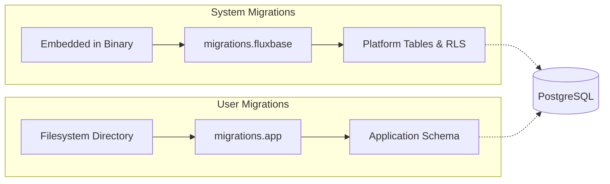
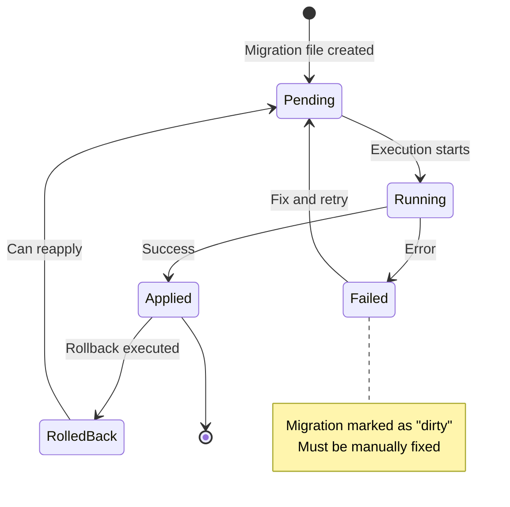

Fluxbase supports automatic database migrations that run on startup. The platform includes a dual migration system:

1. **System Migrations** - Built-in migrations embedded in the Fluxbase binary
2. **User Migrations** - Custom migrations you can provide via the filesystem

## Overview

Migrations are powered by [golang-migrate](https://github.com/golang-migrate/migrate) and use PostgreSQL as the database backend. Fluxbase automatically tracks migration state in separate tables:

- `migrations.fluxbase` - Tracks system migrations
- `migrations.app` - Tracks your custom migrations

This separation ensures that system and user migrations don't conflict with each other.

## Dual Migration System

Fluxbase maintains two independent migration tracks to separate platform updates from application changes:



### System Migrations

**Purpose:** Platform infrastructure managed by Fluxbase

System migrations are embedded into the Fluxbase binary at compile time and include:

- Core authentication tables
- OAuth provider tables
- Row-level security policies
- Webhook configuration
- Storage metadata tables
- Jobs and functions infrastructure

**Tracking:** `migrations.fluxbase` table

**Execution:** Automatically run on every startup (idempotent - only new migrations applied)

**Management:** Controlled by Fluxbase releases, not user-modifiable

### User Migrations

**Purpose:** Application-specific schema managed by developers

User migrations allow you to add your own custom database schema and data migrations without modifying Fluxbase source code.

**Tracking:** `migrations.app` table

**Execution:** Run after system migrations if `DB_USER_MIGRATIONS_PATH` is configured

**Management:** You create and maintain these files

### When to Use Each

| Use System Migrations       | Use User Migrations               |
| --------------------------- | --------------------------------- |
| Never (managed by Fluxbase) | Application tables                |
|                             | Custom indexes                    |
|                             | Data transformations              |
|                             | Business logic triggers           |
|                             | Application-specific RLS policies |

### Migration State Machine



**Migration States:**

- **Pending**: Not yet executed
- **Running**: Currently executing (rare to see)
- **Applied**: Successfully completed
- **Failed**: Error occurred (database in "dirty" state)
- **RolledBack**: Reverted via down migration

### Migration File Format

User migrations follow the standard golang-migrate format:

```text
001_create_users_table.up.sql
001_create_users_table.down.sql
002_add_timestamps.up.sql
002_add_timestamps.down.sql
```

Each migration has two files:

- **`.up.sql`** - Applied when migrating forward
- **`.down.sql`** - Applied when rolling back (optional but recommended)

### Migration Numbering

Migrations are executed in numerical order based on the prefix. Best practices:

- Use sequential numbering: `001`, `002`, `003`, etc.
- Zero-pad numbers for proper sorting
- Never reuse or skip numbers
- Never modify a migration that has already been applied

### Example Migration

**001_create_products_table.up.sql:**

```sql
-- Create products table in public schema
CREATE TABLE IF NOT EXISTS public.products (
    id UUID PRIMARY KEY DEFAULT gen_random_uuid(),
    name TEXT NOT NULL,
    description TEXT,
    price DECIMAL(10,2) NOT NULL,
    created_at TIMESTAMPTZ NOT NULL DEFAULT NOW(),
    updated_at TIMESTAMPTZ NOT NULL DEFAULT NOW()
);

-- Add RLS policies
ALTER TABLE public.products ENABLE ROW LEVEL SECURITY;

-- Allow all authenticated users to read products
CREATE POLICY "Products are viewable by authenticated users"
    ON public.products
    FOR SELECT
    TO authenticated
    USING (true);

-- Allow only admins to insert/update/delete products
CREATE POLICY "Products are manageable by admins"
    ON public.products
    FOR ALL
    TO authenticated
    USING (auth.role() = 'admin')
    WITH CHECK (auth.role() = 'admin');
```

**001_create_products_table.down.sql:**

```sql
-- Drop the table (this will also drop policies)
DROP TABLE IF EXISTS public.products CASCADE;
```

## Configuration

### Docker Compose

To enable user migrations in Docker Compose:

1. Create a directory for your migrations:

```bash
mkdir -p deploy/migrations/user
```

2. Add your migration files to this directory

3. Update `docker-compose.yml`:

```yaml
services:
  fluxbase:
    environment:
      # Enable user migrations
      DB_USER_MIGRATIONS_PATH: /migrations/user
    volumes:
      # Mount migrations directory (read-only)
      - ./migrations/user:/migrations/user:ro
```

4. Restart Fluxbase:

```bash
docker compose restart fluxbase
```

### Kubernetes (Helm)

To enable user migrations in Kubernetes:

1. Create a ConfigMap or PVC with your migration files

**Option A: Using ConfigMap (for small migrations):**

```bash
kubectl create configmap user-migrations \
  --from-file=migrations/user/ \
  -n fluxbase
```

**Option B: Using PVC (recommended for production):**

```yaml
# values.yaml
migrationsPersistence:
  enabled: true
  size: 100Mi
  storageClass: "" # Use cluster default

config:
  database:
    userMigrationsPath: /migrations/user
```

2. Install or upgrade the Helm chart:

```bash
helm upgrade --install fluxbase ./deploy/helm/fluxbase \
  --namespace fluxbase \
  --create-namespace \
  -f values.yaml
```

3. Copy your migration files to the PVC:

```bash
# Find a pod
POD_NAME=$(kubectl get pod -n fluxbase -l app.kubernetes.io/name=fluxbase -o jsonpath="{.items[0].metadata.name}")

# Copy migrations
kubectl cp migrations/user/ fluxbase/$POD_NAME:/migrations/user/
```

4. Restart the deployment:

```bash
kubectl rollout restart deployment/fluxbase -n fluxbase
```

### Environment Variables

You can configure user migrations via environment variables:

| Variable                  | Description                       | Default         |
| ------------------------- | --------------------------------- | --------------- |
| `DB_USER_MIGRATIONS_PATH` | Path to user migrations directory | `""` (disabled) |

When `DB_USER_MIGRATIONS_PATH` is empty or not set, user migrations are skipped.

## CLI Commands

For local development, Fluxbase provides Make commands for migration management:

```bash
# Run all pending migrations
make migrate-up

# Rollback the last migration
make migrate-down

# Create a new migration file pair
make migrate-create NAME=add_users_table
# Creates: migrations/XXX_add_users_table.up.sql and .down.sql

# Check current migration version
make migrate-version

# Force set migration version (use with caution)
make migrate-force VERSION=5
```

**Common workflow:**

```bash
# 1. Create new migration
make migrate-create NAME=add_products

# 2. Edit the generated files
#    migrations/001_add_products.up.sql
#    migrations/001_add_products.down.sql

# 3. Apply migration
make migrate-up

# 4. Test rollback
make migrate-down

# 5. Reapply
make migrate-up
```

**Prerequisites:** These commands require:

- Local PostgreSQL running
- Database connection configured in `.env` or `fluxbase.yaml`
- `migrate` CLI installed (automatically available in DevContainer)

## Migration Execution

When Fluxbase starts, migrations are executed in this order:

1. **System migrations** are applied first from the embedded filesystem
2. **User migrations** are applied second from the configured directory (if enabled)

Both migration sets maintain their own version tracking, so they can be at different versions.

### Logs

Migration progress is logged during startup:

```
INFO Running database migrations...
INFO Running system migrations...
INFO Migrations applied successfully source=system version=6
INFO Running user migrations... path=/migrations/user
INFO Migrations applied successfully source=user version=3
INFO Database migrations completed successfully
```

If no new migrations are found:

```
INFO No new migrations to apply source=system
INFO No new migrations to apply source=user
```

## Best Practices

### 1. Test Migrations Locally First

Always test migrations in a development environment before applying to production:

```bash
# Start local environment
docker compose up -d

# Check logs for migration success
docker compose logs fluxbase | grep -i migration
```

### 2. Use Transactions

Wrap DDL statements in transactions when possible:

```sql
BEGIN;

CREATE TABLE products (...);
CREATE INDEX IF NOT EXISTS idx_products_name ON products(name);

COMMIT;
```

### 3. Make Migrations Idempotent

Use conditional statements to make migrations safe to re-run:

```sql
-- Good: Uses IF NOT EXISTS
CREATE TABLE IF NOT EXISTS products (...);

-- Bad: Will fail if table exists
CREATE TABLE products (...);
```

### 4. Add Indexes Concurrently

For large tables, create indexes without locking:

```sql
-- Add indexes concurrently (won't block reads/writes)
CREATE INDEX CONCURRENTLY idx_products_category ON products(category);
```

### 5. Plan for Rollbacks

Always include `.down.sql` files to support rollback scenarios:

```sql
-- down.sql should reverse the up.sql changes
DROP INDEX IF EXISTS idx_products_category;
DROP TABLE IF EXISTS products;
```

### 6. Document Complex Migrations

Add comments explaining the purpose of complex migrations:

```sql
-- Migration: Add full-text search to products
-- Author: Your Name
-- Date: 2024-01-15
-- Reason: Enable product search functionality

ALTER TABLE products ADD COLUMN search_vector tsvector;

CREATE INDEX IF NOT EXISTS idx_products_search
  ON products
  USING gin(search_vector);
```

## Common Migration Tasks

### Adding a New Table

```sql
-- 002_create_orders_table.up.sql
CREATE TABLE public.orders (
    id UUID PRIMARY KEY DEFAULT gen_random_uuid(),
    user_id UUID NOT NULL REFERENCES auth.app_users(id) ON DELETE CASCADE,
    total DECIMAL(10,2) NOT NULL,
    status TEXT NOT NULL DEFAULT 'pending',
    created_at TIMESTAMPTZ NOT NULL DEFAULT NOW()
);

CREATE INDEX IF NOT EXISTS idx_orders_user_id ON orders(user_id);
CREATE INDEX IF NOT EXISTS idx_orders_status ON orders(status);

ALTER TABLE public.orders ENABLE ROW LEVEL SECURITY;
```

### Adding a Column

```sql
-- 003_add_product_sku.up.sql
ALTER TABLE public.products
  ADD COLUMN IF NOT EXISTS sku TEXT UNIQUE;

-- Add index for lookups
CREATE INDEX CONCURRENTLY IF NOT EXISTS idx_products_sku
  ON products(sku);
```

### Modifying a Column

```sql
-- 004_change_price_precision.up.sql
-- Increase price precision from DECIMAL(10,2) to DECIMAL(12,4)
ALTER TABLE public.products
  ALTER COLUMN price TYPE DECIMAL(12,4);
```

### Adding an Enum Type

```sql
-- 005_add_order_status_enum.up.sql
-- Create enum type
CREATE TYPE order_status AS ENUM ('pending', 'processing', 'shipped', 'delivered', 'cancelled');

-- Migrate existing data
ALTER TABLE orders
  ALTER COLUMN status TYPE order_status
  USING status::order_status;
```

## Troubleshooting

### Migration Failed - Dirty State

If a migration fails partway through, the database may be in a "dirty" state:

```
ERROR failed to run user migrations: Dirty database version X. Fix and force version.
```

Fluxbase will automatically attempt to recover from dirty state by forcing the version. If this fails, you can manually fix it:

```sql
-- Connect to database
psql -h localhost -U fluxbase -d fluxbase

-- Check migration state
SELECT * FROM migrations.app;

-- Force version if needed (replace X with the correct version)
DELETE FROM migrations.app;
INSERT INTO migrations.app (version, dirty) VALUES (X, false);
```

### Migration Not Running

If your migration isn't being applied:

1. **Check file naming**: Ensure files follow the format `NNN_name.up.sql`
2. **Check file location**: Verify files are in the correct directory
3. **Check permissions**: Ensure Fluxbase can read the migration files
4. **Check logs**: Look for migration errors in Fluxbase logs
5. **Check version**: Verify the migration version is newer than the current version

### Checking Migration Status

To see which migrations have been applied:

```sql
-- Check system migrations
SELECT * FROM migrations.fluxbase ORDER BY version;

-- Check user migrations
SELECT * FROM migrations.app ORDER BY version;
```

## Advanced Topics

### Running Migrations Separately

In some cases, you may want to run migrations separately from application startup (e.g., during CI/CD).

Fluxbase currently runs migrations automatically on startup. For manual migration control, you can:

1. Use the golang-migrate CLI directly
2. Use a separate init container in Kubernetes
3. Run migrations in a CI/CD pipeline before deploying

### Migration Locking

Fluxbase uses advisory locks to prevent concurrent migrations. This is handled automatically by golang-migrate.

### Schema Versioning

Each migration source (system and user) maintains its own version number independently. This allows:

- System migrations to be updated without affecting user migrations
- User migrations to be rolled back without affecting system migrations
- Clear separation of concerns

## Related Resources

- [Row-Level Security Guide](./row-level-security.md)
- [Configuration Reference](../reference/configuration.md)
- [Deployment Guides](../deployment/overview.md)
- [golang-migrate Documentation](https://github.com/golang-migrate/migrate)
