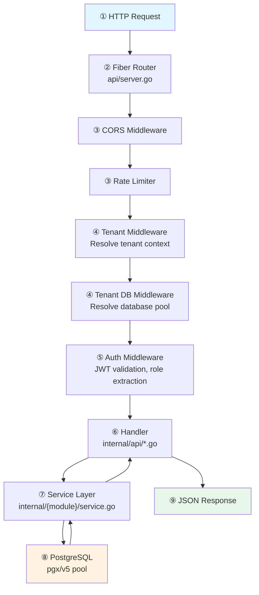

## Code Tour

The best way to understand Fluxbase is to follow a request through the system. The diagram below shows the path a typical API request takes. Below it, each numbered step lists the files you should open and read to understand what happens at that stage.



### ① Entry Point — How the server starts

Before any request arrives, the server boots up and wires everything together using a module-based dependency injection system:

1. Open [`cmd/fluxbase/main.go`](https://github.com/nimbleflux/fluxbase/blob/main/cmd/fluxbase/main.go) and follow the `main()` function. You'll see config loading, database pool creation, and the call to `NewServer()` which triggers the full module initialization pipeline.
2. [`internal/api/server.go`](https://github.com/nimbleflux/fluxbase/blob/main/internal/api/server.go) — `NewServer()` creates a `ServiceRegistry`, instantiates 20 modules in dependency order, calls `InitModules()`, and then wires each module's handler group to the `Server` struct (~20 lines of assignment).
3. [`internal/api/module.go`](https://github.com/nimbleflux/fluxbase/blob/main/internal/api/module.go) — The `Module` interface (`Name()` + `Init(ctx, *ServiceRegistry) error`), the optional `Shutdowner` interface for clean teardown, and the `ServiceRegistry` which stores config, DB, pub/sub, rate limiter, metrics, and registered services. Modules read dependencies via `GetService[T]()` and register outputs via `registry.Register()`.
4. [`internal/api/module_*.go`](https://github.com/nimbleflux/fluxbase/blob/main/internal/api/) — 20 module files, one per domain. Each module's `Init()` creates its services and writes directly to its handler group struct (`m.Handlers`). Modules run in order: Email → Secrets → Storage → Logging → Auth → Webhook → Extensions → Tenancy → Settings → Schema → Functions → Jobs → RPC → AI → Realtime → Branching → GraphQL → MCP → Metrics → BackgroundServices.
5. [`internal/api/handler_groups.go`](https://github.com/nimbleflux/fluxbase/blob/main/internal/api/handler_groups.go) — 22 handler group structs (e.g., `AuthHandlers`, `StorageHandlers`, `AIHandlers`). Each module populates its own group during `Init()`.

For configuration, open [`internal/config/config.go`](https://github.com/nimbleflux/fluxbase/blob/main/internal/config/config.go) for the root `Config` struct. Domain-specific config types (Auth, Database, Storage, etc.) are split into [`config_auth.go`](https://github.com/nimbleflux/fluxbase/blob/main/internal/config/config_auth.go), [`config_database.go`](https://github.com/nimbleflux/fluxbase/blob/main/internal/config/config_database.go), and a dozen more files in the same package. Field names map directly to YAML keys and `FLUXBASE_*` env vars. For defaults, see [`internal/config/config_defaults.go`](https://github.com/nimbleflux/fluxbase/blob/main/internal/config/config_defaults.go).

### ② Routing — Where requests land

Open [`internal/api/server.go`](https://github.com/nimbleflux/fluxbase/blob/main/internal/api/server.go) for the server struct (8 methods: lifecycle, health, and a few cross-group accessors). The actual route registration happens in [`internal/api/server_routes.go`](https://github.com/nimbleflux/fluxbase/blob/main/internal/api/server_routes.go):

1. `setupRoutes()` calls `registerRoutesViaRegistry()` which delegates to `routes.RegisterAllRoutes()`
2. [`internal/api/routes/registry.go`](https://github.com/nimbleflux/fluxbase/blob/main/internal/api/routes/registry.go) — The centralized route registry. Every route is registered with explicit auth requirements (`AuthRequirement`), and middleware is auto-injected based on those declarations. The registry also validates consistency (e.g., no route with `Auth: AuthNone` and `Public: false`)

Route dependencies (handler references, middleware) are organized in per-domain files: [`auth.go`](https://github.com/nimbleflux/fluxbase/blob/main/internal/api/routes/auth.go), [`ai.go`](https://github.com/nimbleflux/fluxbase/blob/main/internal/api/routes/ai.go), etc.

### ③ Middleware — CORS and rate limiting

The global middleware chain runs before any route-specific middleware:

1. [`internal/api/server_middlewares.go`](https://github.com/nimbleflux/fluxbase/blob/main/internal/api/server_middlewares.go) — Structured logger, CORS, recover, and other global middleware setup
2. [`internal/middleware/rate_limiter.go`](https://github.com/nimbleflux/fluxbase/blob/main/internal/middleware/rate_limiter.go) — Rate limiting per route

### ④ Tenant & Branch Context — Which database to talk to

Tenant middleware runs before auth so that tenant context is available for authentication (e.g., per-tenant JWT secrets). Open these in order:

1. [`internal/middleware/tenant.go`](https://github.com/nimbleflux/fluxbase/blob/main/internal/middleware/tenant.go) — Tenant resolution: `X-FB-Tenant` header → JWT claims → default tenant. Sets `tenant_id`, `tenant_slug`, and the merged `tenant_config` in fiber locals
2. [`internal/middleware/tenant_db.go`](https://github.com/nimbleflux/fluxbase/blob/main/internal/middleware/tenant_db.go) — Database pool resolution. `GetPoolForSchema()` implements the branch > tenant > main priority chain
3. [`internal/middleware/branch.go`](https://github.com/nimbleflux/fluxbase/blob/main/internal/middleware/branch.go) — Branch context from `X-Fluxbase-Branch` header

### ⑤ Auth Middleware — Who is making the request

With tenant context established, authentication validates the user:

1. [`internal/middleware/clientkey_auth.go`](https://github.com/nimbleflux/fluxbase/blob/main/internal/middleware/clientkey_auth.go) — JWT validation, role extraction, `RequireAuth` / `RequireServiceKey`. This is where the `Authorization` header is parsed and claims land in fiber locals
2. [`internal/auth/jwt.go`](https://github.com/nimbleflux/fluxbase/blob/main/internal/auth/jwt.go) — How tokens are created, what claims they carry (`TokenClaims` struct), and how roles map to PostgreSQL roles

### ⑥ ⑦ ⑧ Handler → Service → Database — The actual work

This is the three-layer architecture every feature follows. Trace it with the REST CRUD (the most-used feature):

1. [`internal/api/rest_crud.go`](https://github.com/nimbleflux/fluxbase/blob/main/internal/api/rest_crud.go) — The CRUD handler. See how `SELECT`, `INSERT`, `UPDATE`, `DELETE` are built from URL path and query params. Handles all `/api/v1/tables/{table}` requests
2. [`internal/api/query_parser.go`](https://github.com/nimbleflux/fluxbase/blob/main/internal/api/query_parser.go) + [`query_parser_select.go`](https://github.com/nimbleflux/fluxbase/blob/main/internal/api/query_parser_select.go) + [`query_parser_filter.go`](https://github.com/nimbleflux/fluxbase/blob/main/internal/api/query_parser_filter.go) + [`query_parser_order.go`](https://github.com/nimbleflux/fluxbase/blob/main/internal/api/query_parser_order.go) + [`query_parser_sql.go`](https://github.com/nimbleflux/fluxbase/blob/main/internal/api/query_parser_sql.go) — URL query parsing split by concern: `?select=` → select fields, `?order=` → ordering, `?col.eq=` → filters, all composed into SQL
3. [`internal/api/query_builder.go`](https://github.com/nimbleflux/fluxbase/blob/main/internal/api/query_builder.go) — Filters → SQL `WHERE`, `ORDER BY`, `LIMIT`
4. [`internal/database/connection.go`](https://github.com/nimbleflux/fluxbase/blob/main/internal/database/connection.go) — The connection pool, transaction helpers, and the `sync.RWMutex` safety pattern. Migration-related methods are in [`connection_migrations.go`](https://github.com/nimbleflux/fluxbase/blob/main/internal/database/connection_migrations.go)
5. [`internal/database/schema_inspector.go`](https://github.com/nimbleflux/fluxbase/blob/main/internal/database/schema_inspector.go) — Schema introspection: how Fluxbase discovers tables, columns, types, and relationships to power the auto-generated API

### Digging deeper — Multi-tenancy internals

Once you've traced a request, the multi-tenancy subsystem is the most complex piece worth understanding:

1. [`internal/tenantdb/manager.go`](https://github.com/nimbleflux/fluxbase/blob/main/internal/tenantdb/manager.go) — The `Manager` struct. Read `CreateTenantDatabase()` to see the full provisioning flow: database creation → bootstrap → FDW setup → declarative schema
2. [`internal/tenantdb/fdw.go`](https://github.com/nimbleflux/fluxbase/blob/main/internal/tenantdb/fdw.go) — Foreign Data Wrapper setup: `postgres_fdw` configuration, per-tenant roles with `NOBYPASSRLS`, shared schema imports
3. [`internal/tenantdb/router.go`](https://github.com/nimbleflux/fluxbase/blob/main/internal/tenantdb/router.go) — Per-tenant connection pool cache with LRU eviction
4. [`internal/config/tenant_loader.go`](https://github.com/nimbleflux/fluxbase/blob/main/internal/config/tenant_loader.go) + [`internal/config/tenant_merge.go`](https://github.com/nimbleflux/fluxbase/blob/main/internal/config/tenant_merge.go) — Per-tenant config override loading and deep-merge logic

For the full multi-tenancy architecture (database-per-tenant, FDW, connection routing, RLS roles), see the [Multi-Tenancy Guide](/guides/multi-tenancy/).

### Database schemas — The foundation

Internal schemas are managed **declaratively** — the SQL files show the current state, not a migration history. When the server starts, [`internal/migrations/declarative.go`](https://github.com/nimbleflux/fluxbase/blob/main/internal/migrations/declarative.go) diffs the current database state against the desired schema files using `pgschema` and applies only the changes needed. This means you can read any schema file and see exactly what the tables, RLS policies, and grants look like right now — no git archaeology required. This is especially valuable for security reviews.

The SQL files live in [`internal/database/schema/schemas/`](https://github.com/nimbleflux/fluxbase/blob/main/internal/database/schema/schemas/). Start with:

- [`platform.sql`](https://github.com/nimbleflux/fluxbase/blob/main/internal/database/schema/schemas/platform.sql) — Tenants, service keys, users, memberships, settings
- [`auth.sql`](https://github.com/nimbleflux/fluxbase/blob/main/internal/database/schema/schemas/auth.sql) — Users, sessions, identities, OTP codes, client keys
- [`bootstrap.sql`](https://github.com/nimbleflux/fluxbase/blob/main/internal/database/bootstrap/bootstrap.sql) — The SQL that runs on every startup (schemas, extensions, roles, privileges)

### Tracing a complete feature — Edge Functions

To see how a full feature fits together end-to-end, trace the edge functions system:

1. [`internal/api/routes/functions.go`](https://github.com/nimbleflux/fluxbase/blob/main/internal/api/routes/functions.go) — Route definitions and middleware
2. [`internal/functions/handler.go`](https://github.com/nimbleflux/fluxbase/blob/main/internal/functions/handler.go) — HTTP handlers for CRUD and invocation
3. [`internal/functions/loader.go`](https://github.com/nimbleflux/fluxbase/blob/main/internal/functions/loader.go) — Loading functions from disk at startup
4. [`internal/functions/storage.go`](https://github.com/nimbleflux/fluxbase/blob/main/internal/functions/storage.go) + [`storage_sync.go`](https://github.com/nimbleflux/fluxbase/blob/main/internal/functions/storage_sync.go) + [`storage_executions.go`](https://github.com/nimbleflux/fluxbase/blob/main/internal/functions/storage_executions.go) + [`storage_files.go`](https://github.com/nimbleflux/fluxbase/blob/main/internal/functions/storage_files.go) — Database storage for function metadata, sync, executions, and files
5. [`internal/runtime/runtime.go`](https://github.com/nimbleflux/fluxbase/blob/main/internal/runtime/runtime.go) — The Deno runtime wrapper

### Tests — How to test

- [`internal/api/rest_crud_test.go`](https://github.com/nimbleflux/fluxbase/blob/main/internal/api/rest_crud_test.go) — Table-driven unit tests with mock dependencies
- [`test/e2e/`](https://github.com/nimbleflux/fluxbase/blob/main/test/e2e/) — E2E tests against a real database
- [`internal/testutil/`](https://github.com/nimbleflux/fluxbase/blob/main/internal/testutil/) — Shared helpers, mocks, and assertions

## How to Add a New Feature

### Add a Module

Fluxbase uses a module-based dependency injection system. To add a new feature:

1. Create a handler group struct in [`internal/api/handler_groups.go`](https://github.com/nimbleflux/fluxbase/blob/main/internal/api/handler_groups.go)
2. Create a module file `internal/api/module_myfeature.go` implementing the `Module` interface:
   ```go
   type MyFeatureModule struct{ Handlers *MyFeatureHandlers }

   func (m *MyFeatureModule) Name() string { return "myfeature" }
   func (m *MyFeatureModule) Init(ctx context.Context, registry *api.ServiceRegistry) error {
       // Read dependencies: db := registry.DB; config := registry.Config
       // Create services, handlers, and populate m.Handlers
       // Register outputs: registry.Register(myService)
       return nil
   }
   ```
3. If the module has resources to clean up (goroutines, connections), implement `Shutdowner`:
   ```go
   func (m *MyFeatureModule) Shutdown(ctx context.Context) error {
       // Stop goroutines, close connections
       return nil
   }
   ```
4. Wire the module in `NewServer()` in [`internal/api/server.go`](https://github.com/nimbleflux/fluxbase/blob/main/internal/api/server.go): add it to the `mods` slice in the correct dependency order, then assign `m.Handlers` to the server after `InitModules()` returns
5. Add routes in [`internal/api/routes/`](https://github.com/nimbleflux/fluxbase/blob/main/internal/api/routes/)

### Tenant Scoping

If the feature should be tenant-scoped:
- Add `tenant_id` to the database table
- Create RLS policies for `tenant_service` role
- Ensure the middleware chain includes `TenantMiddleware` for the route group
- Use `middleware.GetTenantID(c)` in handlers to get the current tenant

### Write Tests

Add tests alongside the source file:

```go
func TestGetMyResource_Found_ReturnsResource(t *testing.T) {
    // Test implementation
}
```

### Update Documentation

- Add API endpoint to `docs/src/content/docs/api/http/index.md`
- Add guide to `docs/src/content/docs/guides/` if it's a new feature
- Update `CLAUDE.md` if it changes configuration or architecture

## Related Documentation

- [Multi-Tenancy](/guides/multi-tenancy/) - Multi-tenancy architecture and configuration
- [Row Level Security](/guides/row-level-security/) - RLS implementation details
- [Configuration](/reference/configuration/) - Complete configuration reference
- [HTTP API](/api/http/) - HTTP API endpoint reference
