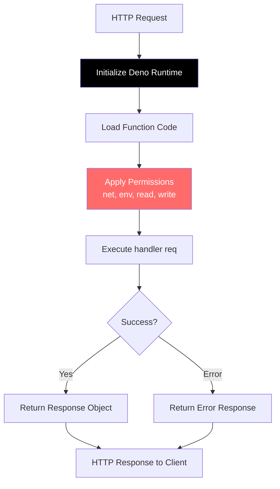

Edge Functions are serverless functions powered by Deno that execute JavaScript/TypeScript code in response to HTTP requests.

## Features

- Deno runtime for TypeScript/JavaScript
- HTTP triggered via REST API or SDK
- Secure sandbox with configurable permissions
- Direct database access
- Execution logging and versioning
- Configurable timeouts

## Use Cases

- Process webhooks from third-party services
- Transform and validate data
- Integrate with external APIs
- Run scheduled tasks
- Implement custom business logic
- Extend authentication flows

## Installation

```bash
npm install @fluxbase/sdk
```

## Quick Start

```typescript
import { FluxbaseClient } from "@fluxbase/sdk";

const client = new FluxbaseClient({
  url: "http://localhost:8080",
  apiKey: process.env.FLUXBASE_CLIENT_KEY,
});

// Create function
await client.functions.create({
  name: "hello-world",
  description: "My first edge function",
  code: `
    async function handler(req) {
      const data = JSON.parse(req.body || '{}')
      return {
        status: 200,
        headers: { "Content-Type": "application/json" },
        body: JSON.stringify({
          message: \`Hello \${data.name || 'World'}!\`
        })
      }
    }
  `,
  enabled: true,
});

// Invoke function
const result = await client.functions.invoke("hello-world", {
  name: "Alice",
});

console.log(result); // { message: "Hello Alice!" }

// List functions
const functions = await client.functions.list();

// Get function details
const details = await client.functions.get("hello-world");

// View execution history
const executions = await client.functions.getExecutions("hello-world", {
  limit: 10,
});
```

## Writing Functions

### Function Signature

Every function must export an async `handler` function:

```typescript
async function handler(req) {
  // req contains: method, url, headers, body, params

  return {
    status: 200,
    headers: { "Content-Type": "application/json" },
    body: JSON.stringify({ result: "success" }),
  };
}
```

### Request Object

```typescript
interface Request {
  method: string; // GET, POST, etc.
  url: string;
  headers: Record<string, string>;
  body: string; // Raw body (use JSON.parse for JSON)
  params: Record<string, string>; // Query parameters

  // Authentication context (if user is authenticated)
  user_id?: string; // Authenticated user's ID
  user_email?: string; // User's email from JWT claims
  user_role?: string; // User's role from JWT claims
  session_id?: string; // Current session ID
}
```

### Using the Fluxbase SDK

Edge functions can import and use the Fluxbase SDK for database operations, authentication, and more:

```typescript
import { createClient } from "@fluxbase/sdk";

async function handler(req) {
  // Create a service client with elevated permissions
  const client = createClient(
    Deno.env.get("FLUXBASE_BASE_URL")!,
    Deno.env.get("FLUXBASE_SERVICE_ROLE_KEY")!,
  );

  // Query the database
  const { data, error } = await client
    .from("users")
    .select("*")
    .eq("id", req.user_id)
    .execute();

  if (error) {
    return {
      status: 500,
      body: JSON.stringify({ error: error.message }),
    };
  }

  return {
    status: 200,
    headers: { "Content-Type": "application/json" },
    body: JSON.stringify(data),
  };
}
```

**Note:** The SDK is available via import maps configured in `/functions/deno.json`. For local development with live SDK changes, use `/functions/deno.dev.json` which points to your local SDK mount.

### Response Object

```typescript
interface Response {
  status: number;
  headers?: Record<string, string>;
  body?: string;
}
```

## Function Examples

### Simple Data Processing

```typescript
async function handler(req) {
  const { email } = JSON.parse(req.body || "{}");

  // Validate email
  if (!email || !email.includes("@")) {
    return {
      status: 400,
      body: JSON.stringify({ error: "Invalid email" }),
    };
  }

  return {
    status: 200,
    body: JSON.stringify({ valid: true }),
  };
}
```

### Database Query

```typescript
async function handler(req) {
  // Database client is available via env
  const dbUrl = Deno.env.get("DATABASE_URL");

  // Use pg client or any PostgreSQL library
  const result = await fetch(`${dbUrl}/users`);

  return {
    status: 200,
    body: JSON.stringify(result),
  };
}
```

### External API Call

```typescript
async function handler(req) {
  const { query } = JSON.parse(req.body || "{}");

  // Call external API
  const response = await fetch(`https://api.example.com/search?q=${query}`);
  const data = await response.json();

  return {
    status: 200,
    headers: { "Content-Type": "application/json" },
    body: JSON.stringify(data),
  };
}
```

### Error Handling

```typescript
async function handler(req) {
  try {
    const data = JSON.parse(req.body || "{}");

    // Process data
    const result = await processData(data);

    return {
      status: 200,
      body: JSON.stringify({ result }),
    };
  } catch (error) {
    return {
      status: 500,
      body: JSON.stringify({
        error: "Processing failed",
        message: error.message,
      }),
    };
  }
}
```

## Authentication

Functions automatically receive the authenticated user context:

```typescript
async function handler(req) {
  // User info from JWT token (if authenticated)
  const userId = req.user_id; // UUID string
  const userEmail = req.user_email; // Email string
  const userRole = req.user_role; // Role string (e.g., "authenticated", "admin")

  if (!userId) {
    return {
      status: 401,
      body: JSON.stringify({ error: "Unauthorized" }),
    };
  }

  // Use user context for authorization
  return {
    status: 200,
    body: JSON.stringify({ userId, userEmail, userRole }),
  };
}
```

**How it works:**

1. Fluxbase validates the JWT token in the `Authorization` header
2. User context (id, email, role) is extracted from the token
3. User info is added to the request object (`user_id`, `user_email`, `user_role`)
4. Function handler receives the request with user context
5. Handler can use user info for authorization and data filtering

## Handler Execution Flow



**Execution steps:**

1. Initialize Deno runtime with configured permissions
2. Load the function code into the sandbox
3. Apply security permissions (net, env, read, write)
4. Execute the handler with the request object
5. Return the response to the client

## npm Package Support

Fluxbase supports importing npm packages in your edge functions using Deno's `npm:` specifier or URL imports. Functions are automatically bundled when they contain imports.

### Using npm Packages

```typescript
// Import from npm
import { z } from "npm:zod@3.22.4";
import dayjs from "npm:dayjs@1.11.10";

// Import from URL
import { marked } from "https://esm.sh/marked@9.1.0";

async function handler(req) {
  const data = JSON.parse(req.body || "{}");

  // Use zod for validation
  const schema = z.object({
    name: z.string(),
    email: z.email(),
  });

  const validated = schema.parse(data);

  return {
    status: 200,
    body: JSON.stringify({ success: true, data: validated }),
  };
}
```

### How Bundling Works

1. **Detection** - Fluxbase detects import statements in your code
2. **Validation** - Imports are checked against security blocklist
3. **Bundling** - Deno bundles your code with dependencies into a single file
4. **Storage** - Bundled code is stored in the database for fast execution
5. **Execution** - Runtime uses the pre-bundled code (no bundling overhead)

**Performance:** Bundling happens once at creation/update time, not on every invocation.

### Security Restrictions

For security, the following packages are blocked:

- `child_process` / `node:child_process` - Process execution
- `vm` / `node:vm` - Code evaluation
- `fs` / `node:fs` - Filesystem access
- `process` / `node:process` - Process manipulation

Use Deno's built-in APIs or web-standard alternatives instead.

### Bundling Errors

If bundling fails, Fluxbase stores the error but keeps the unbundled code:

```typescript
// Check bundling status
const func = await client.functions.get("my-function");
console.log("Is bundled:", func.is_bundled);
console.log("Bundle error:", func.bundle_error);
```

Common bundling errors:

- **Package not found** - Check package name and version
- **Network timeout** - npm registry may be slow/unavailable
- **Bundle too large** - Limit is 5MB after bundling
- **Blocked package** - Using a restricted security package

## Shared Modules

Shared modules allow you to reuse code across multiple edge functions, similar to Supabase's `_shared` directory pattern. Modules are stored with a `_shared/` prefix and can be imported by any function.

### Creating Shared Modules

**Via SDK:**

```typescript
await client.functions.createSharedModule({
  module_path: "_shared/cors.ts",
  description: "CORS headers helper",
  content: `
    export function corsHeaders(origin?: string) {
      return {
        'Access-Control-Allow-Origin': origin || '*',
        'Access-Control-Allow-Headers': 'authorization, x-client-info, apikey, content-type',
        'Access-Control-Allow-Methods': 'POST, GET, OPTIONS, PUT, DELETE'
      }
    }
  `,
});
```

**Via File System:**

Create a `_shared/` directory in your functions folder:

```
functions/
├── _shared/
│   ├── cors.ts         ← Shared CORS utilities
│   ├── database.ts     ← Database helpers
│   └── validation.ts   ← Input validation
└── my-function.ts
```

```typescript
// functions/_shared/cors.ts
export function corsHeaders(origin?: string) {
  return {
    "Access-Control-Allow-Origin": origin || "*",
    "Access-Control-Allow-Headers":
      "authorization, x-client-info, apikey, content-type",
    "Access-Control-Allow-Methods": "POST, GET, OPTIONS, PUT, DELETE",
  };
}

export function handleCors(req: Request) {
  if (req.method === "OPTIONS") {
    return {
      status: 200,
      headers: corsHeaders(),
    };
  }
  return null;
}
```

### Using Shared Modules

Import shared modules using the `_shared/` prefix:

```typescript
// functions/my-api.ts
import { corsHeaders, handleCors } from "_shared/cors.ts";
import { validateEmail } from "_shared/validation.ts";

async function handler(req) {
  // Handle preflight requests
  const corsResponse = handleCors(req);
  if (corsResponse) return corsResponse;

  const data = JSON.parse(req.body || "{}");

  // Use shared validation
  if (!validateEmail(data.email)) {
    return {
      status: 400,
      headers: corsHeaders(),
      body: JSON.stringify({ error: "Invalid email" }),
    };
  }

  return {
    status: 200,
    headers: corsHeaders(),
    body: JSON.stringify({ success: true }),
  };
}
```

### Nested Shared Modules

Organize shared code in subdirectories:

```
functions/
├── _shared/
│   ├── utils/
│   │   ├── date.ts
│   │   └── string.ts
│   ├── database/
│   │   ├── connection.ts
│   │   └── queries.ts
│   └── cors.ts
└── my-function/
    └── index.ts
```

```typescript
// functions/my-function/index.ts
import { corsHeaders } from "_shared/cors.ts";
import { formatDate } from "_shared/utils/date.ts";
import { query } from "_shared/database/queries.ts";

async function handler(req) {
  const users = await query("SELECT * FROM users");
  const timestamp = formatDate(new Date());

  return {
    status: 200,
    headers: corsHeaders(),
    body: JSON.stringify({ users, timestamp }),
  };
}
```

### Common Shared Module Patterns

**CORS Helper:**

```typescript
// _shared/cors.ts
export function corsHeaders(origin?: string) {
  return {
    "Access-Control-Allow-Origin": origin || "*",
    "Access-Control-Allow-Headers":
      "authorization, x-client-info, apikey, content-type",
    "Access-Control-Allow-Methods": "POST, GET, OPTIONS, PUT, DELETE",
  };
}

export function handleCors(req: Request) {
  if (req.method === "OPTIONS") {
    return {
      status: 200,
      headers: corsHeaders(),
    };
  }
  return null;
}
```

**Input Validation:**

```typescript
// _shared/validation.ts
export function validateEmail(email: string): boolean {
  const regex = /^[^\s@]+@[^\s@]+\.[^\s@]+$/;
  return regex.test(email);
}

export function validateRequired(data: any, fields: string[]): string[] {
  const missing = [];
  for (const field of fields) {
    if (!data[field]) {
      missing.push(field);
    }
  }
  return missing;
}

export function sanitizeString(str: string): string {
  return str.trim().replace(/[<>]/g, "");
}
```

**Error Responses:**

```typescript
// _shared/errors.ts
export function errorResponse(message: string, status = 400) {
  return {
    status,
    headers: { "Content-Type": "application/json" },
    body: JSON.stringify({ error: message }),
  };
}

export function successResponse(data: any, status = 200) {
  return {
    status,
    headers: { "Content-Type": "application/json" },
    body: JSON.stringify(data),
  };
}
```

### Managing Shared Modules

**List all shared modules:**

```typescript
const modules = await client.functions.listSharedModules();
console.log(modules);
// [
//   { module_path: '_shared/cors.ts', version: 1, ... },
//   { module_path: '_shared/validation.ts', version: 2, ... }
// ]
```

**Get a specific module:**

```typescript
const module = await client.functions.getSharedModule("_shared/cors.ts");
console.log(module.content);
```

**Update a shared module:**

```typescript
await client.functions.updateSharedModule("_shared/cors.ts", {
  content: `
    export function corsHeaders() {
      // Updated implementation
    }
  `,
  description: "Updated CORS helper",
});
```

**Delete a shared module:**

```typescript
await client.functions.deleteSharedModule("_shared/cors.ts");
```

### How Bundling Works with Shared Modules

1. **Detection** - Fluxbase detects imports from `_shared/` in function code
2. **Loading** - All shared modules are loaded from database or filesystem
3. **Bundling** - Deno bundles the function with all dependencies and shared modules
4. **Storage** - Bundled code is stored for fast execution
5. **Execution** - Runtime uses the pre-bundled code

**Important:** When you update a shared module, you must re-save or reload any functions that use it to trigger re-bundling.

### File-Based vs Database Shared Modules

**File-Based** (`functions/_shared/*.ts`):

- ✅ Version controlled with your code
- ✅ Easy local development
- ✅ Syncs on reload/boot
- ❌ Requires filesystem access

**Database** (created via SDK/API):

- ✅ Dynamically updatable
- ✅ No filesystem required
- ✅ Versioning built-in
- ❌ Not version controlled with code

**Best Practice:** Use file-based shared modules for production deployments and database modules for dynamic/temporary utilities.

## Deployment Methods

### 1. SDK Deployment

```typescript
await client.functions.create({
  name: "my-function",
  code: `async function handler(req) { ... }`,
  enabled: true,
});

// Update existing function
await client.functions.update("my-function", {
  code: `async function handler(req) { ... }`,
});
```

### 2. File-Based Deployment

Mount a directory with function files:

```yaml
# docker-compose.yml
services:
  fluxbase:
    image: ghcr.io/fluxbase-eu/fluxbase:latest
    volumes:
      - ./functions:/app/functions
    environment:
      FLUXBASE_FUNCTIONS_ENABLED: "true"
      FLUXBASE_FUNCTIONS_FUNCTIONS_DIR: /app/functions
      FLUXBASE_FUNCTIONS_AUTO_LOAD_ON_BOOT: "true" # Load on startup (default: true)
```

**Function File Patterns:**

Fluxbase supports two ways to organize your functions:

**1. Flat File Pattern** (simple functions):

```typescript
// functions/hello.ts
async function handler(req) {
  return {
    status: 200,
    body: JSON.stringify({ message: "Hello!" }),
  };
}
```

**2. Directory Pattern** (complex functions with multiple files):

```
functions/
└── complex-webhook/
    ├── index.ts       ← Entry point (handler function)
    ├── types.ts       ← Type definitions
    ├── helpers.ts     ← Shared utilities
    └── config.ts      ← Configuration
```

```typescript
// functions/complex-webhook/index.ts
import { processData } from "./helpers.ts";
import { WebhookConfig } from "./types.ts";

async function handler(req) {
  const data = processData(req.body);
  return {
    status: 200,
    body: JSON.stringify(data),
  };
}
```

**Priority Rules:**

- If both `hello.ts` and `hello/index.ts` exist, the flat file takes precedence
- Directory pattern requires `index.ts` as the entry point
- Only `.ts` files are supported

**Auto-Load on Boot:**
By default (`AUTO_LOAD_ON_BOOT=true`), functions are automatically loaded from the filesystem when Fluxbase starts. Auto-load:

- ✅ Creates new functions from filesystem
- ✅ Updates existing functions from filesystem
- ❌ **Never deletes** functions (preserves UI-created functions)

**Manual Reload:**
Trigger full sync after adding/updating/deleting function files:

```bash
curl -X POST http://localhost:8080/api/v1/admin/functions/reload \
  -H "Authorization: Bearer ADMIN_TOKEN"
```

Manual reload performs **full synchronization**:

- ✅ Creates new functions from filesystem
- ✅ Updates existing functions from filesystem
- ✅ **Deletes functions** missing from filesystem

**File-Based Workflow:**

**Mixed UI + File-based Functions:**

- Functions created via UI/SDK remain in database even after container restarts
- File-based functions sync on boot (create/update only)
- Use manual reload to remove functions deleted from filesystem

**Pure File-based Functions:**

1. Mount functions directory to container
2. Add/update/delete `.ts` or `.js` files
3. Call reload endpoint to sync deletions
4. Functions are bundled and stored in database

**Important:** If you use both UI-created and file-based functions, **do not** call the reload endpoint unless you understand it will delete UI-created functions that don't exist on the filesystem.

### 3. Admin Dashboard

- Navigate to Functions section
- Click "New Function"
- Write code in browser editor
- Save (stores in database and syncs to filesystem)

## Namespaces

Namespaces provide multi-tenant function isolation. Use namespaces to organize functions by team, environment, or service:

```typescript
// Create function in specific namespace
await client.admin.functions.create({
  name: "process-payment",
  namespace: "payment-service",
  code: `async function handler(req) { ... }`,
});

// Invoke with namespace
const result = await client.functions.invoke(
  "payment-service/process-payment",
  {
    body: JSON.stringify({ amount: 100 }),
  },
);

// List functions by namespace
const functions = await client.admin.functions.list("payment-service");
```

**Default namespace:** Functions without an explicit namespace use `"default"`.

**Namespace use cases:**

- **Multi-tenancy**: Isolate functions per customer
- **Environments**: Separate dev, staging, production functions
- **Services**: Organize by microservice boundaries

## Sync API

For bulk function deployment, use the sync API:

```typescript
// Sync functions from filesystem or API
const result = await client.admin.functions.sync({
  namespace: "default",
  functions: [
    { name: "fn1", code: "..." },
    { name: "fn2", code: "..." },
  ],
  delete_missing: false, // Don't delete existing functions
  dry_run: false, // Apply changes
});

console.log(result.summary);
// { created: 2, updated: 0, deleted: 0, unchanged: 5 }
```

**Options:**

- `delete_missing: true` - Remove functions not in sync list
- `dry_run: true` - Preview changes without applying

## Best Practices

**Performance:**

- Keep functions lightweight
- Avoid long-running operations (use timeouts)
- Cache external API responses when possible
- Minimize database queries

**Security:**

- Validate all inputs
- Never expose secrets in function code
- Use environment variables for sensitive data
- Implement proper authentication checks
- Sanitize user-provided data

**Error Handling:**

- Always wrap code in try-catch blocks
- Return appropriate HTTP status codes
- Log errors for debugging
- Provide meaningful error messages

**Code Organization:**

- Keep functions focused on single tasks
- Extract shared logic into utility modules
- Use consistent naming conventions
- Document function purpose and parameters

## Configuration

Set function-level configuration:

```typescript
await client.functions.create({
  name: "my-function",
  code: "...",
  timeout: 30, // seconds
  memory: 256, // MB
  env: {
    API_KEY: "secret-key",
    API_URL: "https://api.example.com",
  },
});
```

Access environment variables in function:

```typescript
async function handler(req) {
  const apiKey = Deno.env.get("API_KEY");
  // Use apiKey...
}
```

## Function Annotations

Fluxbase supports special `@fluxbase:` directives in function code comments to configure function behavior. These annotations provide a convenient way to set function-level configuration without API calls.

### Authentication Annotations

**`@fluxbase:allow-unauthenticated`** - Allow function invocation without authentication:

```typescript
/**
 * Public webhook handler
 *
 * @fluxbase:allow-unauthenticated
 */
async function handler(req) {
  // This function can be called without auth
  return {
    status: 200,
    body: JSON.stringify({ message: "OK" }),
  };
}
```

**`@fluxbase:public`** - Control whether function is publicly listed (default: true):

```typescript
/**
 * Internal helper function
 *
 * @fluxbase:public false
 */
async function handler(req) {
  // This function won't appear in public function listings
  return { status: 200, body: "OK" };
}
```

### CORS Annotations

Configure Cross-Origin Resource Sharing (CORS) per function. If not specified, functions use the global `FLUXBASE_CORS_*` environment variables.

**`@fluxbase:cors-origins`** - Allowed origins (comma-separated):

```typescript
/**
 * API function with restricted origins
 *
 * @fluxbase:cors-origins https://app.example.com,https://admin.example.com
 */
async function handler(req) {
  return {
    status: 200,
    headers: { "Content-Type": "application/json" },
    body: JSON.stringify({ data: "result" }),
  };
}
```

**`@fluxbase:cors-methods`** - Allowed HTTP methods (comma-separated):

```typescript
/**
 * Read-only API endpoint
 *
 * @fluxbase:cors-methods GET,OPTIONS
 */
async function handler(req) {
  // Only GET and OPTIONS methods allowed
  return { status: 200, body: JSON.stringify({ data }) };
}
```

**`@fluxbase:cors-headers`** - Allowed request headers (comma-separated):

```typescript
/**
 * Custom header requirements
 *
 * @fluxbase:cors-headers Content-Type,Authorization,X-API-Key
 */
async function handler(req) {
  const apiKey = req.headers["x-api-key"];
  // Process request...
}
```

**`@fluxbase:cors-credentials`** - Allow credentials (cookies, auth headers):

```typescript
/**
 * Function that requires cookies
 *
 * @fluxbase:cors-origins https://app.example.com
 * @fluxbase:cors-credentials true
 */
async function handler(req) {
  // Can receive cookies from app.example.com
  return { status: 200, body: "OK" };
}
```

**`@fluxbase:cors-max-age`** - Preflight cache duration in seconds:

```typescript
/**
 * Long-lived preflight cache
 *
 * @fluxbase:cors-max-age 3600
 */
async function handler(req) {
  // Preflight results cached for 1 hour
  return { status: 200, body: "OK" };
}
```

### Rate Limiting Annotations

Control how many requests each user or IP can make to your function within a time window.

**`@fluxbase:rate-limit`** - Limit requests per user/IP with format `N/unit` where unit is `min`, `hour`, or `day`:

```typescript
/**
 * API endpoint with rate limiting
 *
 * @fluxbase:rate-limit 100/min
 */
async function handler(req) {
  // Each user/IP can make max 100 requests per minute
  return {
    status: 200,
    body: JSON.stringify({ data: "result" }),
  };
}
```

**Hourly and daily limits:**

```typescript
/**
 * Expensive AI endpoint with strict limits
 *
 * @fluxbase:rate-limit 1000/hour
 */
async function handler(req) {
  // Max 1000 requests per hour per user/IP
  return { status: 200, body: "OK" };
}
```

```typescript
/**
 * Free tier endpoint with daily quota
 *
 * @fluxbase:rate-limit 10000/day
 */
async function handler(req) {
  // Max 10000 requests per day per user/IP
  return { status: 200, body: "OK" };
}
```

**Rate limit behavior:**

- **Authenticated users**: Limits are tracked per user ID
- **Anonymous requests**: Limits are tracked per IP address
- **Exceeded limits**: Returns `429 Too Many Requests` with headers:
  - `Retry-After`: Seconds until the limit resets
  - `X-RateLimit-Limit`: The configured limit
  - `X-RateLimit-Remaining`: Requests remaining (0 when exceeded)
  - `X-RateLimit-Reset`: Unix timestamp when the limit resets

**Example response when rate limited:**

```json
{
  "error": "Rate limit exceeded: 100 requests per minute",
  "retry_after": 45
}
```

### Complete CORS Example

```typescript
/**
 * Webhook handler with custom CORS
 *
 * @fluxbase:allow-unauthenticated
 * @fluxbase:cors-origins https://api.stripe.com,https://api.github.com
 * @fluxbase:cors-methods POST,OPTIONS
 * @fluxbase:cors-headers Content-Type,X-Stripe-Signature,X-Hub-Signature
 * @fluxbase:cors-max-age 300
 */
async function handler(req) {
  if (req.method === "POST") {
    // Process webhook
    const payload = JSON.parse(req.body);
    // ... handle webhook ...

    return {
      status: 200,
      body: JSON.stringify({ received: true }),
    };
  }

  return { status: 405, body: "Method not allowed" };
}
```

### Annotation Priority

Configuration sources are applied in this order (highest to lowest priority):

1. **API Request** - Explicit values in `functions.create()` or `functions.update()`
2. **Code Annotations** - `@fluxbase:` directives in function comments
3. **Global Defaults** - `FLUXBASE_CORS_*` environment variables

Example:

```typescript
// Function with partial CORS config
/**
 * @fluxbase:cors-origins https://app.example.com
 */
async function handler(req) { ... }

// Result:
// - origins: https://app.example.com (from annotation)
// - methods: FLUXBASE_CORS_ALLOWED_METHODS (from env)
// - headers: FLUXBASE_CORS_ALLOWED_HEADERS (from env)
// - credentials: FLUXBASE_CORS_ALLOW_CREDENTIALS (from env)
// - max_age: FLUXBASE_CORS_MAX_AGE (from env)
```

### Automatic Preflight Handling

When CORS is configured (via annotations, API, or global settings), Fluxbase automatically handles OPTIONS preflight requests. Your function code doesn't need to handle OPTIONS methods - the server manages this automatically.

## Debugging

### View Logs

```typescript
const logs = await client.functions.getLogs("my-function", {
  limit: 50,
});

logs.forEach((log) => {
  console.log(`${log.timestamp}: ${log.message}`);
});
```

### Test Locally

Use Deno CLI to test functions:

```bash
deno run --allow-net --allow-env my-function.ts
```

### Execution History

```typescript
const executions = await client.functions.getExecutions("my-function");

executions.forEach((exec) => {
  console.log("Status:", exec.status);
  console.log("Duration:", exec.duration_ms, "ms");
  console.log("Error:", exec.error);
});
```

## Limitations

- Maximum execution time: 60 seconds (configurable)
- Maximum response size: 6MB
- No filesystem persistence (use database or external storage)
- Limited Deno permissions by default (configurable)

## Security Considerations

**Permissions:**
Functions run with restricted permissions. Enable only what's needed:

```typescript
await client.functions.create({
  name: "my-function",
  code: "...",
  permissions: {
    net: true, // Allow network access
    env: true, // Allow environment variables
    read: false, // Deny filesystem read
    write: false, // Deny filesystem write
  },
});
```

**Input Validation:**
Always validate and sanitize inputs:

```typescript
async function handler(req) {
  const data = JSON.parse(req.body || "{}");

  // Validate required fields
  if (!data.email || typeof data.email !== "string") {
    return { status: 400, body: JSON.stringify({ error: "Invalid email" }) };
  }

  // Sanitize inputs
  const email = data.email.trim().toLowerCase();

  // Continue processing...
}
```

**Environment Variable Security:**
Only `FLUXBASE_*` prefixed variables are accessible in functions. Sensitive secrets are automatically blocked for security:

```typescript
// ✅ Allowed
const apiUrl = Deno.env.get("FLUXBASE_API_URL");
const customConfig = Deno.env.get("FLUXBASE_MY_CONFIG");

// ❌ Blocked (returns undefined)
const jwtSecret = Deno.env.get("FLUXBASE_AUTH_JWT_SECRET");
const dbPassword = Deno.env.get("FLUXBASE_DATABASE_PASSWORD");
const s3Secret = Deno.env.get("FLUXBASE_STORAGE_S3_SECRET_KEY");
```

**Blocked variables:**

- `FLUXBASE_AUTH_JWT_SECRET`
- `FLUXBASE_DATABASE_PASSWORD` / `FLUXBASE_DATABASE_ADMIN_PASSWORD`
- `FLUXBASE_STORAGE_S3_SECRET_KEY` / `FLUXBASE_STORAGE_S3_ACCESS_KEY`
- `FLUXBASE_EMAIL_SMTP_PASSWORD`
- `FLUXBASE_SECURITY_SETUP_TOKEN`

## Secrets

Secrets provide secure storage for sensitive values like client keys, database credentials, and tokens. Secrets are encrypted at rest and made available to functions via the built-in `secrets` object.

### Creating Secrets

Use the CLI or SDK to manage secrets. There are two types of secrets:

**System secrets** (admin-only, available to all functions):

```bash
fluxbase settings secrets set stripe_api_key "sk_live_xxx"
fluxbase settings secrets set openai_api_key "sk-proj-xxx"
fluxbase settings secrets list
```

**User secrets** (per-user, set by users via SDK):

```typescript
// Users can set their own secrets via the SDK
await client.settings.setSecret("openai_api_key", "sk-proj-user-key");
```

### Accessing Secrets in Functions

The `secrets` object is automatically available in all functions - no import needed:

```typescript
// The 'secrets' object is automatically available - no import needed

export default async function handler(req: Request): Promise<Response> {
  // Get with automatic fallback: user secret -> system secret
  const openaiKey = secrets.getRequired("openai_api_key");

  // Get without throwing (returns undefined if not found)
  const stripeKey = secrets.get("stripe_api_key");

  // Explicit access to user vs system secrets
  const userKey = secrets.getUser("openai_api_key");
  const systemKey = secrets.getSystem("stripe_api_key");

  // Use the OpenAI API
  const response = await fetch("https://api.openai.com/v1/chat/completions", {
    method: "POST",
    headers: {
      Authorization: `Bearer ${openaiKey}`,
      "Content-Type": "application/json",
    },
    body: JSON.stringify({
      model: "gpt-4",
      messages: [{ role: "user", content: "Hello!" }],
    }),
  });

  const data = await response.json();

  return new Response(
    JSON.stringify({
      message: data.choices[0].message.content,
    }),
    {
      headers: { "Content-Type": "application/json" },
    }
  );
}
```

### Secrets API Reference

| Method                        | Description                                                 |
| ----------------------------- | ----------------------------------------------------------- |
| `secrets.get(key)`            | Get secret with fallback: user → system. Returns undefined. |
| `secrets.getRequired(key)`    | Same as `get()` but throws if not found.                    |
| `secrets.getUser(key)`        | Get user-specific secret only (no fallback).                |
| `secrets.getSystem(key)`      | Get system-level secret only (no fallback).                 |

### User vs System Secrets

| Type   | Set by        | Scope                 | Use case                                    |
| ------ | ------------- | --------------------- | ------------------------------------------- |
| System | Admin (CLI)   | All functions, shared | Shared client keys (Stripe, SendGrid)          |
| User   | User (SDK)    | Per-user, private     | User's own client keys (OpenAI, custom tokens) |

When a function calls `secrets.get("openai_api_key")`:

1. First checks for user-specific secret (if user is authenticated)
2. Falls back to system secret if user secret not found
3. Returns `undefined` if neither exists

### Security Notes

- Secret values are **never logged** or returned by the API
- Secrets are **encrypted at rest** using the server's encryption key
- User secrets use per-user encryption (HKDF) - even admins can't decrypt other users' secrets
- System secrets are admin-only and shared across all function executions

## REST API

For direct HTTP access without the SDK, see the [SDK Documentation](/docs/api/sdk).

## Troubleshooting

**Function not executing:**

- Verify function is enabled: `enabled: true`
- Check function syntax (use Deno to validate TypeScript)
- Review execution logs for errors

**Timeout errors:**

- Increase timeout configuration
- Optimize slow operations
- Consider breaking into smaller functions

**Permission errors:**

- Enable required permissions in function config
- Check environment variable availability

**Memory errors:**

- Increase memory allocation
- Optimize data processing (stream large datasets)
- Reduce in-memory caching

## Migration from Supabase

Supabase Edge Functions use `serve()`, Fluxbase uses `handler()`:

```typescript
// Supabase
import { serve } from "https://deno.land/std@0.168.0/http/server.ts";

serve(async (req) => {
  const data = await req.json();
  return new Response(JSON.stringify(result), {
    headers: { "Content-Type": "application/json" },
  });
});

// Fluxbase equivalent
async function handler(req) {
  const data = JSON.parse(req.body || "{}");
  return {
    status: 200,
    headers: { "Content-Type": "application/json" },
    body: JSON.stringify(result),
  };
}
```

## Related Documentation

- [Authentication](/docs/guides/authentication) - Secure function access
- [Webhooks](/docs/guides/webhooks) - Trigger functions from events
- [SDK Documentation](/docs/api/sdk) - Complete SDK documentation
