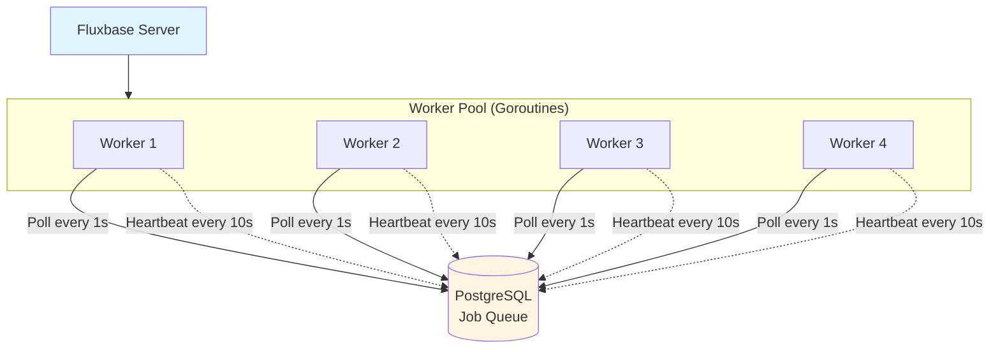
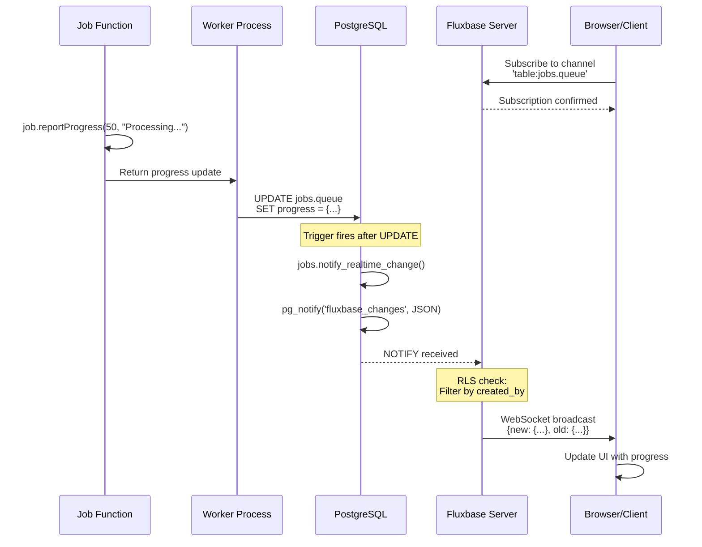
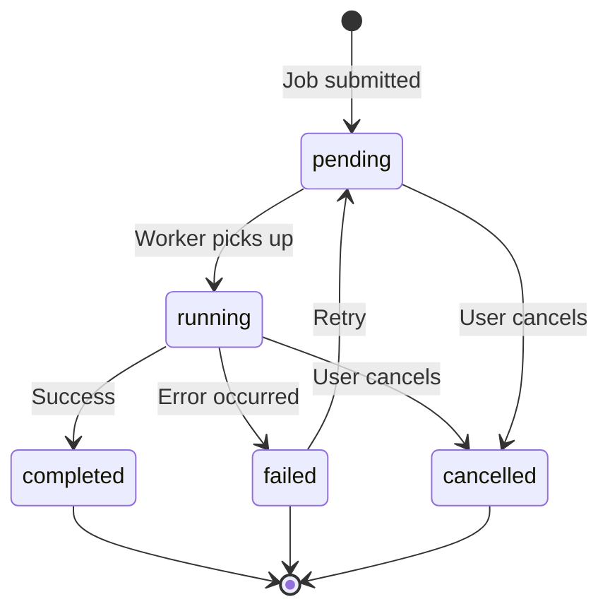
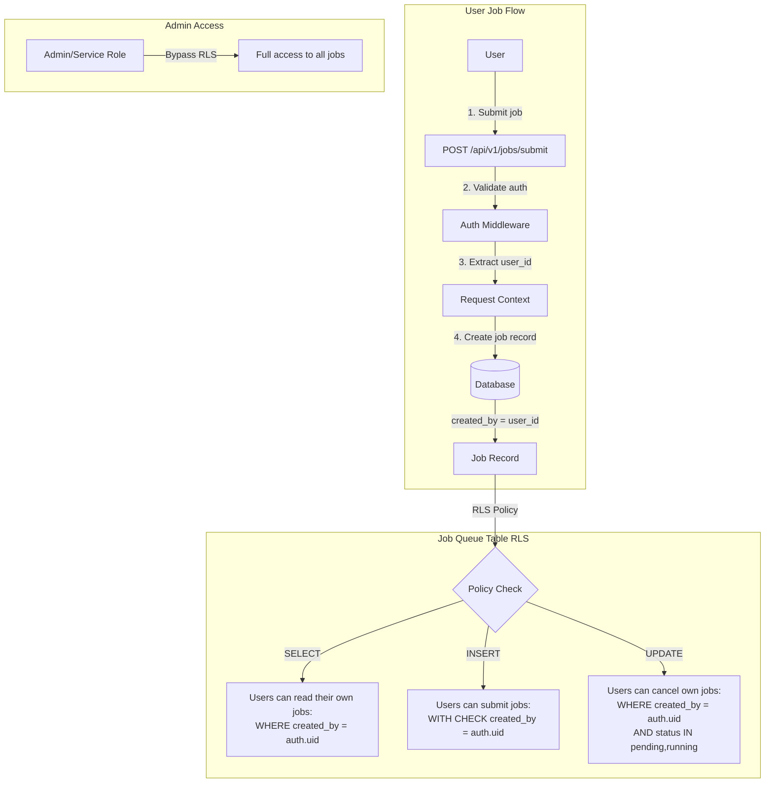
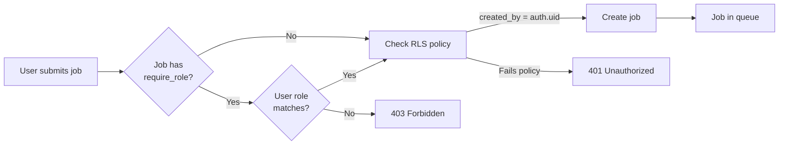
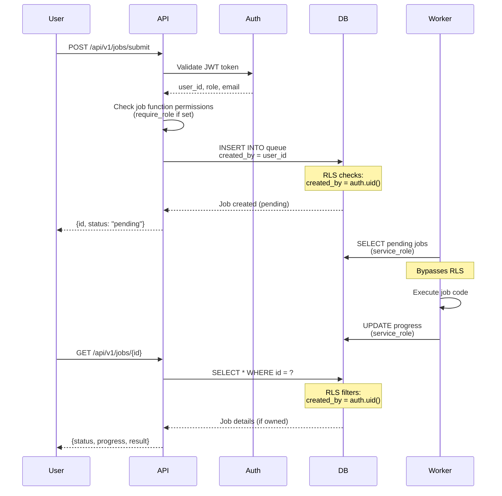

Fluxbase provides a powerful background jobs system for executing long-running tasks asynchronously with progress tracking, retry logic, and role-based access control.

## Features

- **Asynchronous execution** - Submit jobs and track progress without blocking
- **Real-time progress updates** - Subscribe to live job updates via WebSockets
- **Retry logic** - Automatic retry on failure with configurable limits
- **Role-based permissions** - Control who can submit specific jobs
- **User context** - Jobs inherit user identity for RLS-aware database access
- **Scheduled execution** - Run jobs at specific times or on cron schedules
- **Worker pool management** - Scalable job processing with multiple workers
- **Progress tracking** - Report granular progress with custom messages and data

## Configuration

Configure the jobs system via environment variables:

```bash
# Enable background jobs
FLUXBASE_JOBS_ENABLED=true

# Directory for job function files
FLUXBASE_JOBS_DIR=./jobs

# Auto-load job functions on server startup
FLUXBASE_JOBS_AUTO_LOAD_ON_BOOT=true

# Number of embedded worker threads
FLUXBASE_JOBS_EMBEDDED_WORKER_COUNT=4

# Default timeout for job execution (seconds)
FLUXBASE_JOBS_DEFAULT_TIMEOUT=300

# Default maximum retry attempts
FLUXBASE_JOBS_DEFAULT_MAX_RETRIES=3
```

## Worker Architecture

Fluxbase uses an **embedded worker architecture** where job workers run as goroutines within the main server process. This provides a simple, single-binary deployment model with no external dependencies beyond PostgreSQL.

### How Workers Operate



**Worker Lifecycle:**

1. **Startup** - Workers register in database with unique ID and hostname
2. **Polling** - Each worker polls database for pending jobs (default: every 1 second)
3. **Job Claiming** - When available, worker atomically claims next job from queue
4. **Execution** - Job runs in isolated Deno runtime with configured permissions
5. **Heartbeat** - Worker sends heartbeat every 10 seconds to prove it's alive
6. **Completion** - Worker updates job status and becomes available for next job
7. **Shutdown** - Graceful shutdown waits up to 30 seconds for in-flight jobs

### Embedded Workers (Default)

Embedded workers run within the Fluxbase server process:

```yaml
jobs:
  enabled: true
  worker_mode: "embedded" # Default mode
  embedded_worker_count: 4 # Number of worker goroutines
  max_concurrent_per_worker: 5 # Max jobs per worker
  poll_interval: "1s" # How often to check for jobs
  worker_heartbeat_interval: "10s" # Heartbeat frequency
  worker_timeout: "30s" # Stale worker cleanup threshold
```

**Pros:**

- ✅ Simple deployment (single binary/container)
- ✅ No additional infrastructure needed
- ✅ Fast startup and low overhead
- ✅ Shared memory and resources

**Cons:**

- ⚠️ Workers share resources with API server
- ⚠️ All workers restart when server restarts
- ⚠️ Limited horizontal scaling (vertical only)

### Deployment Patterns

#### Single Binary/Container (Recommended)

Deploy one Fluxbase instance with embedded workers:

```bash
# Docker
docker run -e FLUXBASE_JOBS_EMBEDDED_WORKER_COUNT=4 \
  ghcr.io/fluxbase-eu/fluxbase:latest

# Binary
FLUXBASE_JOBS_EMBEDDED_WORKER_COUNT=4 ./fluxbase
```

This is the **recommended approach** for most use cases:

- Handles 1000s of jobs per day
- Scales vertically (increase worker count and resources)
- Simple operations and monitoring

#### Scaling Workers

To handle higher job throughput, increase worker count and resources:

```yaml
jobs:
  embedded_worker_count: 8 # More workers
  max_concurrent_per_worker: 10 # More concurrent jobs per worker
  max_concurrent_per_namespace: 50 # Higher namespace limit
```

**Capacity calculation:**

```text
Max concurrent jobs = embedded_worker_count × max_concurrent_per_worker
Example: 8 workers × 10 jobs = 80 concurrent jobs
```

#### External Workers (Not Currently Supported)

While the codebase includes `worker_mode: "standalone"` configuration, **external worker deployment is not currently exposed as a CLI feature**. The architecture supports it (database-backed queue, worker registration, heartbeats), but you would need to build custom tooling to run standalone workers.

**Future consideration:**
If your use case requires separate worker processes (e.g., different resource limits, isolated failure domains), please open a GitHub issue to discuss adding standalone worker support.

### Worker Configuration Reference

| Setting                        | Default    | Description                                       |
| ------------------------------ | ---------- | ------------------------------------------------- |
| `worker_mode`                  | `embedded` | Worker mode: `embedded`, `standalone`, `disabled` |
| `embedded_worker_count`        | `4`        | Number of worker goroutines                       |
| `max_concurrent_per_worker`    | `5`        | Max jobs each worker can run simultaneously       |
| `max_concurrent_per_namespace` | `20`       | Max concurrent jobs per namespace                 |
| `poll_interval`                | `1s`       | How often workers check for new jobs              |
| `worker_heartbeat_interval`    | `10s`      | Heartbeat frequency                               |
| `worker_timeout`               | `30s`      | Time before worker is considered dead             |
| `default_progress_timeout`     | `300s`     | Kill job if no progress reported                  |

### Monitoring Workers

Check worker health via the admin API:

```typescript
// List active workers
const { data: workers } = await client.admin.jobs.listWorkers();

workers?.forEach((worker) => {
  console.log(`${worker.name}`);
  console.log(`  Status: ${worker.status}`);
  console.log(`  Current jobs: ${worker.current_job_count}`);
  console.log(`  Max concurrent: ${worker.max_concurrent_jobs}`);
  console.log(`  Last heartbeat: ${worker.last_heartbeat_at}`);
});
```

## Installation

```bash
npm install @fluxbase/sdk
```

## Quick Start

### Submit a Job

```typescript
import { createClient } from "@fluxbase/sdk";

const client = createClient("http://localhost:8080", {
  apiKey: "your-anon-key",
});

// Submit a background job
const { data: job, error } = await client.jobs.submit("process-data", {
  items: [1, 2, 3, 4, 5],
});

if (error) {
  console.error("Failed to submit job:", error);
} else {
  console.log("Job submitted:", job.id);
  console.log("Status:", job.status); // "pending"
}
```

### Track Progress (Polling)

```typescript
// Poll for job status
async function waitForJob(jobId: string) {
  let completed = false;

  while (!completed) {
    const { data: job } = await client.jobs.get(jobId);

    console.log(`Status: ${job.status}`);
    if (job.progress) {
      console.log(
        `Progress: ${job.progress.percent}% - ${job.progress.message}`
      );
    }

    if (job.status === "completed") {
      console.log("Result:", job.result);
      completed = true;
    } else if (job.status === "failed") {
      console.error("Error:", job.error_message);
      completed = true;
    } else if (job.status === "cancelled") {
      console.log("Job was cancelled");
      completed = true;
    }

    if (!completed) {
      await new Promise((resolve) => setTimeout(resolve, 2000));
    }
  }
}

await waitForJob(job.id);
```

## Real-Time Progress Tracking

Jobs are fully integrated with Fluxbase's PostgreSQL LISTEN/NOTIFY system. Subscribe to live updates via WebSockets:

### Basic Realtime Subscription

```typescript
// Submit job
const { data: job } = await client.jobs.submit("process-data", {
  items: [1, 2, 3],
});

// Subscribe to realtime updates
const channel = client.realtime.channel("table:jobs.queue");

channel
  .on("UPDATE", (payload) => {
    const updatedJob = payload.new;

    // Filter for our specific job
    if (updatedJob.id === job.id) {
      console.log(
        `[${updatedJob.progress.percent}%] ${updatedJob.progress.message}`
      );

      // Handle completion
      if (updatedJob.status === "completed") {
        console.log("Result:", updatedJob.result);
        channel.unsubscribe();
      }

      // Handle failure
      if (updatedJob.status === "failed") {
        console.error("Error:", updatedJob.error_message);
        console.error("Logs:", updatedJob.logs);
        channel.unsubscribe();
      }
    }
  })
  .subscribe();
```

### What Information is Exposed

When a job updates, subscribers receive the **complete job record** (respecting Row-Level Security):

```typescript
interface RealtimeJobUpdate {
  eventType: "UPDATE";
  schema: "jobs";
  table: "queue";
  commit_timestamp: string;

  // New state after the update
  new: {
    id: string; // Job UUID
    job_name: string; // Name of job function
    namespace: string; // Job namespace
    status: "pending" | "running" | "completed" | "failed" | "cancelled";

    // Progress tracking
    progress: {
      percent: number; // 0-100
      message: string; // Human-readable status
      data?: {
        // Optional custom data
        processed?: number;
        total?: number;
        currentStep?: string;
        [key: string]: any;
      };
    };

    // Timestamps
    created_at: string;
    started_at?: string;
    completed_at?: string;
    last_progress_at?: string;

    // Results and errors
    result?: any; // Job output (when completed)
    error_message?: string; // Failure reason (when failed)
    logs?: string; // Captured stdout/stderr

    // User context (if own job)
    created_by: string; // User UUID
    user_role: string;
    user_email: string;

    // Worker information
    worker_id?: string;
    retry_count: number;
    max_retries: number;
  };

  // Previous state before the update
  old: {
    /* same structure */
  };
}
```

### RLS Filtering on Realtime

Realtime subscriptions respect Row-Level Security policies:

**Regular users see only their own jobs:**

```typescript
// User A subscribes to job updates
const channel = client.realtime.channel("table:jobs.queue");

channel
  .on("UPDATE", (payload) => {
    // Only receives updates for jobs where created_by = userA_uuid
    // Other users' jobs are automatically filtered by RLS
    console.log("My job updated:", payload.new);
  })
  .subscribe();
```

**Admins see all jobs:**

```typescript
// Admin or dashboard_admin role can see all jobs
const channel = adminClient.realtime.channel("table:jobs.queue");

channel
  .on("UPDATE", (payload) => {
    // Receives updates for ALL jobs across all users
    console.log("Job updated:", payload.new);
    console.log("User:", payload.new.user_email);
  })
  .subscribe();
```

### Advanced: Filter Subscriptions

Subscribe only to jobs with specific statuses:

```typescript
const channel = client.realtime.channel("jobs:running");

channel
  .on(
    "postgres_changes",
    {
      event: "UPDATE",
      schema: "jobs",
      table: "queue",
      filter: "status=eq.running", // Only running jobs
    },
    (payload) => {
      console.log("Running job progress:", payload.new.progress);
    }
  )
  .subscribe();
```

### Realtime Architecture



## Job States

Jobs transition through the following states:



- **pending** - Job is queued, waiting for a worker
- **running** - Job is currently being executed
- **completed** - Job finished successfully
- **failed** - Job failed (can be retried)
- **cancelled** - Job was cancelled by user or admin

## Creating Job Functions

Job functions are TypeScript/JavaScript files with a `handler` export and optional annotations. The handler receives four parameters:

| Parameter         | Type                     | Description                                                                     |
| ----------------- | ------------------------ | ------------------------------------------------------------------------------- |
| `req`             | `Request`                | HTTP Request object (for compatibility)                                         |
| `fluxbase`        | `FluxbaseClient \| null` | SDK client with user's RLS context - can only access data the user can access   |
| `fluxbaseService` | `FluxbaseClient \| null` | SDK client with service role - bypasses RLS for system-wide access              |
| `job`             | `JobUtils`               | Job utilities for progress reporting, context access, and cancellation checking |

### Basic Job Function

```typescript
/**
 * Process user data
 * @fluxbase:timeout 300
 * @fluxbase:description Processes user-specific data items
 */
export async function handler(
  req: Request,
  fluxbase: FluxbaseClient,
  fluxbaseService: FluxbaseClient,
  job: JobUtils
) {
  const context = job.getJobContext();
  const { items } = context.payload;

  // User context is automatically available
  console.log("Running for user:", context.user?.email);

  for (let i = 0; i < items.length; i++) {
    // Process item
    await processItem(items[i]);

    // Report progress
    const percent = Math.floor(((i + 1) / items.length) * 100);
    job.reportProgress(percent, `Processed ${i + 1}/${items.length}`);
  }

  // Query user's own data (RLS applies)
  const { data } = await fluxbase
    .from("app.my_table")
    .select("*")
    .eq("user_id", context.user.id);

  return { success: true, processed: items.length };
}
```

### Job Function Annotations

Control job behavior with JSDoc-style annotations:

- `@fluxbase:namespace <name>` - Specify namespace (overrides CLI `--namespace` flag)
- `@fluxbase:require-role <role>` - Require specific user role (admin, authenticated, custom)
- `@fluxbase:timeout <seconds>` - Maximum execution time (default: 300)
- `@fluxbase:max-retries <count>` - Number of retry attempts (default: 3)
- `@fluxbase:schedule <cron>` - Cron expression for scheduled execution
- `@fluxbase:description <text>` - Human-readable job description

### Admin-Only Job

```typescript
/**
 * Generate system-wide report
 * @fluxbase:require-role admin
 * @fluxbase:timeout 600
 */
export async function handler(
  req: Request,
  fluxbase: FluxbaseClient,
  fluxbaseService: FluxbaseClient,
  job: JobUtils
) {
  const context = job.getJobContext();

  // Only admins can submit this job
  console.log("Admin:", context.user?.email);

  job.reportProgress(25, "Fetching data...");

  // Use service client to access all data (bypasses RLS)
  const { data } = await fluxbaseService.from("app.system_data").select("*");

  job.reportProgress(50, "Generating report...");
  const report = await generateReport(data);

  job.reportProgress(75, "Saving results...");

  // Save report using service role
  await fluxbaseService
    .from("app.reports")
    .insert({ data: report, generated_at: new Date().toISOString() });

  job.reportProgress(100, "Complete");

  return { report, recordCount: data?.length };
}
```

### Scheduled Job

```typescript
/**
 * Cleanup old data daily at 2 AM
 * @fluxbase:schedule 0 2 * * *
 * @fluxbase:require-role admin
 * @fluxbase:timeout 1800
 */
export async function handler(
  req: Request,
  fluxbase: FluxbaseClient,
  fluxbaseService: FluxbaseClient,
  job: JobUtils
) {
  const context = job.getJobContext();
  const { retention_days = 30 } = context.payload;

  job.reportProgress(10, "Starting cleanup...");

  const cutoffDate = new Date();
  cutoffDate.setDate(cutoffDate.getDate() - retention_days);

  // Use service role to access all records across users
  const { data: deleted } = await fluxbaseService
    .from("app.old_records")
    .delete()
    .lt("created_at", cutoffDate.toISOString())
    .select();

  job.reportProgress(100, "Cleanup complete");

  return { deleted: deleted?.length ?? 0 };
}
```

### Available APIs in Job Context

Job handlers receive the Fluxbase SDK clients and job utilities as parameters:

#### Job Utilities (`job` parameter)

```typescript
// Get job context
const context = job.getJobContext()
// Returns: { job_id, job_name, namespace, retry_count, payload, user }

// Report progress (0-100)
job.reportProgress(percent, message, data?)

// Check if job was cancelled (call periodically in long-running jobs)
if (job.checkCancellation()) {
  return { cancelled: true }
}

// Get payload directly (convenience method)
const payload = job.getJobPayload()
```

#### Fluxbase SDK Client (`fluxbase` parameter)

The `fluxbase` client has the user's RLS context - it can only access data the user has permission for:

```typescript
// Query database with RLS applied
const { data } = await fluxbase.from("app.my_table").select("*");

// Access storage (user's permissions apply)
const { data: files } = await fluxbase.storage.from("user-uploads").list();

// Submit follow-up jobs
await fluxbase.jobs.submit("process-next", { batch: 2 });
```

#### Service Role Client (`fluxbaseService` parameter)

The `fluxbaseService` client bypasses RLS for system-wide access:

```typescript
// Access all data across users
const { data: allRecords } = await fluxbaseService
  .from("app.all_data")
  .select("count");

// System-level storage operations
await fluxbaseService.storage.from("system-bucket").upload("report.json", blob);
```

#### When to Use Each Client

| Use Case                       | Client            | Reason                                      |
| ------------------------------ | ----------------- | ------------------------------------------- |
| Query user's own data          | `fluxbase`        | Respects RLS, user can only see their data  |
| Read user-uploaded files       | `fluxbase`        | User has permission to access their uploads |
| Generate user-specific exports | `fluxbase`        | Ensures data isolation                      |
| System cleanup jobs            | `fluxbaseService` | Needs access to all records                 |
| Admin reports across all users | `fluxbaseService` | Aggregates data system-wide                 |
| Write to system tables         | `fluxbaseService` | May need elevated permissions               |

#### Environment Variables

The following environment variables are automatically available in jobs:

| Variable                 | Description                                   |
| ------------------------ | --------------------------------------------- |
| `FLUXBASE_URL`           | Server URL for SDK client (set automatically) |
| `FLUXBASE_JOB_ID`        | Current job UUID                              |
| `FLUXBASE_JOB_NAME`      | Job function name                             |
| `FLUXBASE_JOB_NAMESPACE` | Job namespace                                 |
| `FLUXBASE_JOB_CANCELLED` | `"true"` if job was cancelled                 |

Custom `FLUXBASE_*` variables from your server environment are also available (except blocked secrets like JWT keys).

```typescript
// Read job-specific environment variables
const jobId = Deno.env.get("FLUXBASE_JOB_ID");

// Read custom environment variables (must be prefixed with FLUXBASE_)
const apiKey = Deno.env.get("FLUXBASE_EXTERNAL_API_KEY");

// Log output (captured in job.logs)
console.log("Info message");
console.error("Error message");
```

#### Secrets

Jobs can access secrets the same way as Edge Functions. The `secrets` object is automatically available - no import needed:

```typescript
export async function handler(
  req: Request,
  fluxbase: FluxbaseClient,
  fluxbaseService: FluxbaseClient,
  job: JobUtils
) {
  // Get secrets with automatic fallback: user -> system
  const stripeKey = secrets.getRequired("stripe_api_key");
  const webhookSecret = secrets.get("webhook_secret");

  job.reportProgress(25, "Processing payment...");

  // Use the secret for external API calls
  const response = await fetch("https://api.stripe.com/v1/charges", {
    method: "POST",
    headers: {
      Authorization: `Bearer ${stripeKey}`,
    },
    body: new URLSearchParams({ amount: "1000", currency: "usd" }),
  });

  job.reportProgress(100, "Complete");
  return { success: true };
}
```

**Managing secrets:** Use the CLI to create system secrets:

```bash
fluxbase settings secrets set stripe_api_key "sk_live_..."
fluxbase settings secrets set webhook_secret "whsec_..."
fluxbase settings secrets list
```

See the [Edge Functions guide](./edge-functions.md#secrets) for full secrets API reference.

:::note[SDK Configuration]
The SDK clients are automatically configured using `FLUXBASE_URL`. If your `fluxbase` or `fluxbaseService` parameters are `null`, check that:

1. `FLUXBASE_BASE_URL` is set in your server configuration
2. `FLUXBASE_AUTH_JWT_SECRET` is configured
3. Check server logs for "Initializing jobs manager" message

:::

## Security & Permissions

### Row-Level Security (RLS)

Jobs use PostgreSQL Row-Level Security to enforce data isolation:



### RLS Policies

Four policies control access to the `jobs.queue` table:

**1. Users can read their own jobs:**

```sql
CREATE POLICY "Users can read their own jobs"
    ON jobs.queue FOR SELECT
    TO authenticated
    USING (created_by = auth.uid());
```

**2. Users can submit jobs:**

```sql
CREATE POLICY "Users can submit jobs"
    ON jobs.queue FOR INSERT
    TO authenticated
    WITH CHECK (created_by = auth.uid());
```

**3. Users can cancel their own jobs:**

```sql
CREATE POLICY "Users can cancel their own pending/running jobs"
    ON jobs.queue FOR UPDATE
    TO authenticated
    USING (created_by = auth.uid() AND status IN ('pending', 'running'))
    WITH CHECK (status = 'cancelled');
```

**4. Service role has full access:**

```sql
CREATE POLICY "Service role can manage all jobs"
    ON jobs.queue FOR ALL
    TO service_role
    USING (true)
    WITH CHECK (true);
```

### Job Submission Permission Flow



### Job Lifecycle with Security



### Security Mechanisms

1. **RLS Enforcement** - Users only access jobs they created
2. **Role-Based Submission** - Jobs can require specific roles
3. **Service Role Workers** - Workers bypass RLS to execute jobs
4. **User Context Preservation** - Jobs store user identity at submission

## Monitoring & Operations

### List Jobs

```typescript
// List user's own jobs
const { data: jobs } = await client.jobs.list({
  status: "running",
  limit: 20,
  offset: 0,
});

jobs?.forEach((job) => {
  console.log(`${job.job_name}: ${job.status} (${job.progress?.percent}%)`);
});
```

### Cancel a Job

```typescript
const { error } = await client.jobs.cancel(jobId);

if (!error) {
  console.log("Job cancelled");
}
```

### Retry a Failed Job

```typescript
const { data: newJob, error } = await client.jobs.retry(jobId);

console.log("Retry job ID:", newJob.id);
```

### Admin Operations

Admins can manage all jobs across all users:

```typescript
// List all jobs (admin only)
const { data: allJobs } = await client.admin.jobs.listJobs({
  status: "running",
  namespace: "default",
});

// Get statistics
const { data: stats } = await client.admin.jobs.getStats("default");
console.log("Pending:", stats.pending);
console.log("Running:", stats.running);
console.log("Completed:", stats.completed);
console.log("Failed:", stats.failed);

// List active workers
const { data: workers } = await client.admin.jobs.listWorkers();
workers?.forEach((worker) => {
  console.log(`Worker ${worker.id}: ${worker.current_jobs} jobs`);
});

// Terminate a job immediately
await client.admin.jobs.terminate(jobId);
```

## Deploying Job Functions

### Method 1: SDK Upload

```typescript
import { createClient } from "@fluxbase/sdk";
import { readFile } from "fs/promises";

const client = createClient(process.env.FLUXBASE_URL!, {
  serviceKey: process.env.FLUXBASE_SERVICE_KEY!,
});

// Read job file
const code = await readFile("./jobs/process-data.ts", "utf-8");

// Create job function
const { data, error } = await client.admin.jobs.create({
  name: "process-data",
  namespace: "default",
  code,
  enabled: true,
});
```

### Method 2: Filesystem Auto-Load

Configure in `.env`:

```bash
FLUXBASE_JOBS_DIR=./jobs
FLUXBASE_JOBS_AUTO_LOAD_ON_BOOT=true
```

Place job files in the jobs directory:

```bash
mkdir -p jobs
cp my-job.ts jobs/
```

Restart the server - jobs will be automatically loaded.

### Method 3: Sync API

```typescript
// Sync all jobs from filesystem to database
const { data, error } = await client.admin.jobs.sync({
  namespace: "default",
  path: "./jobs",
});

console.log(`Created: ${data.summary.created}`);
console.log(`Updated: ${data.summary.updated}`);
console.log(`Deleted: ${data.summary.deleted}`);
```

## Advanced Patterns

### Long-Running Import

```typescript
export async function handler(
  req: Request,
  fluxbase: FluxbaseClient,
  fluxbaseService: FluxbaseClient,
  job: JobUtils
) {
  const context = job.getJobContext();
  const { file_url } = context.payload;

  // Download file
  job.reportProgress(10, "Downloading file...");
  const response = await fetch(file_url);
  const data = await response.json();

  // Process in batches
  const batchSize = 100;
  let processed = 0;

  for (let i = 0; i < data.length; i += batchSize) {
    // Check for cancellation
    if (job.checkCancellation()) {
      return { cancelled: true, processed };
    }

    const batch = data.slice(i, i + batchSize);

    // Insert batch - RLS ensures user can only insert to their tables
    await fluxbase.from("app.imports").insert(
      batch.map((item) => ({
        ...item,
        user_id: context.user?.id,
      }))
    );

    processed += batch.length;
    const progress = 10 + Math.floor((processed / data.length) * 90);
    job.reportProgress(
      progress,
      `Imported ${processed}/${data.length} records`
    );
  }

  return { success: true, imported: processed };
}
```

### Parallel Processing

```typescript
export async function handler(
  req: Request,
  fluxbase: FluxbaseClient,
  fluxbaseService: FluxbaseClient,
  job: JobUtils
) {
  const { items } = job.getJobPayload();

  // Process items in parallel
  const results = await Promise.all(
    items.map(async (item: any, index: number) => {
      const result = await processItem(item);

      // Update progress
      const progress = Math.floor(((index + 1) / items.length) * 100);
      job.reportProgress(progress, `Processed ${index + 1}/${items.length}`);

      return result;
    })
  );

  return { success: true, results };
}
```

### External API Integration

```typescript
export async function handler(
  req: Request,
  fluxbase: FluxbaseClient,
  fluxbaseService: FluxbaseClient,
  job: JobUtils
) {
  const context = job.getJobContext();
  const apiKey = Deno.env.get("FLUXBASE_EXTERNAL_API_KEY");

  job.reportProgress(25, "Calling external API...");

  const response = await fetch("https://api.example.com/data", {
    headers: {
      Authorization: `Bearer ${apiKey}`,
      "Content-Type": "application/json",
    },
  });

  const data = await response.json();

  job.reportProgress(50, "Storing results...");

  // Store with user's RLS context
  await fluxbase.from("app.api_results").insert({
    data,
    user_id: context.user?.id,
    fetched_at: new Date().toISOString(),
  });

  job.reportProgress(100, "Complete");

  return { success: true, records: data.length };
}
```

### Storage Operations

```typescript
export async function handler(
  req: Request,
  fluxbase: FluxbaseClient,
  fluxbaseService: FluxbaseClient,
  job: JobUtils
) {
  const context = job.getJobContext();
  const { source_file } = context.payload;

  job.reportProgress(10, "Downloading source file...");

  // Download file from user's storage (RLS applies)
  const { data: fileData, error } = await fluxbase.storage
    .from("temp-files")
    .download(source_file);

  if (error) {
    throw new Error(`Failed to download: ${error.message}`);
  }

  job.reportProgress(50, "Processing file...");
  const processed = await processFile(fileData);

  job.reportProgress(80, "Uploading result...");

  // Upload result to user's storage
  const resultBlob = new Blob([JSON.stringify(processed)], {
    type: "application/json",
  });
  await fluxbase.storage
    .from("exports")
    .upload(`results/${context.job_id}.json`, resultBlob);

  job.reportProgress(100, "Complete");

  return { success: true, output_file: `results/${context.job_id}.json` };
}
```

### Submitting Follow-up Jobs

```typescript
export async function handler(
  req: Request,
  fluxbase: FluxbaseClient,
  fluxbaseService: FluxbaseClient,
  job: JobUtils
) {
  const context = job.getJobContext();
  const { total_batches, current_batch = 0 } = context.payload;

  job.reportProgress(
    0,
    `Processing batch ${current_batch + 1}/${total_batches}`
  );

  // Process current batch
  await processBatch(current_batch, fluxbase);

  job.reportProgress(100, `Batch ${current_batch + 1} complete`);

  // Submit next batch job if not done
  if (current_batch + 1 < total_batches) {
    await fluxbase.jobs.submit("process-batch", {
      total_batches,
      current_batch: current_batch + 1,
    });
  }

  return { batch: current_batch, remaining: total_batches - current_batch - 1 };
}
```

## Troubleshooting

### Jobs not loading at startup

- Check `FLUXBASE_JOBS_ENABLED=true` in environment
- Verify `FLUXBASE_JOBS_DIR` points to correct directory
- Check `FLUXBASE_JOBS_AUTO_LOAD_ON_BOOT=true`
- Review server logs for error messages

### Job stuck in "pending" status

- Check workers are running: `await client.admin.jobs.listWorkers()` should return active workers
- Verify `FLUXBASE_JOBS_EMBEDDED_WORKER_COUNT > 0`
- Review server logs for worker errors
- Check database connectivity

### Permission denied errors

- Regular users cannot submit jobs with `@fluxbase:require-role admin`
- Verify user's role matches the required role
- Use service key or admin token for admin-only jobs
- Check RLS policies on jobs.queue table

### Job fails immediately

- Check job logs: `await client.jobs.get(jobId)` and inspect `logs` field
- Look for syntax errors in job code
- Verify database permissions (RLS policies)
- Check environment variables are set correctly

### Environment variables not available

- Only `FLUXBASE_*` prefixed variables are accessible
- Verify variable is set in `.env.local` or environment
- Restart server after changing environment variables
- Sensitive secrets are blocked for security

### Realtime updates not received

- Check WebSocket connection is established
- Verify subscription to correct channel
- Review RLS policies - users only see their own jobs
- Check browser console for connection errors

## AI Capabilities

Jobs can leverage AI capabilities via the `job.ai` object (same as `utils.ai` in edge functions) for chat completions and embeddings.

### AI Chat Completions

```typescript
/**
 * AI-powered data analysis job
 * @fluxbase:allow-net
 * @fluxbase:timeout 300
 */
export async function handler(
  req: Request,
  fluxbase: FluxbaseClient,
  fluxbaseService: FluxbaseClient,
  job: JobUtils
) {
  job.reportProgress(10, "Fetching data...");

  const { data: records } = await fluxbaseService
    .from("sales_data")
    .select("*")
    .gte("created_at", new Date(Date.now() - 7 * 24 * 60 * 60 * 1000).toISOString())
    .execute();

  job.reportProgress(40, "Analyzing with AI...");

  // Use AI to generate insights
  const response = await job.ai.chat({
    messages: [
      {
        role: "system",
        content: "You are a business analyst. Provide concise, actionable insights."
      },
      {
        role: "user",
        content: `Analyze this week's sales data and provide key insights:\n${JSON.stringify(records, null, 2)}`
      }
    ],
    maxTokens: 500
  });

  job.reportProgress(80, "Saving report...");

  // Store the AI-generated report
  await fluxbaseService
    .from("reports")
    .insert({
      type: "weekly_analysis",
      content: response.content,
      generated_at: new Date().toISOString()
    })
    .execute();

  job.reportProgress(100, "Complete");

  return { analysis: response.content };
}
```

### AI Embeddings for Batch Processing

```typescript
/**
 * Generate embeddings for documents
 * @fluxbase:allow-net
 * @fluxbase:timeout 600
 */
export async function handler(
  req: Request,
  fluxbase: FluxbaseClient,
  fluxbaseService: FluxbaseClient,
  job: JobUtils
) {
  const { document_ids } = job.getJobPayload();

  job.reportProgress(0, "Starting embedding generation...");

  for (let i = 0; i < document_ids.length; i++) {
    // Get document content
    const { data: doc } = await fluxbaseService
      .from("documents")
      .select("id, content")
      .eq("id", document_ids[i])
      .single()
      .execute();

    if (doc) {
      // Generate embedding
      const { embedding } = await job.ai.embed({ text: doc.content });

      // Store embedding
      await fluxbaseService
        .from("document_embeddings")
        .upsert({
          document_id: doc.id,
          embedding: embedding,
          updated_at: new Date().toISOString()
        })
        .execute();
    }

    job.reportProgress(
      Math.round(((i + 1) / document_ids.length) * 100),
      `Processed ${i + 1}/${document_ids.length} documents`
    );
  }

  return { processed: document_ids.length };
}
```

### JobUtils AI Interface

The `job` parameter includes AI capabilities:

```typescript
interface JobUtils {
  // Progress and context
  reportProgress(percent: number, message?: string, data?: any): void;
  isCancelled(): Promise<boolean>;
  getJobContext(): JobContext;
  getJobPayload(): any;

  // AI capabilities (requires allow-net permission)
  ai: {
    chat(options: {
      messages: Array<{ role: string; content: string }>;
      provider?: string;
      model?: string;
      maxTokens?: number;
      temperature?: number;
    }): Promise<{
      content: string;
      model: string;
      finish_reason?: string;
      usage?: { prompt_tokens: number; completion_tokens: number; total_tokens: number };
    }>;

    embed(options: {
      text: string;
      provider?: string;
    }): Promise<{
      embedding: number[];
      model: string;
    }>;

    listProviders(): Promise<{
      providers: Array<{ name: string; type: string; model: string; enabled: boolean }>;
      default: string;
    }>;
  };
}
```

**Note:** AI capabilities require `@fluxbase:allow-net` to be set in the job annotations.

## Next Steps

- Explore the [Edge Functions guide](./edge-functions.md) for serverless functions
- Learn about [Realtime subscriptions](./realtime.md) for live updates
- Review [Row Level Security](./row-level-security.md) for data isolation
- Check the [Admin Dashboard](./admin/index.md) for job management UI
