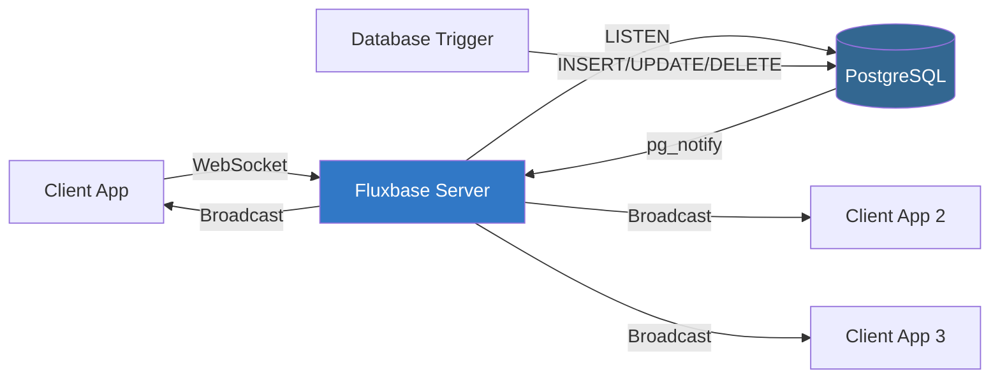
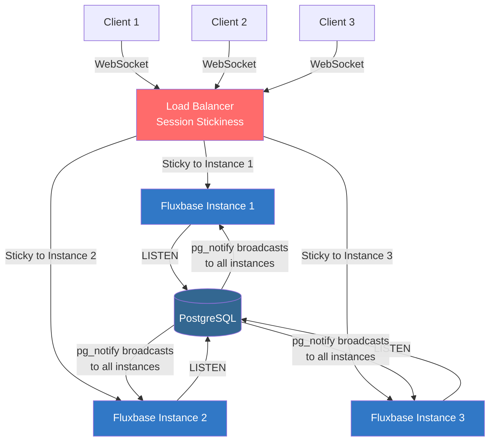

Fluxbase provides real-time database change notifications via WebSockets, powered by PostgreSQL's LISTEN/NOTIFY system.

## Installation

```bash
npm install @fluxbase/sdk
```

## Basic Usage

```typescript
import { createClient } from "@fluxbase/sdk";

const client = createClient("http://localhost:8080", "your-anon-key");

// Subscribe to table changes
const channel = client.realtime
  .channel("table:public.products")
  .on("INSERT", (payload) => {
    console.log("New product:", payload.new_record);
  })
  .on("UPDATE", (payload) => {
    console.log("Updated:", payload.new_record);
    console.log("Previous:", payload.old_record);
  })
  .on("DELETE", (payload) => {
    console.log("Deleted:", payload.old_record);
  })
  .subscribe();

// Or use wildcard for all events
const channel = client.realtime
  .channel("table:public.products")
  .on("*", (payload) => {
    console.log("Event:", payload.type); // INSERT, UPDATE, or DELETE
  })
  .subscribe();

// Unsubscribe
channel.unsubscribe();
```

## Payload Structure

```typescript
interface RealtimeChangePayload {
  type: "INSERT" | "UPDATE" | "DELETE";
  schema: string;
  table: string;
  new_record?: Record<string, unknown>; // INSERT and UPDATE
  old_record?: Record<string, unknown>; // UPDATE and DELETE
  timestamp: string;
}
```

## React Hook Example

```typescript
import { useEffect, useState } from 'react'
import { createClient } from '@fluxbase/sdk'

function useRealtimeTable(tableName) {
  const [data, setData] = useState([])
  const client = createClient('http://localhost:8080', 'your-anon-key')

  useEffect(() => {
    const channel = client.realtime
      .channel(`table:public.${tableName}`)
      .on('INSERT', (payload) => {
        setData(prev => [...prev, payload.new_record])
      })
      .on('UPDATE', (payload) => {
        setData(prev =>
          prev.map(item =>
            item.id === payload.new_record.id ? payload.new_record : item
          )
        )
      })
      .on('DELETE', (payload) => {
        setData(prev => prev.filter(item => item.id !== payload.old_record.id))
      })
      .subscribe()

    return () => channel.unsubscribe()
  }, [tableName])

  return data
}

// Usage
function ProductList() {
  const products = useRealtimeTable('products')

  return (
    <div>
      {products.map(product => (
        <div key={product.id}>{product.name}</div>
      ))}
    </div>
  )
}
```

## Filtering Updates

Subscribe to specific rows using RLS policies:

```typescript
// Only receive updates for rows user has access to
// Access control is enforced via Row-Level Security policies
const channel = client.realtime
  .channel("table:public.posts")
  .on("*", (payload) => {
    // Only events matching RLS policies are received
    console.log("Post update:", payload);
  })
  .subscribe();
```

## Multiple Subscriptions

Subscribe to multiple tables:

```typescript
const productsChannel = client.realtime
  .channel("table:public.products")
  .on("*", handleProductChange)
  .subscribe();

const ordersChannel = client.realtime
  .channel("table:public.orders")
  .on("*", handleOrderChange)
  .subscribe();

// Cleanup
productsChannel.unsubscribe();
ordersChannel.unsubscribe();
```

## Connection States

Monitor connection status:

```typescript
const channel = client.realtime
  .channel("table:public.products")
  .on("*", handleChange)
  .subscribe((status) => {
    if (status === "SUBSCRIBED") {
      console.log("Connected and listening");
    } else if (status === "CHANNEL_ERROR") {
      console.error("Subscription error");
    } else if (status === "CLOSED") {
      console.log("Connection closed");
    }
  });
```

## Enabling Realtime on Tables

By default, realtime is disabled on user tables. Use the admin API to enable it:

```typescript
// Enable realtime on a table (all events)
await client.admin.realtime.enableRealtime("products");

// Enable with specific events only
await client.admin.realtime.enableRealtime("orders", {
  events: ["INSERT", "UPDATE"], // Skip DELETE events
});

// Exclude large columns from notifications (helps with 8KB pg_notify limit)
await client.admin.realtime.enableRealtime("posts", {
  exclude: ["content", "raw_html"],
});

// Enable on a custom schema
await client.admin.realtime.enableRealtime("events", {
  schema: "analytics",
});
```

### What Happens Under the Hood

When you enable realtime, Fluxbase automatically:

1. Sets `REPLICA IDENTITY FULL` on the table (required for UPDATE/DELETE to include old values)
2. Creates a trigger that calls `pg_notify('fluxbase_changes', ...)` on INSERT/UPDATE/DELETE
3. Registers the table in `realtime.schema_registry` for subscription validation

### Managing Realtime Tables

```typescript
// List all realtime-enabled tables
const { tables, count } = await client.admin.realtime.listTables();
console.log(`${count} tables have realtime enabled`);

// Check status of a specific table
const status = await client.admin.realtime.getStatus("public", "products");
if (status.realtime_enabled) {
  console.log("Events:", status.events.join(", "));
}

// Update configuration (change events or excluded columns)
await client.admin.realtime.updateConfig("public", "products", {
  events: ["INSERT"], // Only track inserts now
  exclude: ["metadata"],
});

// Disable realtime on a table
await client.admin.realtime.disableRealtime("public", "products");
```

### Manual SQL Setup (Alternative)

You can also enable realtime manually with SQL:

```sql
-- Enable realtime for a table
ALTER TABLE products REPLICA IDENTITY FULL;

-- Register in schema registry
INSERT INTO realtime.schema_registry (schema_name, table_name, realtime_enabled, events)
VALUES ('public', 'products', true, ARRAY['INSERT', 'UPDATE', 'DELETE']);

-- Create trigger using the shared notify function
CREATE TRIGGER products_realtime_notify
AFTER INSERT OR UPDATE OR DELETE ON products
FOR EACH ROW EXECUTE FUNCTION public.notify_realtime_change();
```

## Architecture

Fluxbase uses PostgreSQL's LISTEN/NOTIFY system:

1. Database triggers detect changes (INSERT, UPDATE, DELETE)
2. Trigger calls `pg_notify()` to broadcast change
3. Fluxbase server listens to notifications
4. Server forwards changes to subscribed WebSocket clients
5. Clients receive real-time updates

This architecture is lightweight and scales well for moderate traffic.



### Single-Instance Architecture

In a single-instance deployment, all WebSocket connections are handled by one Fluxbase server. This is the default setup and works well for most use cases.

### Multi-Instance Architecture (Horizontal Scaling)

Fluxbase supports two types of realtime notifications, each handled differently in multi-instance deployments:

#### Database Change Notifications

Database changes (INSERT/UPDATE/DELETE) are automatically broadcast to **all instances** via PostgreSQL's LISTEN/NOTIFY. No extra configuration needed.



#### Application Broadcasts (Cross-Instance)

For application-level broadcasts (chat messages, custom events, presence), configure a distributed pub/sub backend:

```bash
# Option 1: PostgreSQL LISTEN/NOTIFY (default, no extra dependencies)
FLUXBASE_SCALING_BACKEND=postgres

# Option 2: Redis/Dragonfly (for high-scale deployments)
FLUXBASE_SCALING_BACKEND=redis
FLUXBASE_SCALING_REDIS_URL=redis://dragonfly:6379
```

When configured, broadcasts sent via `BroadcastGlobal()` are delivered to clients on **all instances**, not just the originating one.

**Key points for horizontal scaling:**

- Each Fluxbase instance maintains its own PostgreSQL LISTEN connection
- PostgreSQL broadcasts `pg_notify()` to **all** listening instances simultaneously
- Load balancer uses session stickiness (source IP or cookie-based) to route each client to the same Fluxbase instance
- Requires external PostgreSQL (which also stores authentication sessions shared across instances)
- With `postgres` or `redis` scaling backend, rate limiting is shared across instances

See [Deployment: Scaling](/docs/deployment/scaling#horizontal-scaling) for configuration details.

## Connection Management

**Auto-reconnect:** SDK automatically reconnects on connection loss

**Heartbeat:** Periodic ping/pong to detect stale connections

**Cleanup:** Always unsubscribe when done to prevent memory leaks

```typescript
// Good: cleanup in effect
useEffect(() => {
  const channel = client.realtime
    .channel("table:public.products")
    .on("*", handleChange)
    .subscribe();

  return () => channel.unsubscribe(); // Cleanup
}, []);
```

## Security

Realtime subscriptions respect Row-Level Security policies. Users only receive updates for rows they have permission to view.

```sql
-- Example: Users only see their own posts
CREATE POLICY "Users see own posts"
ON posts
FOR SELECT
USING (current_setting('app.user_id', true)::uuid = user_id);
```

When authenticated, users receive realtime updates only for their own posts.

## Best Practices

**Performance:**

- Limit number of active subscriptions per client
- Unsubscribe from unused channels
- Use wildcard (`*`) when listening to all event types

**Security:**

- Always use RLS policies to control data access
- Validate JWT tokens for authenticated subscriptions
- Never expose sensitive data in realtime payloads

**Reliability:**

- Handle connection errors gracefully
- Implement reconnection logic for long-running apps
- Cache local state to handle brief disconnections

**Debugging:**

- Monitor connection status
- Log payload structures during development
- Use browser DevTools to inspect WebSocket traffic

## Raw WebSocket Protocol

For non-JavaScript environments, see the [Realtime SDK Documentation](/docs/api/sdk/classes/FluxbaseRealtime) for WebSocket protocol details.

## Troubleshooting

**No updates received:**

- Verify realtime is enabled on table (triggers exist)
- Check RLS policies allow access to rows
- Confirm WebSocket connection is established
- Verify channel name matches table: `table:schema.table_name`

**Connection drops:**

- Check network stability
- Verify Fluxbase server is running
- Review firewall/proxy WebSocket support
- Ensure JWT token is valid (not expired)

**Performance issues:**

- Reduce number of subscriptions
- Optimize RLS policies (avoid slow queries)
- Consider aggregating rapid changes client-side
- Monitor PostgreSQL NOTIFY queue size

## Next Steps

- [Row-Level Security](/docs/guides/row-level-security) - Control data access
- [Authentication](/docs/guides/authentication) - Secure subscriptions
- [Monitoring](/docs/guides/monitoring-observability) - Track realtime performance
- [Scaling Guide](/docs/deployment/scaling#horizontal-scaling) - Configure realtime for horizontal scaling
