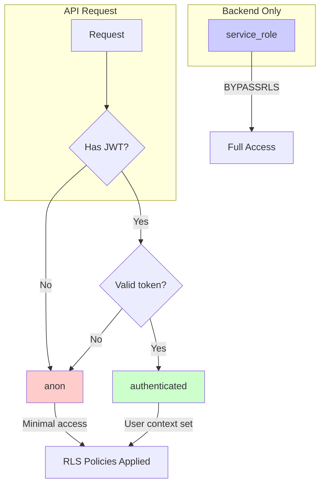

Row Level Security (RLS) is PostgreSQL's feature for controlling which rows users can access in database tables. Fluxbase provides seamless RLS integration for building secure multi-tenant applications.

## What is RLS?

RLS enables fine-grained access control at the row level. Instead of granting permissions to entire tables, you define policies that determine which rows each user can see, insert, update, or delete.

**Benefits:**

- Automatic enforcement at database level
- No application-level filtering code needed
- Defense in depth security
- Perfect for multi-tenant SaaS applications
- Version-controlled policies via migrations

**Without RLS:**

```typescript
// Must remember to filter by user
const tasks = await client
  .from("tasks")
  .select("*")
  .eq("user_id", currentUser.id); // Easy to forget!
```

**With RLS:**

```typescript
// Database automatically enforces access
const tasks = await client.from("tasks").select("*");
// Only returns current user's tasks
```

## How Fluxbase Implements RLS

Fluxbase sets PostgreSQL session variables from JWT tokens:

- `app.user_id` - Authenticated user's UUID
- `app.role` - User's role (`anon`, `authenticated`, `admin`)

These variables are used in RLS policy conditions.

## Default Permissions

Fluxbase sets up a comprehensive permission system out of the box. Understanding these defaults helps you build secure applications.

### Role Hierarchy



**Three roles control all access:**

| Role | Description | RLS Behavior |
|------|-------------|--------------|
| `anon` | Unauthenticated requests | Policies applied, minimal default access |
| `authenticated` | Valid JWT token | Policies applied, user context available |
| `service_role` | Backend services only | **Bypasses all RLS policies** |

### Permission Matrix

This table shows the default table-level permissions for each schema. Actual row access is further controlled by RLS policies.

| Schema | anon | authenticated | service_role |
|--------|------|---------------|--------------|
| **auth** | None | Full CRUD (via RLS) | ALL |
| **app** | SELECT (public settings) | Full CRUD (via RLS) | ALL |
| **storage** | SELECT (public buckets) | Full CRUD (via RLS) | ALL |
| **functions** | None | Full CRUD (via RLS) | ALL |
| **realtime** | None | Full CRUD (via RLS) | ALL |
| **dashboard** | None | Full CRUD (via RLS) | ALL |
| **jobs** | None | SELECT (via RLS) | ALL |
| **migrations** | None | None | ALL |
| **public** | None | None | ALL |

### Schema Details

#### auth

Anonymous users have no direct access to auth tables. All authentication operations (signup, signin, password reset) are performed internally using the service role. Authenticated users can view and update their own profile, manage their sessions and client keys. Dashboard admins can view all users and perform administrative actions.

#### app

Application settings with fine-grained access control. Anyone can read public, non-secret settings. Authenticated users can read all non-secret settings. Write access is controlled by the `editable_by` field on each setting.

#### storage

File storage with ownership-based access. Public buckets are readable by anyone. Users own their uploaded files and have full control over them. File sharing is managed through the permissions table. Admins can manage all files.

#### functions

Edge functions management. Only dashboard admins can create, update, or delete edge functions.

#### realtime

Realtime subscription configuration. Authenticated users can view the configuration. Only admins can modify it.

#### dashboard

Admin dashboard tables for managing users, invitations, and email templates. Only dashboard admins have access. The first user registration is allowed to bootstrap the system.

#### jobs

Background job processing. Users can view, submit, and cancel their own jobs. Dashboard admins can view all jobs. The service role manages workers and job execution.

#### migrations

Internal migration tracking. System migrations are tracked in `migrations.fluxbase`. All user-facing migrations (filesystem and API-managed) are tracked in `migrations.app` with different namespaces (`filesystem` for local files, custom namespaces for API). Only the service role has access. This schema is not exposed to regular users.

#### public

User-defined tables. **No default access for anon or authenticated users.** Only the service role has access by default. This "closed by default" approach ensures developers must explicitly define RLS policies to grant access, preventing accidental data exposure.

### Helper Functions

Fluxbase provides helper functions for use in RLS policies:

| Function | Returns | Description |
|----------|---------|-------------|
| `auth.current_user_id()` | `uuid` | Current user's ID from JWT |
| `auth.uid()` | `uuid` | Alias for `current_user_id()` |
| `auth.current_user_role()` | `text` | Current role from JWT |
| `auth.role()` | `text` | Alias for `current_user_role()` |
| `auth.is_admin()` | `boolean` | Whether current user is admin |

## Enable RLS on Tables

```sql
-- Enable RLS on a table
ALTER TABLE posts ENABLE ROW LEVEL SECURITY;

-- Create policy
CREATE POLICY "Users can view own posts"
ON posts
FOR SELECT
USING (current_setting('app.user_id', true)::uuid = user_id);
```

## Common RLS Patterns

### User-Owned Resources

```sql
-- Users can only see their own posts
CREATE POLICY "select_own_posts"
ON posts FOR SELECT
USING (current_setting('app.user_id', true)::uuid = user_id);

-- Users can only insert their own posts
CREATE POLICY "insert_own_posts"
ON posts FOR INSERT
WITH CHECK (current_setting('app.user_id', true)::uuid = user_id);

-- Users can only update their own posts
CREATE POLICY "update_own_posts"
ON posts FOR UPDATE
USING (current_setting('app.user_id', true)::uuid = user_id);

-- Users can only delete their own posts
CREATE POLICY "delete_own_posts"
ON posts FOR DELETE
USING (current_setting('app.user_id', true)::uuid = user_id);
```

### Public Read, Authenticated Write

```sql
-- Anyone can view posts
CREATE POLICY "public_read_posts"
ON posts FOR SELECT
USING (true);

-- Only authenticated users can insert
CREATE POLICY "authenticated_insert_posts"
ON posts FOR INSERT
WITH CHECK (current_setting('app.role', true) = 'authenticated');
```

### Role-Based Access

```sql
-- Admins can see all posts
-- Users can only see their own posts
CREATE POLICY "role_based_posts"
ON posts FOR SELECT
USING (
  current_setting('app.role', true) = 'admin'
  OR current_setting('app.user_id', true)::uuid = user_id
);
```

### Team/Organization Access

```sql
-- Users can see posts from their organization
CREATE POLICY "org_posts"
ON posts FOR SELECT
USING (
  organization_id IN (
    SELECT organization_id
    FROM user_organizations
    WHERE user_id = current_setting('app.user_id', true)::uuid
  )
);
```

### Combination Policies

```sql
-- Posts visible if:
-- 1. User owns the post, OR
-- 2. Post is published and public
CREATE POLICY "select_posts"
ON posts FOR SELECT
USING (
  current_setting('app.user_id', true)::uuid = user_id
  OR (published = true AND visibility = 'public')
);
```

## Helper Functions

Create helper functions for cleaner policies:

```sql
-- Get current user ID
CREATE FUNCTION auth_user_id()
RETURNS uuid
LANGUAGE sql STABLE
AS $$
  SELECT current_setting('app.user_id', true)::uuid;
$$;

-- Get current user role
CREATE FUNCTION auth_role()
RETURNS text
LANGUAGE sql STABLE
AS $$
  SELECT current_setting('app.role', true);
$$;

-- Check if user is admin
CREATE FUNCTION is_admin()
RETURNS boolean
LANGUAGE sql STABLE
AS $$
  SELECT current_setting('app.role', true) = 'admin';
$$;
```

Use in policies:

```sql
CREATE POLICY "select_own_posts"
ON posts FOR SELECT
USING (auth_user_id() = user_id);

CREATE POLICY "admin_full_access"
ON posts FOR ALL
USING (is_admin());
```

## Multiple Policies

You can create multiple policies for the same operation. They are combined with OR logic:

```sql
-- Policy 1: Users see own posts
CREATE POLICY "own_posts"
ON posts FOR SELECT
USING (auth_user_id() = user_id);

-- Policy 2: Users see published posts
CREATE POLICY "published_posts"
ON posts FOR SELECT
USING (published = true);

-- Result: Users see their own posts OR published posts
```

## Testing RLS Policies

### Test as Specific User

```sql
-- Set session variables manually
SET LOCAL app.user_id = '123e4567-e89b-12d3-a456-426614174000';
SET LOCAL app.role = 'authenticated';

-- Test query
SELECT * FROM posts;
-- Should only return posts accessible to this user
```

### Test via SDK

```typescript
import { createClient } from "@fluxbase/sdk";

const client = createClient("http://localhost:8080", "user-api-key");

// Queries automatically use authenticated user's context
const posts = await client.from("posts").select("*");

// Should only return posts user has access to
console.log(posts.data);
```

### Test Service Role (Bypass RLS)

```typescript
const adminClient = createClient("http://localhost:8080", {
  serviceKey: process.env.SERVICE_KEY,
});

// Service key bypasses RLS - returns ALL posts
const allPosts = await adminClient.from("posts").select("*");
```

## Performance Considerations

**Index on Policy Columns:**

```sql
-- If policies filter by user_id, index it
CREATE INDEX IF NOT EXISTS idx_posts_user_id ON posts(user_id);

-- If policies check organization_id
CREATE INDEX IF NOT EXISTS idx_posts_org_id ON posts(organization_id);
```

**Avoid Complex Subqueries:**

```sql
-- Slow: Subquery runs for each row
CREATE POLICY "slow_policy"
ON posts FOR SELECT
USING (
  user_id IN (
    SELECT user_id FROM teams
    WHERE team_id = (SELECT team_id FROM user_teams WHERE user_id = auth_user_id())
  )
);

-- Better: Join or simplified logic
-- Consider denormalizing team_id onto posts table
```

**Use STABLE Functions:**
Mark helper functions as STABLE (not VOLATILE) to allow caching:

```sql
CREATE FUNCTION auth_user_id()
RETURNS uuid
LANGUAGE sql STABLE  -- STABLE, not VOLATILE
AS $$ ... $$;
```

## Security Best Practices

**Always Enable RLS:**

```sql
-- Enable on all user-accessible tables
ALTER TABLE posts ENABLE ROW LEVEL SECURITY;
ALTER TABLE comments ENABLE ROW LEVEL SECURITY;
ALTER TABLE profiles ENABLE ROW LEVEL SECURITY;
```

**Default Deny:**

```sql
-- No policies = no access (except for service role)
-- This is secure by default
```

**Explicit Policies:**

```sql
-- Be explicit about what each policy allows
-- Don't use overly permissive policies like:
-- USING (true)  -- Allows everything!
```

**Test Thoroughly:**

- Test as different users
- Test unauthorized access attempts
- Test with anonymous users
- Test with service role

**Audit Policies:**

```sql
-- List all policies for a table
SELECT * FROM pg_policies WHERE tablename = 'posts';
```

## Debugging RLS

### Check if RLS is Enabled

```sql
SELECT tablename, rowsecurity
FROM pg_tables
WHERE schemaname = 'public';
```

### View Policies

```sql
SELECT *
FROM pg_policies
WHERE tablename = 'posts';
```

### Check Session Variables

```sql
SELECT current_setting('app.user_id', true);
SELECT current_setting('app.role', true);
```

### Explain Query with RLS

```sql
SET LOCAL app.user_id = 'some-uuid';
EXPLAIN ANALYZE
SELECT * FROM posts;
-- Shows how RLS policies affect query plan
```

## Bypassing RLS (Admin Operations)

Use service keys to bypass RLS for administrative operations:

```typescript
const adminClient = createClient("http://localhost:8080", {
  serviceKey: process.env.FLUXBASE_SERVICE_KEY,
});

// Bypasses all RLS policies
const allUsers = await adminClient.from("users").select("*");
```

**Security:**

- Never expose service keys in client code
- Use only in backend services
- Store in secure secrets management

## Common Issues

**Policy Not Applied:**

- Verify RLS is enabled: `ALTER TABLE ... ENABLE ROW LEVEL SECURITY`
- Check policy exists: `SELECT * FROM pg_policies WHERE tablename = 'table_name'`
- Ensure session variables are set

**Empty Results:**

- Policy may be too restrictive
- Check `current_setting('app.user_id')` is set correctly
- Test with simpler policy first

**Performance Issues:**

- Add indexes on columns used in policies
- Avoid complex subqueries in policies
- Use `EXPLAIN ANALYZE` to identify bottlenecks

**Service Role Still Affected:**

- Service keys should bypass RLS
- Verify you're using `serviceKey` not `apiKey` in SDK

## Related Documentation

- [Authentication](/docs/guides/authentication) - JWT tokens and roles
- [Database Guide](/docs/guides/typescript-sdk/database) - Table management and querying
- [Security](/docs/security/overview) - Overall security best practices
