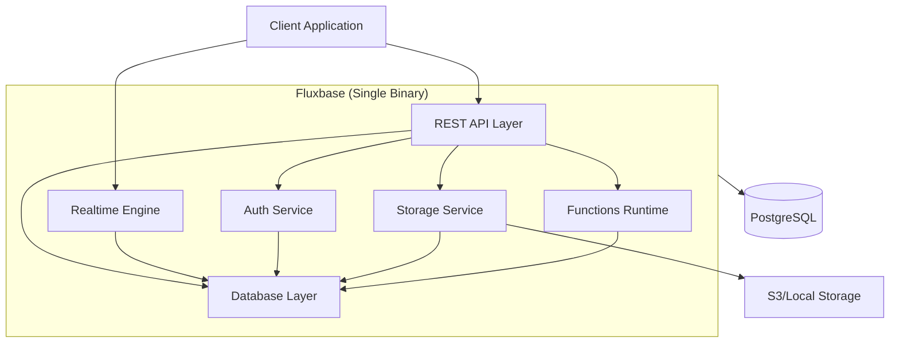

:::caution[Beta Software]
Fluxbase is currently in beta. While we're working hard to stabilize the API and features, you may encounter breaking changes between versions. We welcome feedback and contributions!
:::

Fluxbase is a lightweight, single-binary Backend-as-a-Service (BaaS) alternative to Supabase. It provides essential backend services including auto-generated REST APIs, authentication, realtime subscriptions, file storage, and edge functions - all in a single Go binary with PostgreSQL as the only dependency.

## Why Fluxbase?

### Single Binary Deployment

- **Compact**: Deploy one ~70MB binary or ~110MB container
- **Easy to operate**: An admin UI lets you manage and update all configurations without restarts
- **Scalable**: Scale horizontally if needed

### Minimal Dependencies

- **PostgreSQL Only**: No Redis, no RabbitMQ, no additional services
- **Self-Contained**: Everything runs in one process
- **Easy Operations**: Less moving parts = less complexity

### High Performance

- **Efficient**: Written in Go for maximum performance
- **Scalable**: Handle 1000+ concurrent connections
- **Fast**: Sub-millisecond response times

### Developer Friendly

- **PostgREST Compatible**: Use existing Supabase knowledge
- **Auto-Generated APIs**: Database tables become REST endpoints automatically
- **TypeScript & Go SDKs**: First-class support for modern development

## Core Features

### REST API

Automatically generate CRUD endpoints from your PostgreSQL schema with PostgREST-compatible query syntax:

```bash
# Filter and select
GET /api/v1/tables/posts?published=eq.true&select=id,title,author(name)

# Order and paginate
GET /api/v1/tables/posts?order=created_at.desc&limit=10&offset=20

# Complex queries
GET /api/v1/tables/posts?or=(status.eq.draft,status.eq.published)&author_id=eq.1
```

### Authentication

Built-in authentication with JWT tokens:

- Email/password authentication
- Magic link authentication
- Session management
- Protected endpoints

### Realtime

WebSocket-based realtime subscriptions:

- PostgreSQL LISTEN/NOTIFY integration
- Channel-based subscriptions
- Presence tracking
- Broadcast capabilities

### Storage

File storage with access policies:

- Local filesystem or S3-compatible backends
- Bucket management
- Public/private access control
- Image transformations

### Edge Functions

JavaScript/TypeScript function execution:

- HTTP-triggered functions
- Scheduled functions (cron)
- Database webhook triggers
- Deno runtime

### AI Chatbots

WebSocket-based AI chatbot integration:

- SQL query assistants with natural language
- Streaming responses via WebSocket
- Custom chatbot creation with TypeScript
- Provider management (OpenAI, Anthropic, etc.)
- Rate limiting and token budgets
- Conversation persistence

## Quick Comparison

| Feature                | Fluxbase                        | Supabase                 | Firebase            |
| ---------------------- | ------------------------------- | ------------------------ | ------------------- |
| **Deployment**         | ~70MB binary / ~110MB container | ~13 containers (~2.5GB)  | Cloud only          |
| **Dependencies**       | PostgreSQL only                 | PostgreSQL + 5+ services | Proprietary         |
| **Self-hosting**       | ✅ Easy                         | ⚠️ Complex               | ❌ No               |
| **REST API**           | ✅ Built-in                     | ✅ PostgREST             | ✅ Auto-generated   |
| **Authentication**     | ✅ Built-in                     | ✅ GoTrue                | ✅ Built-in         |
| **Realtime**           | ✅ WebSocket                    | ✅ WebSocket             | ✅ WebSocket        |
| **Storage**            | ✅ S3 or local                  | ✅ S3 or local           | ✅ Cloud Storage    |
| **Edge Functions**     | ✅ Deno                         | ✅ Deno                  | ✅ Cloud Functions  |
| **AI Chatbots**        | ✅ Built-in                     | ❌ No                    | ❌ No               |
| **Background Jobs**    | ✅ Built-in                     | ✅ pg_cron (ext)         | ❌ No               |
| **Database**           | PostgreSQL 15+                  | PostgreSQL 15+           | Proprietary (NoSQL) |
| **Row-Level Security** | ✅ Yes                          | ✅ Yes                   | ⚠️ Rules-based      |
| **Client SDK**         | TypeScript/JS                   | TypeScript/JS            | TypeScript/JS       |
| **Horizontal Scaling** | ✅ Yes (distributed backends)   | ✅ Yes (read replicas)   | ✅ Yes (auto)       |
| **Open Source**        | ✅ AGPLv2                       | ✅ Apache 2.0            | ❌ Proprietary      |

## Getting Started

### Prerequisites

- Go 1.25+ (for building from source)
- PostgreSQL 15+

### Quick Install

```bash
# Download the latest binary
curl -L https://github.com/fluxbase-eu/fluxbase/releases/latest/download/fluxbase-linux-amd64 -o fluxbase
chmod +x fluxbase

# Or use Docker
docker run -p 8080:8080 ghcr.io/fluxbase-eu/fluxbase:latest

# Or build from source
git clone https://github.com/fluxbase-eu/fluxbase.git
cd fluxbase
make build
./fluxbase
```

### Your First API

1. Create a table in PostgreSQL:

```sql
CREATE TABLE public.posts (
    id UUID PRIMARY KEY DEFAULT gen_random_uuid(),
    title TEXT NOT NULL,
    content TEXT,
    published BOOLEAN DEFAULT false,
    created_at TIMESTAMPTZ DEFAULT NOW()
);
```

2. Access your auto-generated API:

```bash
# Create a post
curl -X POST http://localhost:8080/api/v1/tables/posts \
  -H "Content-Type: application/json" \
  -d '{"title": "Hello World", "content": "My first post!"}'

# Query posts
curl http://localhost:8080/api/v1/tables/posts?published=eq.true
```

That's it! Your API is ready.

## Architecture

Fluxbase is built as a monolithic Go application with a modular architecture:



## Next Steps

- [Quick Start](getting-started/quick-start) - Get Fluxbase running in 5 minutes
- [AI Chatbots Guide](guides/ai-chatbots) - Build natural language interfaces to your database
- [Configuration Reference](reference/configuration) - Customize Fluxbase for your needs
- [SDK Documentation](api/sdk) - TypeScript SDK API reference
- [TypeScript SDK Guide](/guides/typescript-sdk) - Learn how to use the TypeScript SDK

## Community & Support

- **GitHub**: [github.com/fluxbase-eu/fluxbase](https://github.com/fluxbase-eu/fluxbase)
- **Discord**: [discord.gg/BXPRHkQzkA](https://discord.gg/BXPRHkQzkA)
- **Twitter**: [@fluxbase](https://twitter.com/fluxbase)

## License

Fluxbase is open source and released under the [AGPLv2 license](https://github.com/fluxbase-eu/fluxbase/blob/main/LICENSE).
