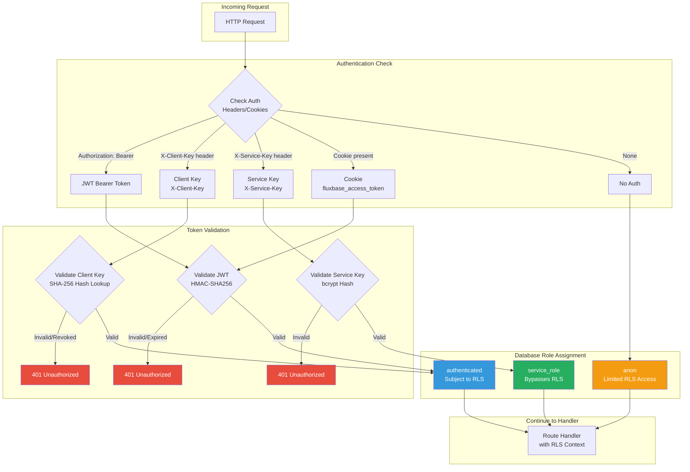
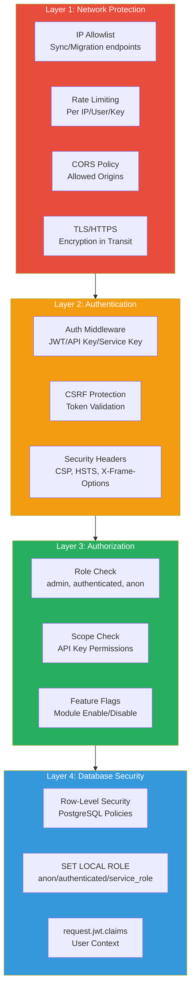
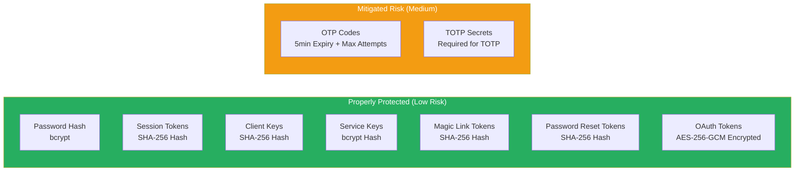
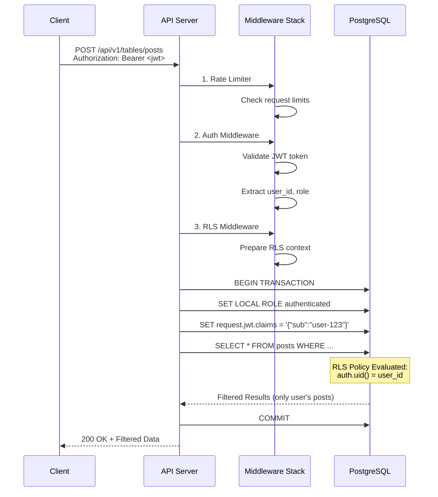
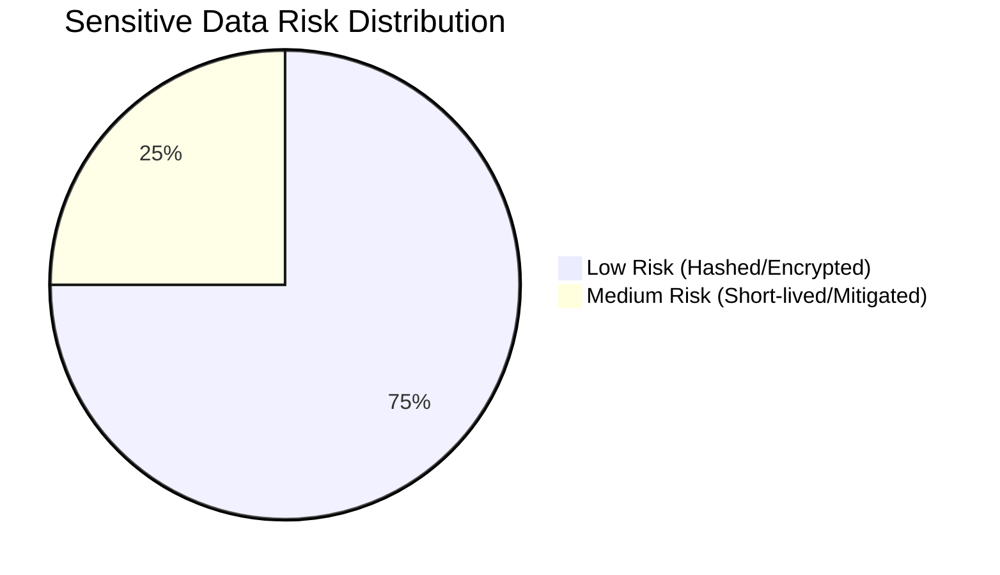

This document provides a comprehensive overview of API endpoint protection in Fluxbase, including authentication methods, authorization models, and data security measures.

## Table of Contents

- [Overview](#overview)
- [Authentication Methods](#authentication-methods)
- [Authorization Model](#authorization-model)
- [Endpoint Protection Matrix](#endpoint-protection-matrix)
- [Security Architecture Diagrams](#security-architecture-diagrams)
- [Sensitive Data Risk Matrix](#sensitive-data-risk-matrix)
- [Security Best Practices](#security-best-practices)

---

## Overview

Fluxbase implements a **multi-layered security model** to protect API endpoints and sensitive data:

| Layer | Protection | Description |
|-------|------------|-------------|
| **Layer 1** | Network | IP allowlists, rate limiting, CORS, TLS/HTTPS |
| **Layer 2** | Authentication | JWT tokens, client keys, service keys, CSRF protection |
| **Layer 3** | Authorization | Role-based access (RBAC), scope enforcement, feature flags |
| **Layer 4** | Database | Row-Level Security (RLS), PostgreSQL policies |
| **Layer 5** | Data | Password hashing, token hashing, audit logging |

### Protection Level Quick Reference

| Level | Symbol | Description |
|-------|--------|-------------|
| Public | 🔓 | No authentication required |
| Optional | 🔑 | Auth optional, affects data visibility via RLS |
| Required | 🔒 | Authentication required |
| Admin | 🛡️ | Admin or dashboard_admin role required |
| Service | 🔐 | Service key + additional restrictions |

---

## Authentication Methods

Fluxbase supports four authentication methods, each suited for different use cases.

### 1. JWT Authentication

**Use case**: Web applications, mobile apps, authenticated users

**Token delivery**:
- `Authorization: Bearer <token>` header
- `fluxbase_access_token` cookie (httpOnly, Secure, SameSite=Strict)
- `token` query parameter (WebSocket connections only)

**Token types**:
| Type | Lifetime | Purpose |
|------|----------|---------|
| Access Token | 1 hour | API access |
| Refresh Token | 7 days | Obtain new access tokens |

**Claims extracted**:
- `user_id`, `email`, `role`
- `session_id`, `is_anonymous`
- `user_metadata`, `app_metadata`

### 2. Client Key Authentication

**Use case**: Server-to-server integrations, automated scripts, third-party apps

**Key delivery**:
- `X-Client-Key: <key>` header
- `clientkey=<key>` query parameter

**Key format**: `fbk_<base64_random_bytes>`

**Features**:
- Scoped permissions (granular access control)
- Rate limiting per key
- Expiration support
- Revocation support
- Usage tracking (`last_used_at`)

**Storage**: SHA-256 hash (only prefix exposed: `fbk_xxxxxxxx`)

### 3. Service Key Authentication

**Use case**: Backend services, deployment pipelines, admin operations

**Key delivery**:
- `X-Service-Key: <key>` header
- `Authorization: ServiceKey <key>` header

**Key format**: `sk_test_<random>` or `sk_live_<random>`

**Privileges**:
- Maps to `service_role` database role
- **Bypasses Row-Level Security (RLS)**
- Full access to all data

**Storage**: bcrypt hash (only prefix exposed)

### 4. Dashboard Admin JWT

**Use case**: Fluxbase dashboard administrators (platform management)

**Separate auth system** from application users:
- Independent user table (`dashboard.users`)
- Own JWT tokens with `dashboard_admin` role
- Maps to `service_role` for database operations

---

## Authorization Model

### Roles

| Role | Database Role | RLS Bypass | Description |
|------|---------------|------------|-------------|
| `anon` | `anon` | No | Unauthenticated/anonymous users |
| `authenticated` | `authenticated` | No | Logged-in application users |
| `admin` | `authenticated` | No | Application administrators (still subject to RLS) |
| `service_role` | `service_role` | **Yes** | Backend services with full access |
| `dashboard_admin` | `service_role` | **Yes** | Platform administrators |

### Client Key Scopes

Client keys can be granted specific scopes to limit their access:

| Category | Scopes | Description |
|----------|--------|-------------|
| **Tables** | `read:tables`, `write:tables` | Database table operations |
| **Storage** | `read:storage`, `write:storage` | File storage operations |
| **Functions** | `read:functions`, `execute:functions` | Edge function management/invocation |
| **Auth** | `read:auth`, `write:auth` | Authentication operations |
| **Client Keys** | `read:clientkeys`, `write:clientkeys` | Client key management |
| **Webhooks** | `read:webhooks`, `write:webhooks` | Webhook configuration |
| **Monitoring** | `read:monitoring` | System monitoring data |
| **Realtime** | `realtime:connect`, `realtime:broadcast` | WebSocket operations |
| **RPC** | `read:rpc`, `execute:rpc` | Remote procedure calls |
| **Jobs** | `read:jobs`, `write:jobs` | Background job operations |
| **AI** | `read:ai`, `write:ai` | AI chatbot operations |
| **Wildcard** | `*` | All permissions (use with caution) |

### Rate Limiting

| Endpoint Type | Limit | Window | Notes |
|--------------|-------|--------|-------|
| Global API | 100 req | 1 min | Per IP address |
| Login | 10 req | 15 min | Per IP |
| Signup | 10 req | 15 min | Per IP |
| Password Reset | 5 req | 15 min | Per IP |
| Magic Link | 5 req | 15 min | Per IP |
| 2FA Verification | 5 req | 5 min | Per IP (strict) |
| Admin Login | 4 req | 1 min | Per IP |
| Migrations API | 10 req | 1 hour | Per service key |
| Client Key Requests | 1000 req | 1 min | Per key |
| Authenticated Users | 500 req | 1 min | Per user |

---

## Endpoint Protection Matrix

### Summary by Category

| Category | Path Prefix | Endpoints | Auth | RLS | Feature Flag |
|----------|-------------|-----------|------|-----|--------------|
| Health | `/`, `/health`, `/ready` | 3 | 🔓 Public | - | - |
| Auth | `/api/v1/auth/*` | ~30 | 🔑 Mixed | - | - |
| REST API | `/api/v1/tables/*` | 12 | 🔒 Required | Yes | - |
| Storage | `/api/v1/storage/*` | ~20 | 🔑 Optional | Yes | `app.storage.enabled` |
| Functions | `/api/v1/functions/*` | ~15 | 🔑 Per-function | - | `app.functions.enabled` |
| Jobs | `/api/v1/jobs/*` | ~10 | 🔒 Required | - | `app.jobs.enabled` |
| AI | `/api/v1/ai/*` | ~20 | 🔑 Mixed | - | `app.ai.enabled` |
| RPC | `/api/v1/rpc/*` | ~8 | 🔑 Optional | - | `app.rpc.enabled` |
| Realtime | `/realtime` | 3 | 🔑 Optional | Yes | `app.realtime.enabled` |
| Webhooks | `/api/v1/webhooks/*` | 6 | 🔒 Required | - | - |
| Client Keys | `/api/v1/client-keys/*` | 6 | 🛡️ Admin | - | - |
| Admin | `/api/v1/admin/*` | 50+ | 🛡️ Admin | - | Various |
| Migrations | `/api/v1/admin/migrations/*` | 10 | 🔐 Service | - | `app.migrations.enabled` |

---

### Health & Status Endpoints

| Endpoint | Method | Auth | Rate Limit | Description |
|----------|--------|------|------------|-------------|
| `/` | GET | 🔓 Public | - | Basic health check |
| `/health` | GET | 🔓 Public | - | Health status with DB check |
| `/ready` | GET | 🔓 Public | - | Readiness probe |
| `/metrics` | GET | 🔓 Public | - | Prometheus metrics (firewall recommended) |

---

### Authentication Endpoints (`/api/v1/auth/*`)

| Endpoint | Method | Auth | Rate Limit | Description |
|----------|--------|------|------------|-------------|
| `/auth/csrf` | GET | 🔓 Public | - | Get CSRF token |
| `/auth/signup` | POST | 🔓 Public | 10/15min | User registration |
| `/auth/signin` | POST | 🔓 Public | 10/15min | User login |
| `/auth/signout` | POST | 🔒 Required | - | User logout |
| `/auth/refresh` | POST | 🔓 Public | 10/1min | Refresh access token |
| `/auth/user` | GET | 🔒 Required | - | Get current user |
| `/auth/user` | PATCH | 🔒 Required | - | Update user profile |
| `/auth/magiclink` | POST | 🔓 Public | 5/15min | Request magic link |
| `/auth/magiclink/verify` | POST | 🔓 Public | - | Verify magic link |
| `/auth/password/reset` | POST | 🔓 Public | 5/15min | Request password reset |
| `/auth/password/reset/confirm` | POST | 🔓 Public | - | Confirm password reset |
| `/auth/otp/signin` | POST | 🔓 Public | 5/15min | Request OTP |
| `/auth/otp/verify` | POST | 🔓 Public | 5/5min | Verify OTP |
| `/auth/otp/resend` | POST | 🔓 Public | 5/15min | Resend OTP |
| `/auth/2fa/setup` | POST | 🔒 Required | - | Setup TOTP 2FA |
| `/auth/2fa/enable` | POST | 🔒 Required | - | Enable 2FA |
| `/auth/2fa/disable` | POST | 🔒 Required | - | Disable 2FA |
| `/auth/2fa/verify` | POST | 🔓 Public | 5/5min | Verify 2FA code (login) |
| `/auth/2fa/status` | GET | 🔒 Required | - | Get 2FA status |
| `/auth/user/identities` | GET | 🔒 Required | - | List linked OAuth identities |
| `/auth/user/identities` | POST | 🔒 Required | - | Link OAuth identity |
| `/auth/user/identities/:id` | DELETE | 🔒 Required | - | Unlink OAuth identity |
| `/auth/oauth/providers` | GET | 🔓 Public | - | List enabled OAuth providers |
| `/auth/oauth/:provider/authorize` | GET | 🔓 Public | - | OAuth authorization |
| `/auth/oauth/:provider/callback` | GET | 🔓 Public | - | OAuth callback |
| `/auth/impersonate` | POST | 🛡️ Admin | - | Start user impersonation |
| `/auth/impersonate/anon` | POST | 🛡️ Admin | - | Impersonate anonymous user |
| `/auth/impersonate/service` | POST | 🛡️ Admin | - | Impersonate service role |
| `/auth/impersonate` | DELETE | 🛡️ Admin | - | Stop impersonation |
| `/auth/reauthenticate` | POST | 🔒 Required | - | Reauthenticate user |

---

### REST API Endpoints (`/api/v1/tables/*`)

All REST API endpoints require authentication and apply Row-Level Security.

| Endpoint | Method | Auth | Scopes | Description |
|----------|--------|------|--------|-------------|
| `/tables/` | GET | 🛡️ Admin | - | List all tables |
| `/tables/:table` | GET | 🔒 Required | `read:tables` | List rows (with RLS) |
| `/tables/:table` | POST | 🔒 Required | `write:tables` | Create row |
| `/tables/:table` | PATCH | 🔒 Required | `write:tables` | Batch update rows |
| `/tables/:table` | DELETE | 🔒 Required | `write:tables` | Batch delete rows |
| `/tables/:table/:id` | GET | 🔒 Required | `read:tables` | Get single row |
| `/tables/:table/:id` | PUT | 🔒 Required | `write:tables` | Replace row |
| `/tables/:table/:id` | PATCH | 🔒 Required | `write:tables` | Update row |
| `/tables/:table/:id` | DELETE | 🔒 Required | `write:tables` | Delete row |
| `/tables/:table/query` | POST | 🔒 Required | `read:tables` | Complex query |
| `/tables/:schema/:table/*` | * | 🔒 Required | `read/write:tables` | Schema-qualified operations |

**RLS Behavior**:
- `anon` role: Only sees data permitted by RLS policies for anonymous users
- `authenticated` role: Sees data filtered by `auth.uid() = user_id` policies
- `service_role`: Bypasses all RLS policies (full access)

---

### Storage Endpoints (`/api/v1/storage/*`)

**Feature Flag**: `app.storage.enabled`

| Endpoint | Method | Auth | Scopes | Description |
|----------|--------|------|--------|-------------|
| `/storage/object` | GET | 🔓 Public | - | Download signed object |
| `/storage/buckets` | GET | 🔑 Optional | `read:storage` | List buckets |
| `/storage/buckets/:bucket` | POST | 🔑 Optional | `write:storage` | Create bucket |
| `/storage/buckets/:bucket` | PUT | 🔑 Optional | `write:storage` | Update bucket settings |
| `/storage/buckets/:bucket` | DELETE | 🔑 Optional | `write:storage` | Delete bucket |
| `/storage/:bucket` | GET | 🔑 Optional | `read:storage` | List files in bucket |
| `/storage/:bucket/*` | GET | 🔑 Optional | `read:storage` | Download file |
| `/storage/:bucket/*` | POST | 🔑 Optional | `write:storage` | Upload file |
| `/storage/:bucket/*` | HEAD | 🔑 Optional | `read:storage` | Get file metadata |
| `/storage/:bucket/*` | DELETE | 🔑 Optional | `write:storage` | Delete file |
| `/storage/:bucket/sign/*` | POST | 🔑 Optional | `write:storage` | Generate signed URL |
| `/storage/:bucket/*/share` | POST | 🔑 Optional | `write:storage` | Share file with user |
| `/storage/:bucket/*/shares` | GET | 🔑 Optional | `read:storage` | List file shares |
| `/storage/:bucket/stream/*` | POST | 🔑 Optional | `write:storage` | Stream upload |
| `/storage/:bucket/chunked/*` | * | 🔑 Optional | `read/write:storage` | Chunked upload operations |

---

### Functions Endpoints (`/api/v1/functions/*`)

**Feature Flag**: `app.functions.enabled`

| Endpoint | Method | Auth | Scopes | Description |
|----------|--------|------|--------|-------------|
| `/functions/` | GET | 🔒 Required | `read:functions` | List functions |
| `/functions/:name` | GET | 🔒 Required | `read:functions` | Get function details |
| `/functions/:name/invoke` | POST | 🔑 Per-function | `execute:functions` | Invoke function |
| `/functions/:name/invoke` | GET | 🔑 Per-function | `execute:functions` | Invoke (health checks) |
| `/functions/:name/executions` | GET | 🔒 Required | `read:functions` | List executions |
| `/functions/shared/*` | * | 🔒 Required | `read/write:functions` | Shared module management |

**Per-function auth**: Each function can be configured as public or authenticated.

---

### Jobs Endpoints (`/api/v1/jobs/*`)

**Feature Flag**: `app.jobs.enabled`

| Endpoint | Method | Auth | Scopes | Description |
|----------|--------|------|--------|-------------|
| `/jobs/submit` | POST | 🔒 Required | `write:jobs` | Submit new job |
| `/jobs/:id` | GET | 🔒 Required | `read:jobs` | Get job status |
| `/jobs/:id/logs` | GET | 🔒 Required | `read:jobs` | Get job logs |
| `/jobs/` | GET | 🔒 Required | `read:jobs` | List user's jobs |
| `/jobs/:id/cancel` | POST | 🔒 Required | `write:jobs` | Cancel job |
| `/jobs/:id/retry` | POST | 🔒 Required | `write:jobs` | Retry job |

---

### AI Endpoints (`/api/v1/ai/*`)

**Feature Flag**: `app.ai.enabled`

| Endpoint | Method | Auth | Description |
|----------|--------|------|-------------|
| `/ai/ws` | WS | 🔑 Optional | WebSocket for AI chat |
| `/ai/chatbots` | GET | 🔑 Optional | List public chatbots |
| `/ai/chatbots/:id` | GET | 🔑 Optional | Get chatbot details |
| `/ai/conversations` | GET | 🔒 Required | List user's conversations |
| `/ai/conversations/:id` | GET | 🔒 Required | Get conversation |
| `/ai/conversations/:id` | DELETE | 🔒 Required | Delete conversation |
| `/ai/conversations/:id` | PATCH | 🔒 Required | Update conversation |

---

### RPC Endpoints (`/api/v1/rpc/*`)

**Feature Flag**: `app.rpc.enabled`

| Endpoint | Method | Auth | Scopes | Description |
|----------|--------|------|--------|-------------|
| `/rpc/procedures` | GET | 🔑 Optional | `read:rpc` | List public procedures |
| `/rpc/:namespace/:name` | POST | 🔑 Optional | `execute:rpc` | Execute procedure |
| `/rpc/executions/:id` | GET | 🔑 Optional | `read:rpc` | Get execution status |
| `/rpc/executions/:id/logs` | GET | 🔑 Optional | `read:rpc` | Get execution logs |

---

### Realtime Endpoints

**Feature Flag**: `app.realtime.enabled`

| Endpoint | Method | Auth | Scopes | Description |
|----------|--------|------|--------|-------------|
| `/realtime` | WS | 🔑 Optional | `realtime:connect` | WebSocket subscriptions |
| `/api/v1/realtime/stats` | GET | 🔒 Required | `realtime:connect` | Get realtime statistics |
| `/api/v1/realtime/broadcast` | POST | 🔒 Required | `realtime:broadcast` | Broadcast message |

---

### Webhooks Endpoints (`/api/v1/webhooks/*`)

| Endpoint | Method | Auth | Scopes | Description |
|----------|--------|------|--------|-------------|
| `/webhooks/` | GET | 🔒 Required | `read:webhooks` | List webhooks |
| `/webhooks/:id` | GET | 🔒 Required | `read:webhooks` | Get webhook |
| `/webhooks/:id/deliveries` | GET | 🔒 Required | `read:webhooks` | List delivery history |
| `/webhooks/` | POST | 🔒 Required | `write:webhooks` | Create webhook |
| `/webhooks/:id` | PATCH | 🔒 Required | `write:webhooks` | Update webhook |
| `/webhooks/:id` | DELETE | 🔒 Required | `write:webhooks` | Delete webhook |
| `/webhooks/:id/test` | POST | 🔒 Required | `write:webhooks` | Test webhook |

---

### Client Keys Endpoints (`/api/v1/client-keys/*`)

| Endpoint | Method | Auth | Description |
|----------|--------|------|-------------|
| `/client-keys/` | GET | 🛡️ Admin | List client keys |
| `/client-keys/:id` | GET | 🛡️ Admin | Get client key |
| `/client-keys/` | POST | 🛡️ Admin | Create client key |
| `/client-keys/:id` | PATCH | 🛡️ Admin | Update client key |
| `/client-keys/:id` | DELETE | 🛡️ Admin | Delete client key |
| `/client-keys/:id/revoke` | POST | 🛡️ Admin | Revoke client key |

---

### Admin Endpoints (`/api/v1/admin/*`)

All admin endpoints require `admin` or `dashboard_admin` role.

#### Dashboard Authentication

| Endpoint | Method | Auth | Rate Limit | Description |
|----------|--------|------|------------|-------------|
| `/admin/setup/status` | GET | 🔓 Public | - | Check setup status |
| `/admin/setup` | POST | 🔓 Public | 5/15min | Initial admin setup |
| `/admin/login` | POST | 🔓 Public | 4/1min | Dashboard login |
| `/admin/refresh` | POST | 🔓 Public | - | Refresh dashboard token |
| `/admin/logout` | POST | 🔒 Required | - | Dashboard logout |
| `/admin/me` | GET | 🔒 Required | - | Get current admin |

#### Database Management

| Endpoint | Method | Auth | Description |
|----------|--------|------|-------------|
| `/admin/ddl/schemas` | GET | 🛡️ Admin | List schemas |
| `/admin/ddl/schemas` | POST | 🛡️ Admin | Create schema |
| `/admin/ddl/tables` | GET | 🛡️ Admin | List tables |
| `/admin/ddl/tables` | POST | 🛡️ Admin | Create table |
| `/admin/ddl/tables/:schema/:table` | DELETE | 🛡️ Admin | Delete table |
| `/admin/ddl/tables/:schema/:table` | PATCH | 🛡️ Admin | Rename table |
| `/admin/ddl/tables/:schema/:table/columns` | POST | 🛡️ Admin | Add column |
| `/admin/ddl/tables/:schema/:table/columns/:column` | DELETE | 🛡️ Admin | Drop column |
| `/admin/sql/execute` | POST | 🛡️ Admin | Execute raw SQL |

#### User Management

| Endpoint | Method | Auth | Description |
|----------|--------|------|-------------|
| `/admin/users` | GET | 🛡️ Admin | List users |
| `/admin/users/invite` | POST | 🛡️ Admin | Invite user |
| `/admin/users/:id` | DELETE | 🛡️ Admin | Delete user |
| `/admin/users/:id/role` | PATCH | 🛡️ Admin | Update user role |
| `/admin/users/:id/reset-password` | POST | 🛡️ Admin | Reset user password |

#### Settings Management

| Endpoint | Method | Auth | Description |
|----------|--------|------|-------------|
| `/admin/app/settings` | GET | 🛡️ Admin | Get app settings |
| `/admin/app/settings` | PUT | 🛡️ Admin | Update app settings |
| `/admin/system/settings` | GET | 🛡️ Admin | Get system settings |
| `/admin/system/settings/*` | PUT | 🛡️ Admin | Update system setting |
| `/admin/settings/custom/*` | * | 🛡️ Admin | Custom settings CRUD |

#### OAuth Provider Management

| Endpoint | Method | Auth | Description |
|----------|--------|------|-------------|
| `/admin/oauth/providers` | GET | 🛡️ Admin | List OAuth providers |
| `/admin/oauth/providers/:id` | GET | 🛡️ Admin | Get provider |
| `/admin/oauth/providers` | POST | 🛡️ Admin | Create provider |
| `/admin/oauth/providers/:id` | PUT | 🛡️ Admin | Update provider |
| `/admin/oauth/providers/:id` | DELETE | 🛡️ Admin | Delete provider |
| `/admin/auth/settings` | GET | 🛡️ Admin | Get auth settings |
| `/admin/auth/settings` | PUT | 🛡️ Admin | Update auth settings |

#### Session Management

| Endpoint | Method | Auth | Description |
|----------|--------|------|-------------|
| `/admin/auth/sessions` | GET | 🛡️ Admin | List sessions |
| `/admin/auth/sessions/:id` | DELETE | 🛡️ Admin | Revoke session |
| `/admin/auth/sessions/user/:user_id` | DELETE | 🛡️ Admin | Revoke all user sessions |

#### Feature-Specific Admin Endpoints

| Category | Path | Auth | Feature Flag |
|----------|------|------|--------------|
| Functions | `/admin/functions/*` | 🛡️ Admin | `app.functions.enabled` |
| Jobs | `/admin/jobs/*` | 🛡️ Admin | `app.jobs.enabled` |
| AI | `/admin/ai/*` | 🛡️ Admin | `app.ai.enabled` |
| RPC | `/admin/rpc/*` | 🛡️ Admin | `app.rpc.enabled` |
| Extensions | `/admin/extensions/*` | 🛡️ Admin | - |
| Logs | `/admin/logs/*` | 🛡️ Admin | - |
| Monitoring | `/admin/monitoring/*` | 🛡️ Admin | - |
| Email | `/admin/email/*` | 🛡️ Admin | - |

---

### Migrations Endpoints (`/api/v1/admin/migrations/*`)

**Feature Flag**: `app.migrations.enabled`

**Additional restrictions**: IP allowlist, Service key required

| Endpoint | Method | Auth | Rate Limit | Description |
|----------|--------|------|------------|-------------|
| `/admin/migrations` | GET | 🔐 Service | 10/hour | List migrations |
| `/admin/migrations` | POST | 🔐 Service | 10/hour | Create migration |
| `/admin/migrations/:name` | GET | 🔐 Service | 10/hour | Get migration |
| `/admin/migrations/:name` | PUT | 🔐 Service | 10/hour | Update migration |
| `/admin/migrations/:name` | DELETE | 🔐 Service | 10/hour | Delete migration |
| `/admin/migrations/:name/apply` | POST | 🔐 Service | 10/hour | Apply migration |
| `/admin/migrations/:name/rollback` | POST | 🔐 Service | 10/hour | Rollback migration |
| `/admin/migrations/apply-pending` | POST | 🔐 Service | 10/hour | Apply all pending |
| `/admin/migrations/sync` | POST | 🔐 Service | 10/hour | Sync migrations |

---

### Sync Endpoints (Deployment)

These endpoints are used by deployment pipelines and require IP allowlist verification.

| Endpoint | Method | Auth | IP Allowlist | Description |
|----------|--------|------|--------------|-------------|
| `/admin/functions/sync` | POST | 🔐 Service | Yes | Sync functions from filesystem |
| `/admin/jobs/sync` | POST | 🔐 Service | Yes | Sync jobs from filesystem |
| `/admin/ai/sync` | POST | 🔐 Service | Yes | Sync chatbots |
| `/admin/rpc/sync` | POST | 🔐 Service | Yes | Sync RPC procedures |

---

## Security Architecture Diagrams

### Authentication Flow



### Authorization Layers



### Data Protection Model



### Request Flow with RLS



---

## Sensitive Data Risk Matrix

### Token & Credential Storage

| Data Type | Storage Location | Storage Method | Risk Level | Exposure Impact |
|-----------|------------------|----------------|------------|-----------------|
| Password | `auth.users.password_hash` | bcrypt hash | 🟢 LOW | Cannot reverse hash |
| Session Access Token | `auth.sessions.access_token_hash` | SHA-256 hash | 🟢 LOW | Hash-only since migration 032 |
| Session Refresh Token | `auth.sessions.refresh_token_hash` | SHA-256 hash | 🟢 LOW | Hash-only since migration 032 |
| Client Key | `auth.client_keys.key_hash` | SHA-256 hash | 🟢 LOW | Only prefix `fbk_xxxxxxxx` exposed |
| Service Key | `auth.service_keys.key_hash` | bcrypt hash | 🟢 LOW | Only prefix exposed |
| OAuth Access Token | `auth.oauth_tokens.access_token` | AES-256-GCM encrypted | 🟢 LOW | Encrypted at rest (requires `FLUXBASE_ENCRYPTION_KEY`) |
| OAuth Refresh Token | `auth.oauth_tokens.refresh_token` | AES-256-GCM encrypted | 🟢 LOW | Encrypted at rest (requires `FLUXBASE_ENCRYPTION_KEY`) |
| Magic Link Token | `auth.magic_links.token_hash` | SHA-256 hash | 🟢 LOW | Hash-only since migration 039 |
| Password Reset Token | `auth.password_reset_tokens.token_hash` | SHA-256 hash | 🟢 LOW | Hash-only since migration 039 |
| OTP Code | `auth.otp_codes.code` | Plaintext | 🟡 MEDIUM | 5-min expiry, max 3 attempts |
| TOTP Secret | `auth.users.totp_secret` | Plaintext | 🟡 MEDIUM | Required for TOTP algorithm |
| Backup Codes | `auth.users.backup_codes` | Plaintext array | 🟡 MEDIUM | Hashed after use |

### PII & Metadata Storage

| Data Type | Storage Location | Risk Level | Notes |
|-----------|------------------|------------|-------|
| Email Address | `auth.users.email` | 🟡 MEDIUM | Indexed, exposed in API |
| User Metadata | `auth.users.user_metadata` | 🟡 MEDIUM | User-editable, may contain PII |
| App Metadata | `auth.users.app_metadata` | 🟡 MEDIUM | Admin-only, may contain sensitive info |
| OAuth Identity Data | `auth.oauth_links.metadata` | 🟡 MEDIUM | Full provider response (name, avatar, etc.) |

### API Response Security

| Field | JSON Serialization | Notes |
|-------|-------------------|-------|
| `password_hash` | `json:"-"` | Never exposed |
| `failed_login_attempts` | `json:"-"` | Never exposed |
| `is_locked` | `json:"-"` | Never exposed |
| `locked_until` | `json:"-"` | Never exposed |
| Client Key (full) | Return only on creation | Never returned again |
| Session tokens | Never in list operations | Only returned on login |

### Risk Distribution



---

## Security Best Practices

### Configuration Checklist

```markdown
Security Configuration Verification:

- [ ] FLUXBASE_AUTH_JWT_SECRET is set (minimum 32 characters)
- [ ] FLUXBASE_ENCRYPTION_KEY is set (32 bytes for AES-256)
- [ ] FLUXBASE_SECURITY_SETUP_TOKEN is set for admin setup
- [ ] Rate limiting is enabled (app.security.enable_global_rate_limit)
- [ ] CORS is configured to specific origins (not wildcard *)
- [ ] TLS/HTTPS is enabled in production
- [ ] Debug mode is disabled in production (FLUXBASE_DEBUG=false)
- [ ] Webhook SSRF protection is enabled
- [ ] IP allowlists are configured for migrations/sync APIs
- [ ] Feature flags are reviewed for enabled modules
- [ ] Prometheus metrics endpoint is firewalled
```

### Monitoring Recommendations

| Metric | Source | Alert Condition |
|--------|--------|-----------------|
| Failed login attempts | `auth.users.failed_login_attempts` | > 5 per user |
| Account lockouts | `auth.users.is_locked` | Any lockout event |
| Rate limit violations | Application logs | Sustained high volume |
| 2FA recovery attempts | `auth.two_factor_recovery_attempts` | Multiple failures |
| Impersonation sessions | `auth.impersonation_sessions` | Any activity (audit) |
| Service key usage | `auth.service_keys.last_used_at` | Unexpected usage patterns |
| RLS bypass operations | Query logs | `service_role` usage outside expected services |

---

## Source Code References

The following source files contain the implementation details for the security features documented above:

| File | Purpose |
|------|---------|
| `internal/api/server.go` | Route registration and middleware chains |
| `internal/middleware/clientkey_auth.go` | Client key validation |
| `internal/auth/jwt.go` | JWT handling |
| `internal/middleware/rls.go` | Row-Level Security |
| `internal/auth/scopes.go` | Scope definitions |
| `internal/auth/magiclink.go` | Magic link token hashing |
| `internal/auth/password_reset.go` | Password reset token hashing |
| `internal/api/oauth_handler.go` | OAuth token encryption |
| `internal/crypto/encrypt.go` | AES-256-GCM encryption utilities |
| `internal/database/migrations/006_tables_auth.up.sql` | Auth schema |
| `internal/database/migrations/032_auth_security.up.sql` | Session token hashing migration |
| `internal/database/migrations/039_hash_security_tokens.up.sql` | Magic link & password reset token hashing |
